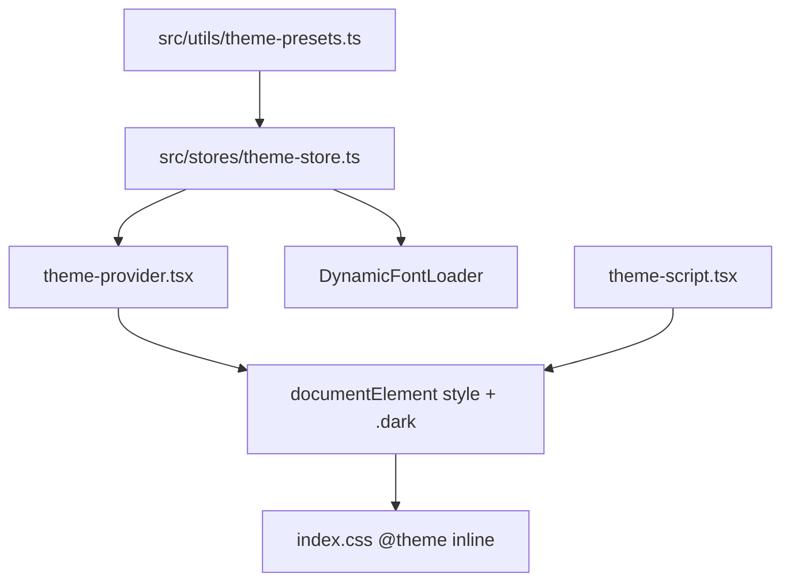
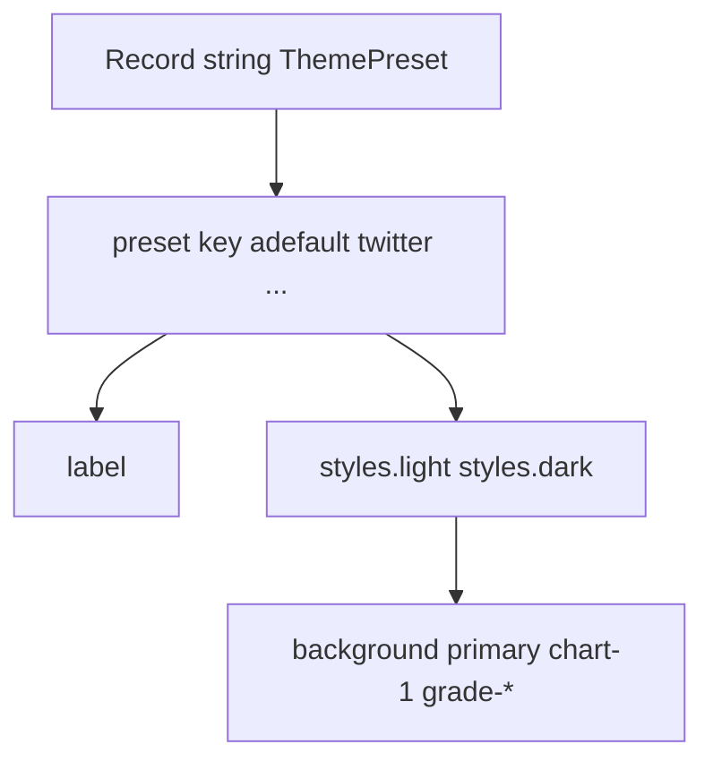
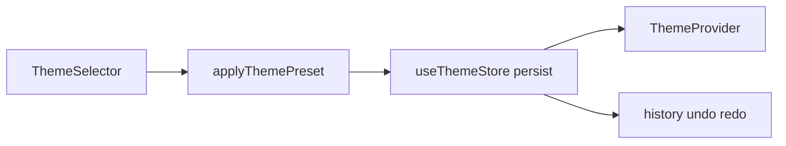
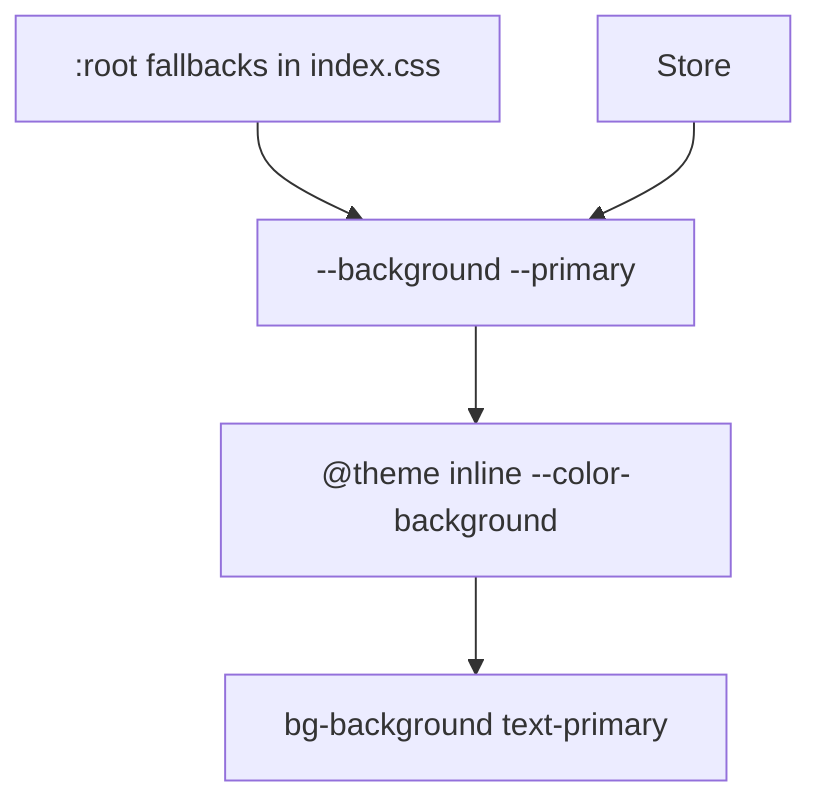
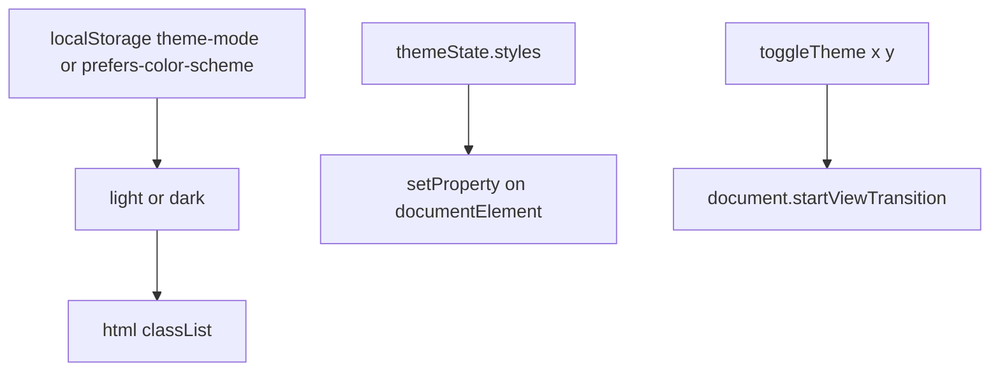
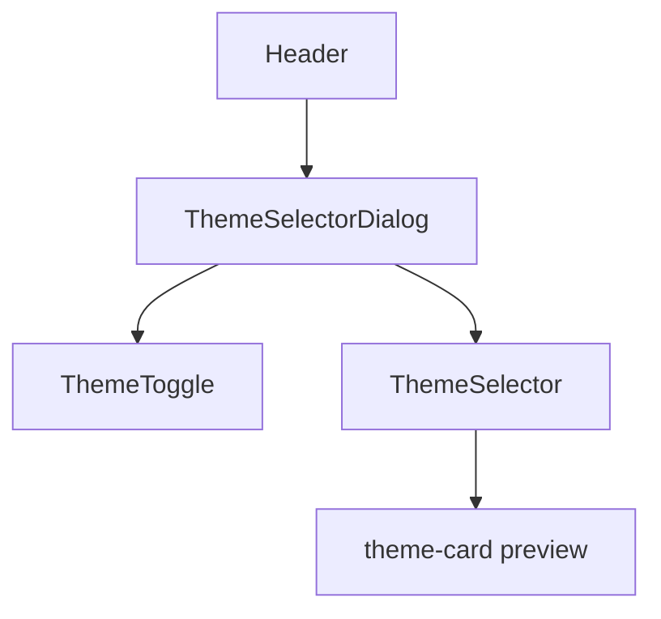
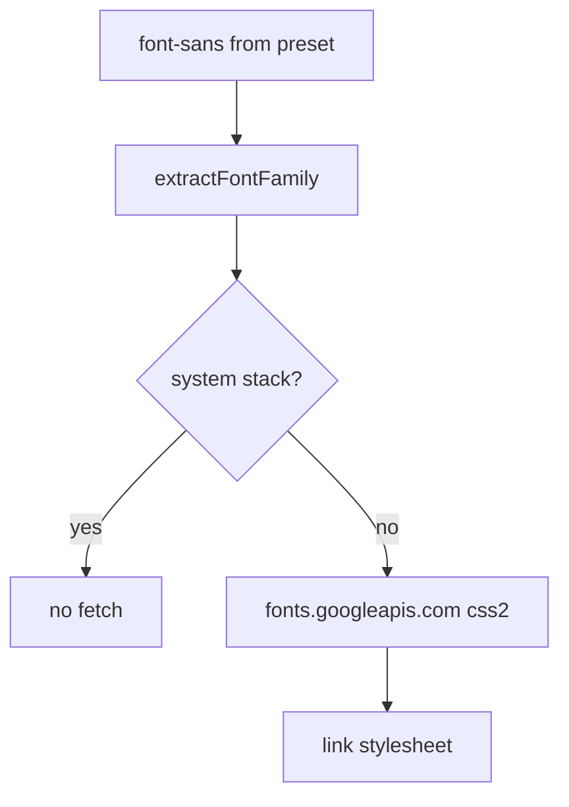
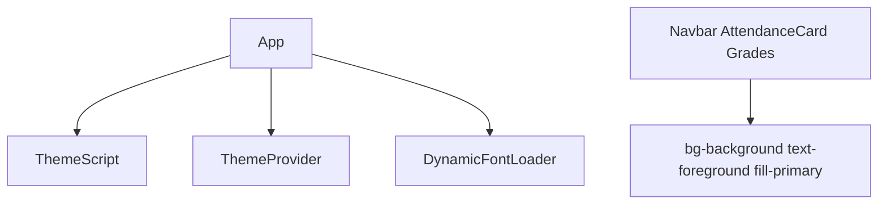

# Theme system

Presets, light/dark, fonts, view transitions. Values land in CSS custom properties that Tailwind utilities read.

Related: [Styling System](5.4-styling-system), [Theme & Navigation Components](5.2-theme-and-navigation-components).

## Architecture overview

### Theme system architecture

## Theme presets configuration

### Theme preset structure

`defaultPresets` is `extendAllThemePresets(basePresets)`. Keys include `adefault`, `modern-minimal`, `violet-bloom`, `t3-chat`, `twitter`, `mocha-mousse`, `bubblegum`, `amethyst-haze`, `notebook`, `doom-64`, `catppuccin`, `graphite`, `perpetuity`, plus later presets such as `kodama-grove`, `claude`, `vercel`.

| Preset key | Label |
| --- | --- |
| `adefault` | Default |
| `modern-minimal` | Modern Minimal |
| `violet-bloom` | Violet Bloom |
| `t3-chat` | T3 Chat |
| `twitter` | Twitter |
| `mocha-mousse` | Mocha Mousse |
| `bubblegum` | Bubblegum |
| `amethyst-haze` | Amethyst Haze |
| `notebook` | Notebook |
| `doom-64` | Doom 64 |
| `catppuccin` | Catppuccin |
| `graphite` | Graphite |
| `perpetuity` | Perpetuity |

### Color token system

| Category | Properties |
| --- | --- |
| Base | `background`, `foreground` |
| Surface | `card`, `popover` and foregrounds |
| Interactive | `primary`, `secondary` |
| Semantic | `muted`, `accent`, `destructive` |
| Inputs | `border`, `input`, `ring` |
| Charts | `chart-1` through `chart-5` |
| Sidebar | `sidebar-*` |
| JPortal | `grade-*`, `marks-*` |

## State management with zustand

### Theme store data flow

Store fields: `themeState`, `themeCheckpoint`, `history`, `future`, `setThemeState`, `applyThemePreset`, undo/redo.

`ThemeSelector` reads `defaultPresets[presetKey]`, copies light and dark styles, updates the store.

## CSS architecture

### CSS variable flow

Shadows compose `--shadow-offset-x`, `--shadow-blur`, `--shadow-color`, `--shadow-opacity`.

## Theme provider and context

### Theme provider responsibilities

Default mode is dark when nothing is stored. Click coordinates set `--x` and `--y` for the circular reveal.

## User interface components

### Theme UI component hierarchy

`ThemeSelectorDialog` gestures:

* Click opens the dialog
* Hold ~500ms toggles mode at the pointer
* Horizontal or vertical swipe cycles presets

`ThemeSelector` is a grid of preset buttons with a four-color stripe from light styles.

`ThemeToggle` is Sun/Moon and calls `toggleTheme({x, y})`.

## Dynamic font loading

### Font loading architecture

Weights: `["400", "500", "600", "700"]`. `index.html` already preloads a large Google Fonts CSS covering preset families.

## View transition animations

`index.css` `@supports (view-transition-name: none)`:

* new root expands `clip-path` from `circle(0 at var(--x) var(--y))` to `100vmax`
* old root shrinks
* duration 1s

Browsers without the API snap instantly.

## Integration with application

### Application integration points

Navbar example: `bg-muted`, `fill-primary-foreground` when active.

Custom tokens in `index.css`: `--grade-aa` through `--grade-f`, `--marks-outstanding`, `--marks-good`, `--marks-average`, `--marks-poor`.
