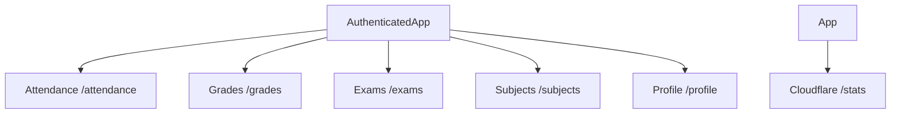
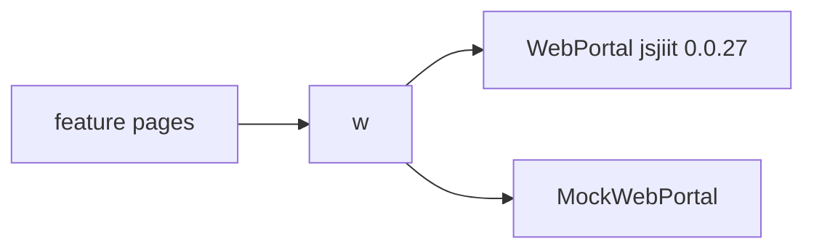
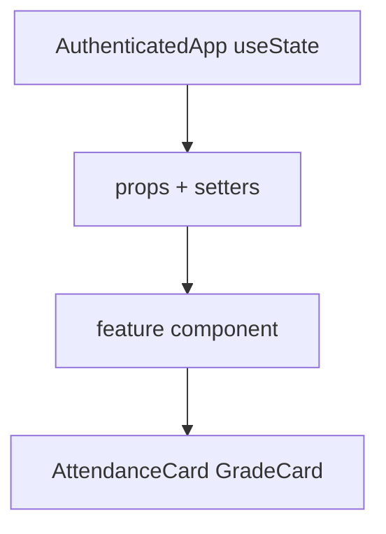
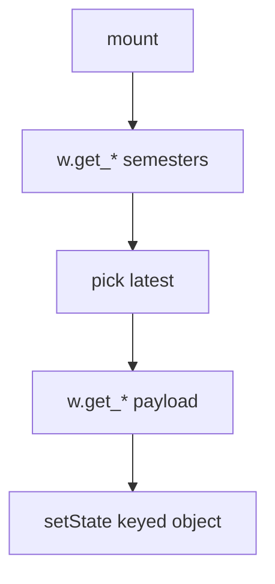
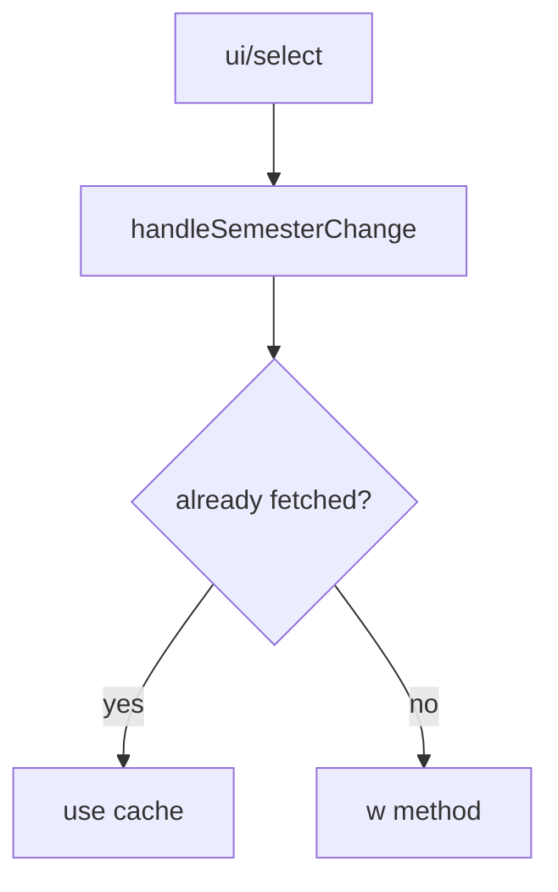
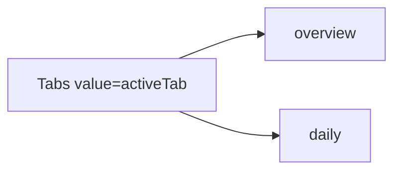
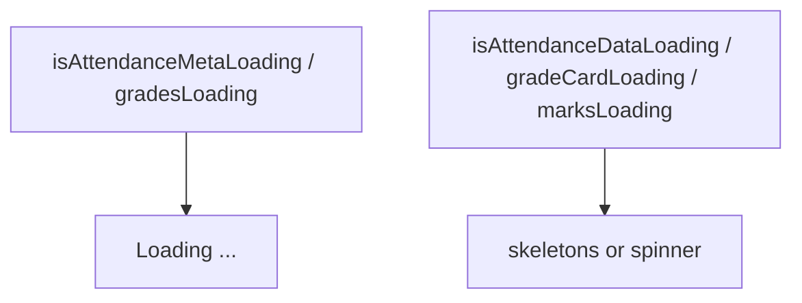
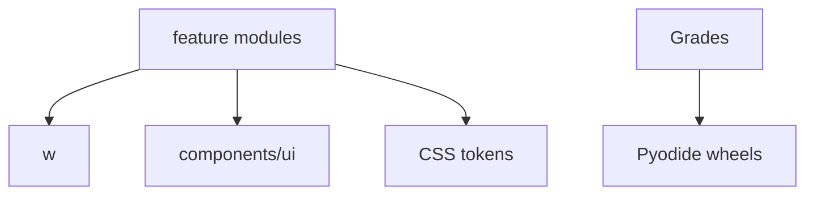
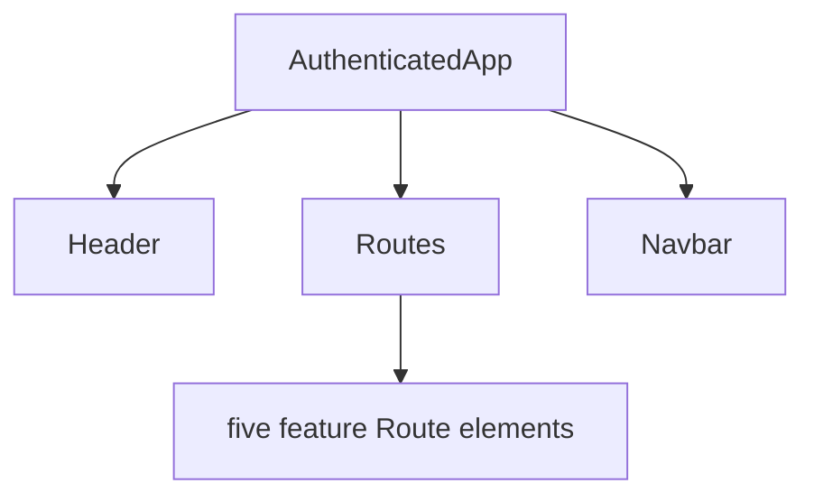

# Feature modules

* [Attendance Module](4.1-attendance-module)
* [Grades Module](4.2-grades-module)
* [Exams Module](4.3-exams-module)
* [Subjects Module](4.4-subjects-module)
* [Profile Module](4.5-profile-module)
* [Analytics Dashboard](4.6-analytics-dashboard)

Related: [Theme & Navigation Components](5.2-theme-and-navigation-components), [Application Structure & Authentication](3.1-application-structure-and-authentication).

## Feature module architecture

### Module coordination

`/stats` is outside `AuthenticatedApp`. It does not take `w`.

### Data access layer

## Common patterns

### State management pattern

| Module | Primary state on AuthenticatedApp |
| --- | --- |
| Attendance | `attendanceData`, `attendanceSemestersData`, `selectedAttendanceSem`, `attendanceGoal`, `subjectAttendanceData` |
| Grades | `gradesData`, `gradeCards`, `marksData`, `selectedGradeCardSem` |
| Exams | `examSchedule`, `examSemesters`, `selectedExamSem`, `selectedExamEvent` |
| Subjects | `subjectData`, `subjectChoices`, `subjectSemestersData` |
| Profile | `profileData` |

### Data fetching pattern

1. Fetch semester or event lists on mount
2. Fetch payload for the selected key
3. Cache by `registration_id` or event id
4. Show loading flags

### Semester selection pattern

| Module | Handler | API |
| --- | --- | --- |
| Attendance | `handleSemesterChange` | `w.get_attendance` |
| Grades | `handleSemesterChange` | `w.get_grade_card` |
| Exams | `handleSemesterChange` | `w.get_exam_events` |
| Subjects | `handleSemesterChange` | `w.get_registered_subjects_and_faculties` or `w.get_subject_choices` |

### Tab-based navigation pattern

| Module | Tabs |
| --- | --- |
| Attendance | `overview`, `daily` |
| Grades | `overview`, `semester`, `marks` |
| Subjects | `registered`, `choices` |

## Loading state management

| Module | Flags |
| --- | --- |
| Attendance | `isAttendanceMetaLoading`, `isAttendanceDataLoading` |
| Grades | `gradesLoading`, `gradeCardLoading`, `marksLoading` |
| Exams | local `loading` |
| Subjects | `loading`, `subjectsLoading`, `choicesLoading` |

## Feature module summary

| Feature | Route | API methods | Cache key |
| --- | --- | --- | --- |
| Attendance | `/attendance` | `get_attendance_meta`, `get_attendance`, `get_subject_daily_attendance` | `registration_id`, subject name |
| Grades | `/grades` | `get_sgpa_cgpa`, `get_grade_card`, `get_semesters_for_marks`, `download_marks` | `registration_id` |
| Exams | `/exams` | `get_semesters_for_exam_events`, `get_exam_events`, `get_exam_schedule` | event id |
| Subjects | `/subjects` | `get_registered_semesters`, `get_registered_subjects_and_faculties`, `get_subject_choices` | `registration_id` |
| Profile | `/profile` | `get_personal_info` | single object |

### Module dependencies

## Integration points

### AuthenticatedApp coordination

1. State declared in `AuthenticatedApp`
2. `w={activePortal}` on every feature
3. `Header` and `Navbar` wrap routes
4. `HashRouter` nested `Routes`

Attendance still receives the long explicit prop list (`w`, caches, goal, tabs, calendar, tracker). State survives route changes. `AuthenticatedApp` stays coupled to each module. See [State Management Strategy](3.2-state-management-strategy).
