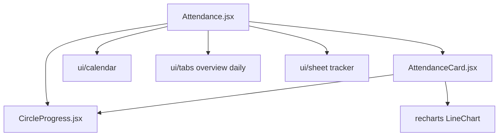
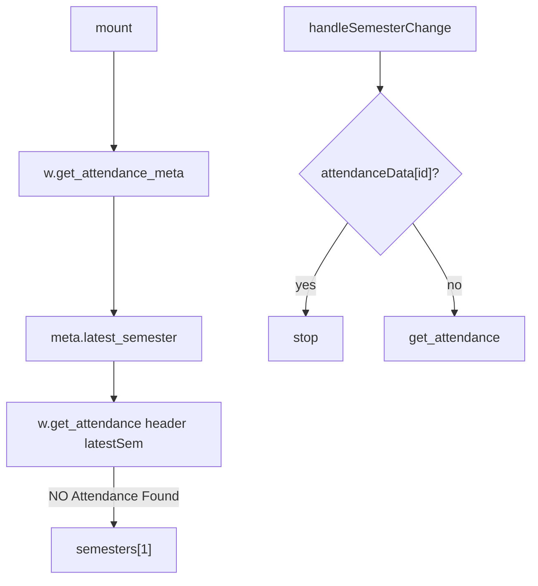
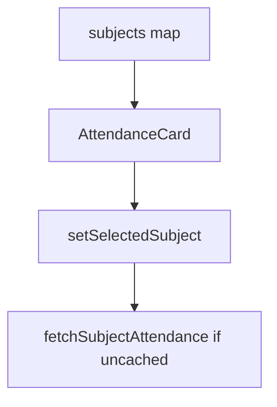
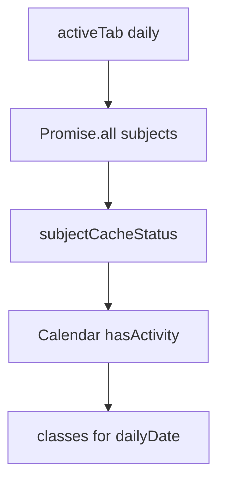
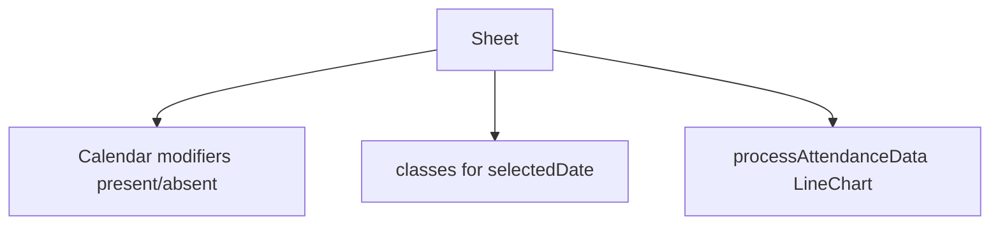

# Attendance module

Class attendance across registered subjects. Overview cards, a goal percentage, and a day-to-day calendar.

Related: [Architecture Overview](3-architecture-overview), [Data Layer & API Integration](3.3-data-layer-and-api-integration).

## Component architecture



## State management and props interface

| Prop | Purpose |
| --- | --- |
| `w` | `WebPortal` or `MockWebPortal` |
| `attendanceData` | Cache keyed by `registration_id` |
| `semestersData` | Meta from `get_attendance_meta` |
| `selectedSem` | Current semester |
| `attendanceGoal` | 1–100, default 75 |
| `subjectAttendanceData` | Daily rows per subject name |
| `selectedSubject` | Open sheet |
| `activeTab` | `"overview"` or `"daily"` |
| `dailyDate` | Day-to-day date |
| `calendarOpen` | Calendar popover |
| `isTrackerOpen` | Prefetch progress sheet |
| `subjectCacheStatus` | idle / fetching / cached |

Each has a matching setter from `AuthenticatedApp`.

## Data flow and fetching strategy



On miss of the latest semester, Attendance falls back to the previous entry in `meta.semesters`.

## Subject data processing

`studentattendancelist` maps to cards. Attended and total sum L/T/P present and class counts.

| Field | Meaning |
| --- | --- |
| `subjectcode` | Display name |
| `Ltotalclass`, `Ltotalpres` | Lecture |
| `Ttotalclass`, `Ttotalpres` | Tutorial |
| `Ptotalclass`, `Ptotalpres` | Practical |
| `LTpercantage` | Combined (API spelling) |
| `subjectid`, `individualsubjectcode` | Daily fetch keys |

```
classesNeeded = ceil((goal * total - 100 * attended) / (100 - goal))
classesCanMiss = floor((100 * attended - goal * total) / goal)
```

`handleGoalChange` keeps values in 1–100.

## Feature: overview tab



`AttendanceCard` strips trailing `(...)` from names, shows L/T/P percents, `CircleProgress` for combined, and Attend X / Can miss Y.

## Feature: day-to-day tab



Statuses: `idle`, `fetching`, `cached`. A floating `CircleProgress` opens a sheet with Check / Loader2 / AlertCircle per subject.

`hasActivity` adds an inset primary bar on dates that have classes.

## Feature: subject detail sheet



Modifiers cover one, two, or three classes per day (solid, split gradient, conic mix). Colors use `color-mix` with `--chart-3` and `--chart-5`.

`processAttendanceData` sorts records, accumulates present/total, one point per date, `Line` on `percentage`.

## Data fetching methods

`fetchSubjectAttendance` collects `Lsubjectcomponentid`, `Psubjectcomponentid`, `Tsubjectcomponentid`, then:

```
w.get_subject_daily_attendance(
  selectedSem,
  subjectData.subjectid,
  subjectData.individualsubjectcode,
  subjectcomponentids
)
```

Return shape: `{ studentAttdsummarylist: [{ datetime, classtype, present, attendanceby }] }`.

## UI components used

Select, Input, Calendar, Tabs, Sheet, Progress, Recharts, lucide `Check` `Loader2` `AlertCircle`.

Sticky header uses `top-14`. Theme tokens: `--foreground`, `--chart-*`.

## Demo mode data structure

`MockWebPortal.get_attendance_meta` sorts EVESEM first in Jan–July.

```
attendance.semestersData
attendance.attendanceData["2025EVESEM"]
attendance.subjectAttendanceData["15B11EC611"]
```

## Error handling

Latest semester empty → previous semester. Semester-specific miss caches `{ error: "Attendance not available for this semester" }` and the UI prints that string.

## Performance optimizations

Semester cache, subject daily cache, `subjectCacheStatus` to skip work. Daily fetch runs only on the daily tab or card click.

## Integration points

Parent: `AuthenticatedApp`. Data: `w`. UI: [Base UI Components](5.3-base-ui-components), [Custom Feature Components](5.1-custom-feature-components).
