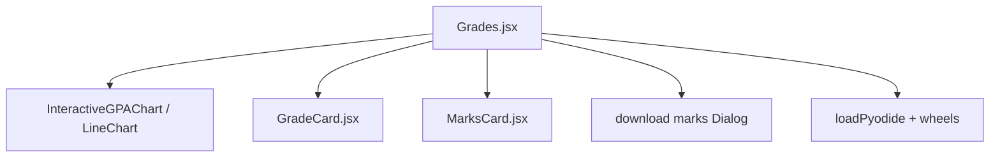
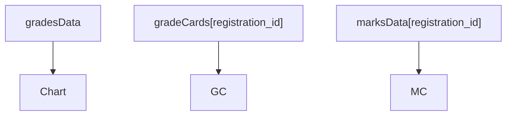
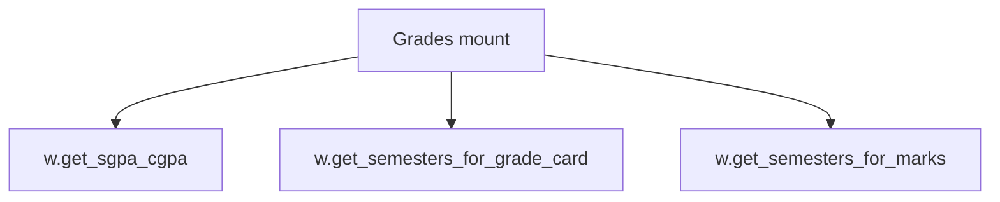
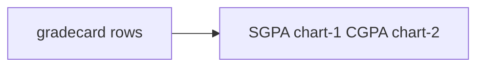
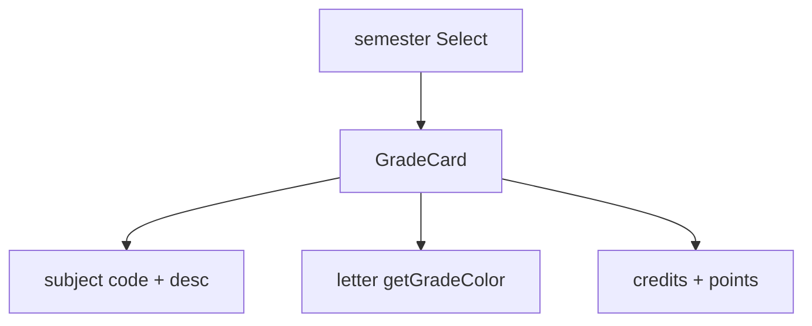
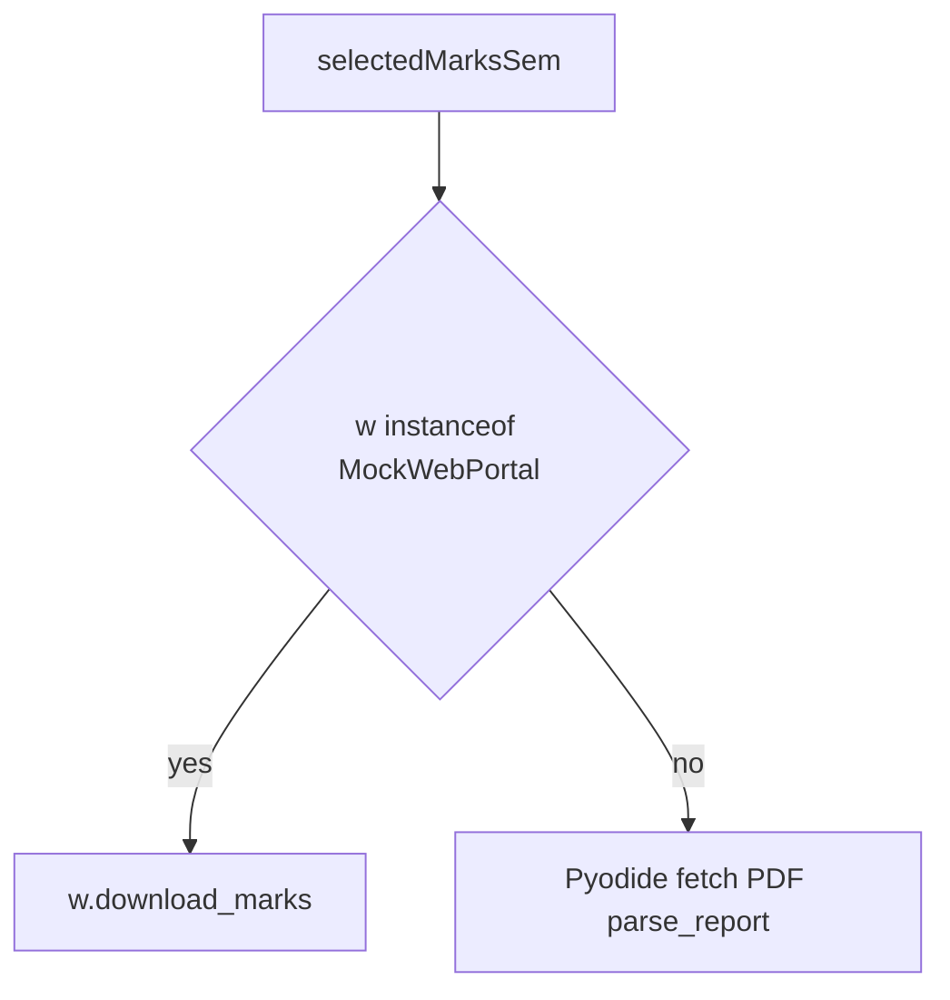
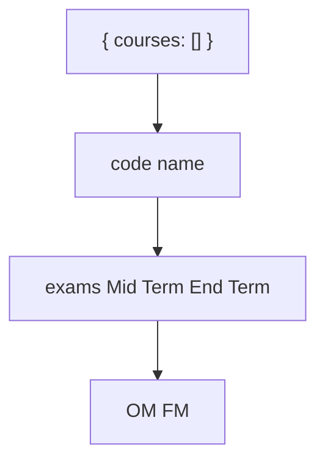

# Grades module

Three tabs. SGPA/CGPA chart, grade cards, marks. Real marks go through Pyodide and PyMuPDF. Demo marks come from `download_marks`.

See [Attendance Module](4.1-attendance-module), [Exams Module](4.3-exams-module), [Subjects Module](4.4-subjects-module), [Profile Module](4.5-profile-module).

| Tab | Method |
| --- | --- |
| Overview | `w.get_sgpa_cgpa()` |
| Semester | `w.get_grade_card(semester)` |
| Marks | demo `w.download_marks`, real Pyodide PDF |

## Component architecture



## State management

### Core data state



Caches skip refetch when the semester key exists.

## Data flow and API integration

### Initial data loading



Semester change: set loading, pick semester, if `gradeCards[value]` use it, else `w.get_grade_card(semester)` and write cache.

## Overview tab

### Data visualization



Fields include `stynumber`, `sgpa`, `cgpa`, `earnedgradepoints`, `totalcoursecredit`. Grid uses `--border`, axes `--muted-foreground`.

## Semester tab

### Grade card structure



`getGradeColor` maps A+ → `text-grade-aa` through F → `text-grade-f`.

## Marks tab

### Dual-mode operation



Real path:

1. Endpoint `/studentsexamview/printstudent-exammarks/{instituteid}/{registration_id}/{registration_code}`
2. Headers from `w.session.get_headers(generate_local_name())`
3. `loadPyodide()`, load PyMuPDF and `jiit_marks-0.2.0` from `${artifactBaseUrl}`
4. `parse_report(doc)` then convert to JS

Wheels are listed in VitePWA `additionalManifestEntries`.

## Marks data structure



`MarksCard` progress bar. Colors: outstanding ≥80, good ≥60, average ≥40, poor below.

## Download marks dialog

`handleDownloadMarks` calls `w.download_marks(semester)`. Real mode downloads the PDF. Demo returns JSON and does not write a file.

## UI components and styling

Radix `Tabs` three columns. `Select` on semester and marks tabs. Chart `ResponsiveContainer` height 250.

## Error handling

* Overview: `"Unexpected end of JSON input"` → "Grade sheet is not available"
* Empty semester lists → not available yet
* PDF errors log; `marksLoading` always clears in `finally`

## Integration with mock data system

```
fakeData.grades.gradesData
fakeData.grades.gradeCardSemesters
fakeData.grades.gradeCards[semKey]
fakeData.grades.marksSemesters
fakeData.grades.marksData[semKey]
```

Matching `MockWebPortal` methods: `get_sgpa_cgpa`, `get_semesters_for_grade_card`, `get_grade_card`, `get_semesters_for_marks`, `download_marks`.

## Performance considerations

Separate caches, lazy marks load, 30MB SW cache for wheels.

## Theme integration

`--chart-1` SGPA, `--chart-2` CGPA, `--grade-*`, `--marks-*`. See [Theme System](3.4-theme-system).
