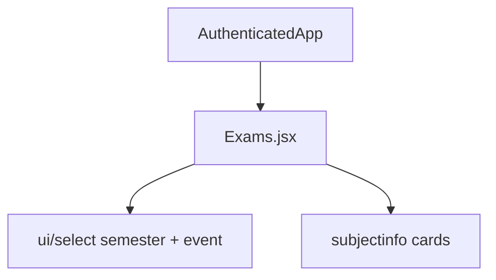
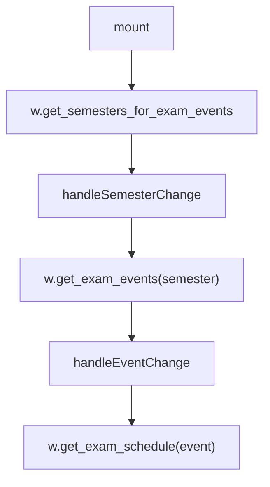
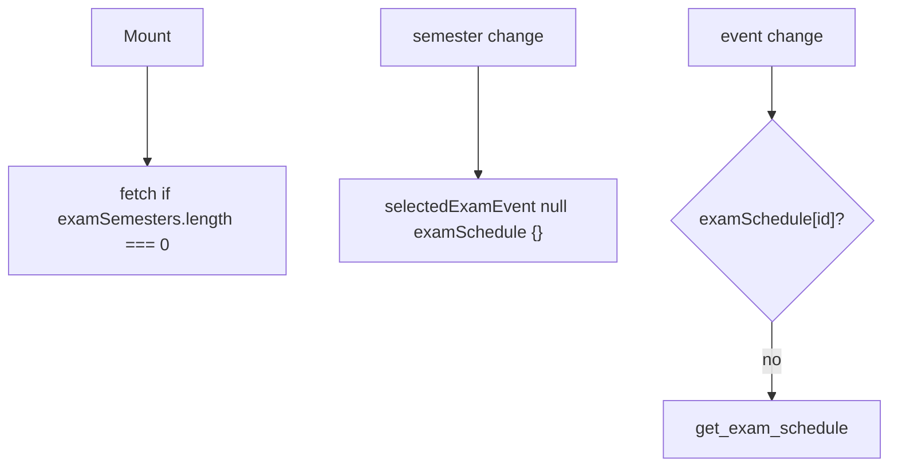
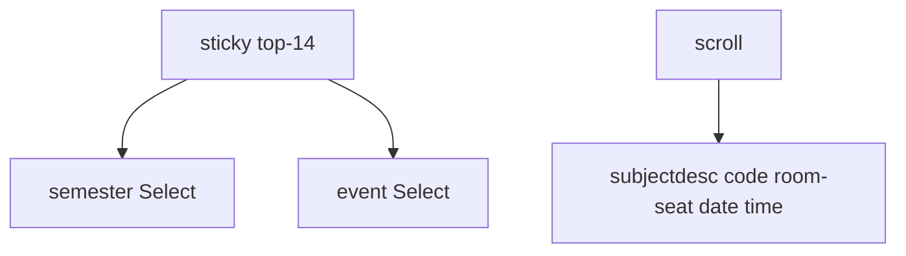

# Exams module

Semester, then exam event, then schedule cards (date, time, room, seat).

See [Attendance Module](4.1-attendance-module), [Grades Module](4.2-grades-module), [Subjects Module](4.4-subjects-module), [Data Layer & API Integration](3.3-data-layer-and-api-integration).

## Component architecture

`w` plus `examSchedule`, `examSemesters`, `selectedExamSem`, `selectedExamEvent` and setters. Local: `examEvents`, `loading`.

## State management

| Variable | Source |
| --- | --- |
| `examSchedule` | parent, keyed by event id |
| `examSemesters` | parent |
| `selectedExamSem` | parent |
| `selectedExamEvent` | parent |
| `examEvents` | local |
| `loading` | local |

## Data flow and API integration

`get_exam_schedule` returns `{ subjectinfo }`. Cached under `exameventid || exam_event_id`.

## Component lifecycle and event handlers

## User interface structure

`formatDate` turns `DD/MM/YYYY` into a long en-US date.

Event objects may use `exameventid` / `exameventdesc` or `exam_event_id` / `exam_event_desc`. Code reads both.

Empty states: Loading..., cards, "No exam schedule available", or nothing if no event.

Mock: `fakeData.exams.examSemesters`, `examEvents`, `examSchedule`.
