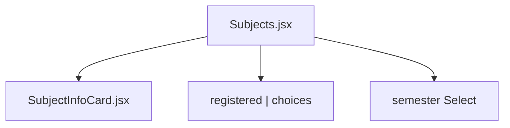
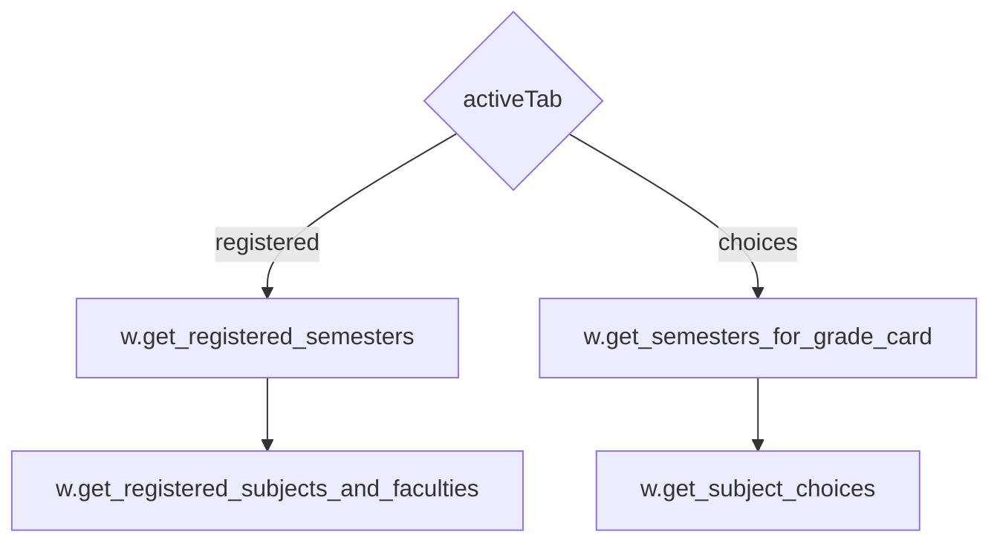
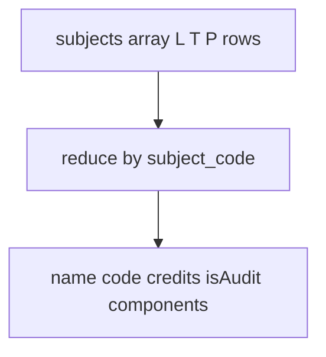
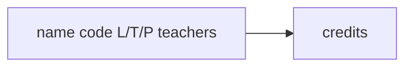
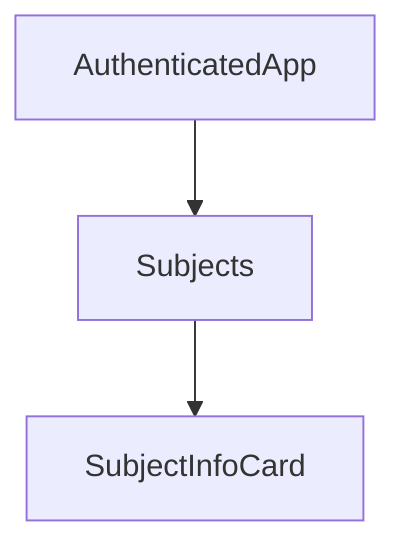
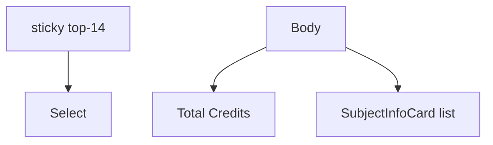
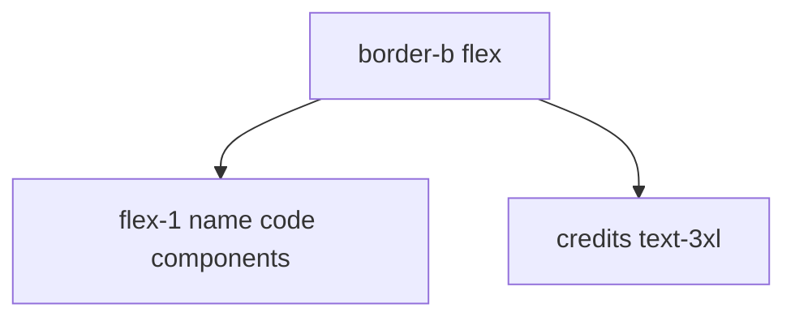
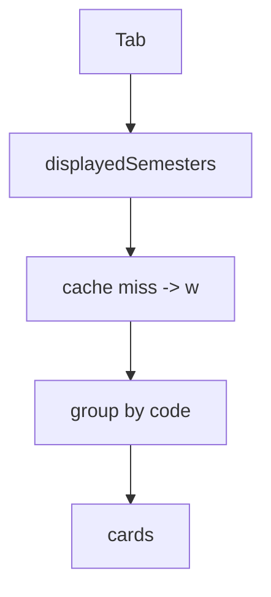

# Subjects module

Registered courses and a choices tab. Groups L/T/P rows that share a subject code.

Related: [Attendance Module](4.1-attendance-module), [Exams Module](4.3-exams-module).

## Component architecture

Props include `w`, `subjectData`, `semestersData`, `selectedSem`, `subjectChoices`, `activeTab`, and the loading flags lifted in `App.jsx`.

## Component: Subjects.jsx

### Data fetching flow

Cache keys are `semester.registration_id`. Choices land in `subjectChoices`. Registered subjects land in `subjectData`.

### Subject grouping logic

Each component: `{ type: subject_component_code, teacher: employee_name }`. Audit when `audtsubject === "Y"`.

## Component: SubjectInfoCard.jsx

`L` Lecture, `T` Tutorial, `P` Practical.

## Data layer integration

`get_registered_semesters()` → semester list.

`get_registered_subjects_and_faculties(semester)` → `{ subjects, registered_subject_faculty }`.

`get_subject_choices(semester)` → object with `subjectpreferencegrid` in mock data.

Mock keys: `fakeData.subjects.semestersData`, `subjectData[semKey]`, `choiceSubjects`.

## State management pattern

Local loading booleans are actually lifted (`loading`, `subjectsLoading`, `choicesLoading`).

## UI components

## Styling and layout

`max-[390px]` shrinks type.

## Data flow summary

