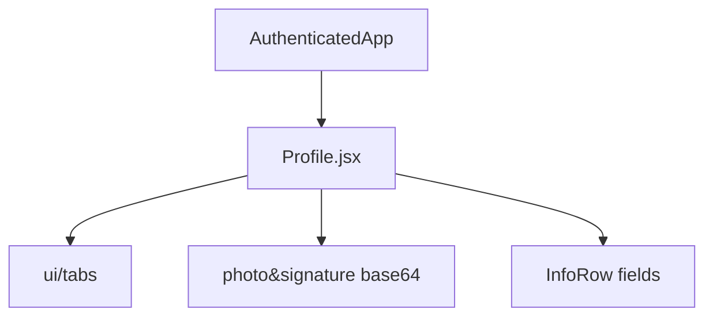
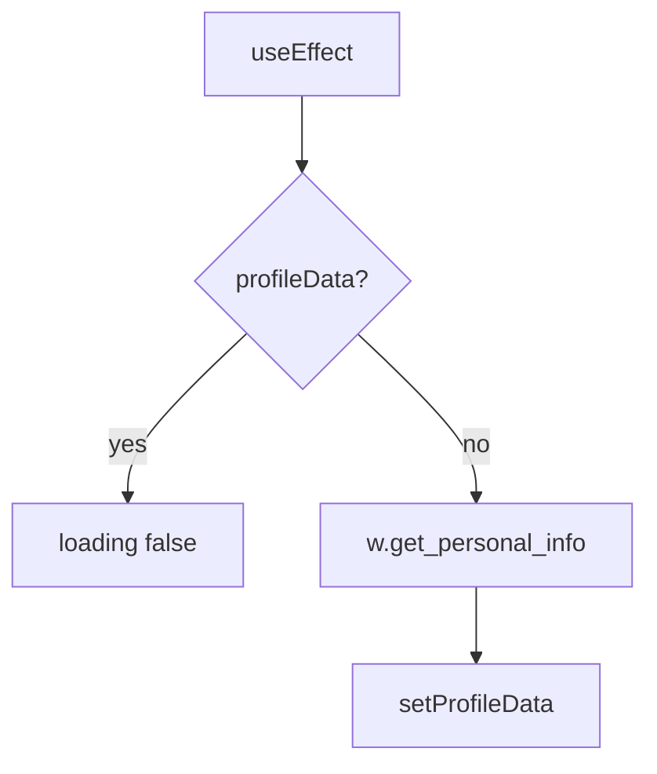
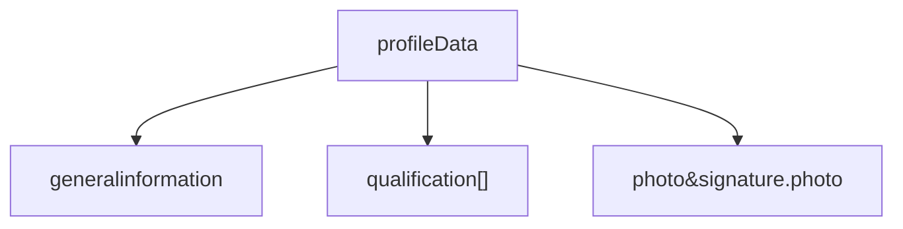
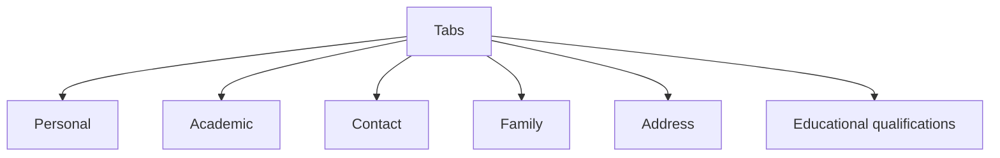

# Profile module

Student record from `w.get_personal_info()`. Tabs over personal, academic, contact, family, addresses, qualifications.

Related: [Header](5.2-theme-and-navigation-components), [Data Layer & API Integration](3.3-data-layer-and-api-integration).

## Component architecture

### Component structure



| Prop | Role |
| --- | --- |
| `w` | portal |
| `profileData` | cache |
| `setProfileData` | setter |

## Data flow

### Data fetching flow diagram



Errors log to console. Loading always clears.

## Data structure

### Profile data schema



Mock:

```
async get_personal_info() {
  return fakeData.profile;
}
```

## UI layout and sections

### Section breakdown



| Section | Fields |
| --- | --- |
| Personal | name, registration, DOB, gender, blood group, nationality, category |
| Academic | program, branch, section, batch, semester, institute, years |
| Contact | college email, personal email, mobile, telephone |
| Family | parent names and contacts |
| Addresses | current and permanent |
| Qualifications | board, year, marks, percentage, division, grade |

`InfoRow` stacks on mobile, row on `sm+`. Missing values print `N/A`.

Navbar path `/profile`. Route:

```
<Route path="/profile" element={<Profile w={w} profileData={profileData} setProfileData={setProfileData} />} />
```
