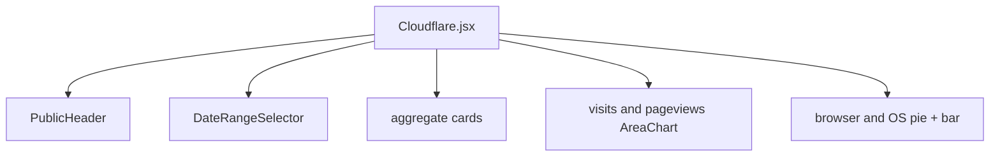
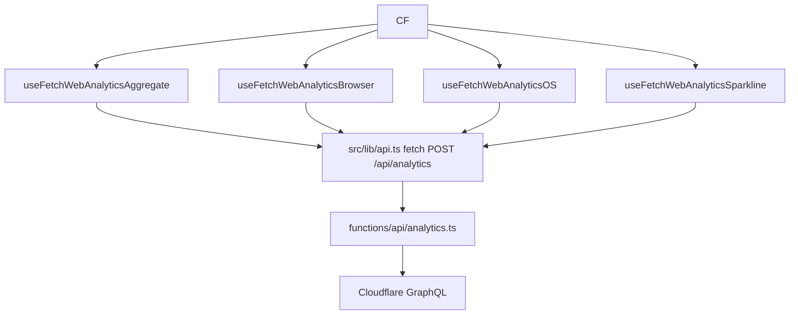
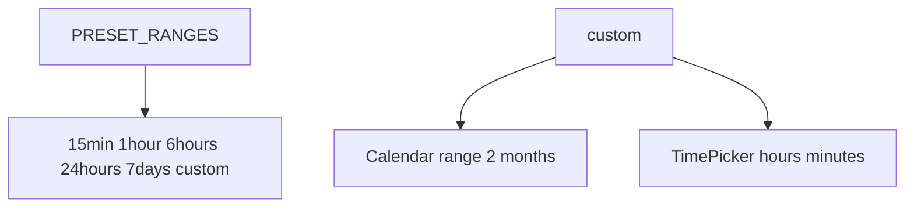
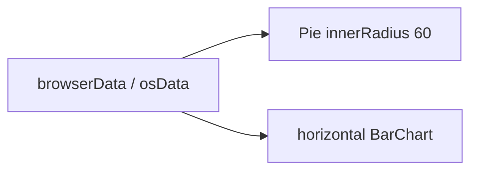

# Analytics dashboard

Public `/stats` page. Cloudflare Web Analytics through `POST /api/analytics`. No `w` prop.

Related: [Feature Modules](4-feature-modules), [UI Components](5-ui-components).

Live: https://codeblech.github.io/jportal/#/stats.

## Overview

* Totals: visits and page views
* Area charts over time
* Browser and OS pie + bar
* Date range presets and a custom calendar

## Component architecture

### Main component structure

## State management

`dateRange` defaults to the last 7 days. Chart colors read `--chart-1` … `--chart-5` from the computed style so they follow the theme.

## Data fetching layer

### Custom hooks architecture

Hooks wrap `useQuery` in `src/hooks/cloudflare.ts`. Query keys round timestamps to 5 minutes. `staleTime` is 5–15 minutes.

`api.ts` notes that Pages Functions hold secrets. The client no longer needs the old `VITE_CLOUDFLARE_*` values for production. Vite still proxies `/api/cloudflare` in dev if you set `VITE_CLOUDFLARE_API_TOKEN`.

## Date range selection

### DateRangeSelector component

Custom dates clamp from 2020-01-01 to now.

## Visualizations

### Distribution chart architecture

Skeletons while each query loads. Empty copy: "No visits data available" and similar.

`getDateRangeDescription()` writes subtitles like "last 7 days" or a custom span.

## Configuration

Production: Cloudflare Pages function `functions/api/analytics.ts` injects `CLOUDFLARE_ACCOUNT_TAG`, `CLOUDFLARE_SITE_TAG`, `CLOUDFLARE_API_TOKEN`.

Dev: `vite.config.ts` `/api/cloudflare` proxy.

## Integration with application

`/stats` is registered on `App`'s router, not inside `AuthenticatedApp`. `PublicHeader` can show a back button. Layout is a sticky header, date selector, two metric cards, two area charts, then a two-column distribution grid.
