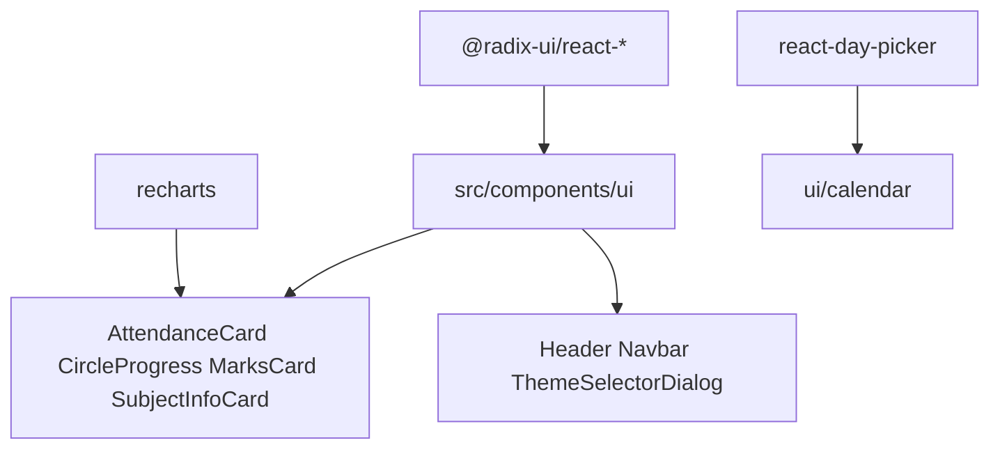
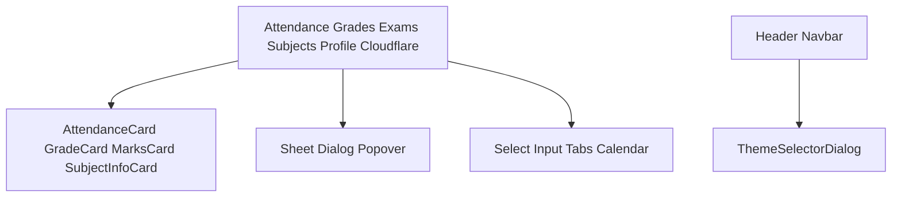
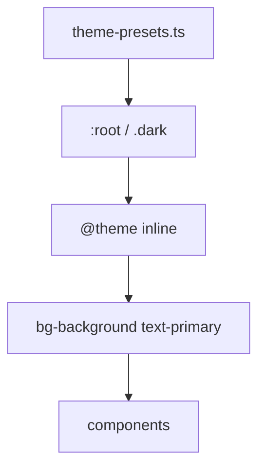
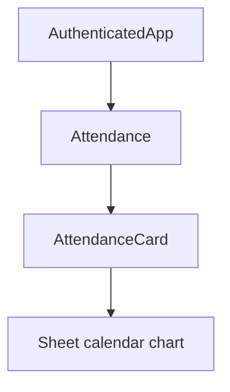

# UI components

* Feature cards: [Custom Feature Components](5.1-custom-feature-components)
* Header, navbar, theme widgets: [Theme & Navigation Components](5.2-theme-and-navigation-components)
* Radix wrappers: [Base UI Components](5.3-base-ui-components)
* CSS: [Styling System](5.4-styling-system)

## Component architecture overview

Three layers: Radix primitives, styled `ui/` wrappers, domain components.

### Component hierarchy diagram

## UI library stack

### Dependency matrix

| Layer | Library | Version | Role |
| --- | --- | --- | --- |
| Primitives | `@radix-ui/react-*` | 1.x–2.x | Unstyled accessible parts |
| Wrappers | `src/components/ui/*.jsx` | app | Theme classes + CVA |
| Feature | `src/components/*.jsx` | app | Attendance, grades, etc. |
| Charts | `recharts` | 2.15.4 | Line, area, pie, bar |
| Calendar | `react-day-picker` | 8.10.1 | Attendance and stats |
| CSS | `tailwindcss` | 4.1.12 | Utilities |
| Variants | `class-variance-authority` | 0.7.0 | Button, Sheet sides |
| Merge | `clsx`, `tailwind-merge` | `cn()` in `lib/utils.js` |

Import pattern: wrappers from `@/components/ui/*`, charts from `recharts`, `cn` from `@/lib/utils`.

## Component categories

### Category breakdown by function

| Type | Common props | Example |
| --- | --- | --- |
| Feature cards | subject, selectedSubject, data | `AttendanceCard` |
| Display | percentage, label, className | `CircleProgress` |
| Pages | `w`, state, setters | `Profile` |
| Wrappers | className, children | `ui/button` |
| Nav | `navItems` paths | `Navbar` |

## Styling infrastructure

### CSS architecture layers

Groups in `index.css`: Shadcn colors, charts, `grade-*`, `marks-*`, fonts, radius, shadows.

`CircleProgress` uses `stroke="var(--primary)"` and `fill-foreground`.

## Key design patterns

Sheet detail views (`AttendanceCard` `open={selectedSubject?.name === subject.name}`).

Responsive type: `max-[390px]:text-xs` on cards and navbar.

Recharts strokes and tooltip boxes use CSS variables.

Loading gates on pages (`Loading profile...`).

`cn()` merges default wrapper classes with `className`.

## Component communication patterns

### Props drilling architecture

| Pattern | Where |
| --- | --- |
| Fetch on click | `AttendanceCard` `handleClick` |
| Skip if cached | `subjectAttendanceData[subject.name]` |
| Loading around async | local `isLoading` |
| Clear on close | `setSelectedSubject(null)` |

Wrappers keep Radix keyboard, ARIA, and focus traps.
