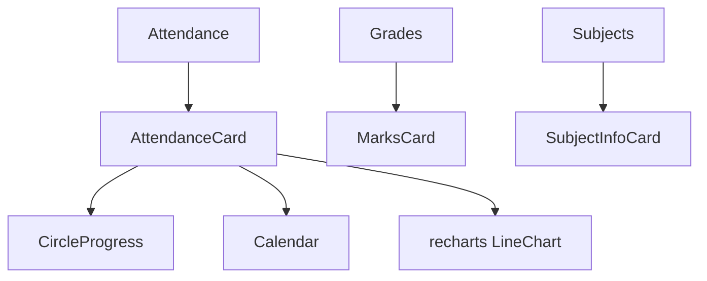
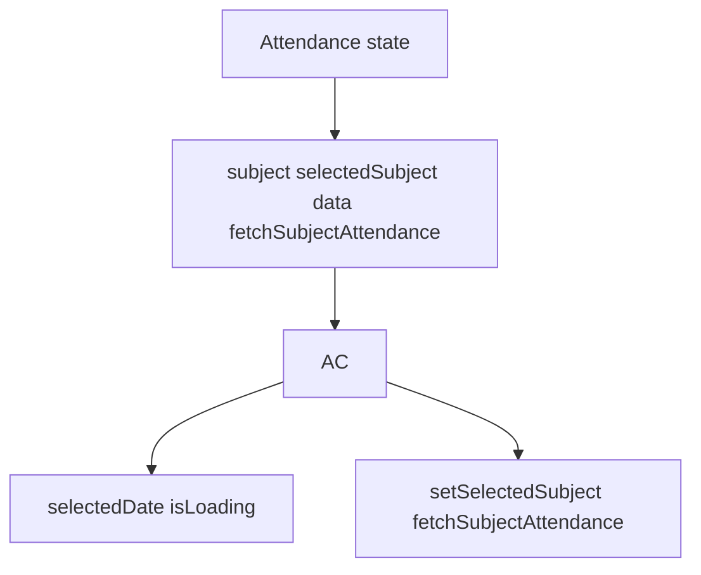
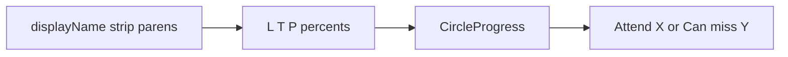
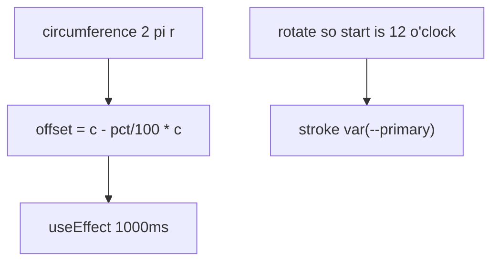
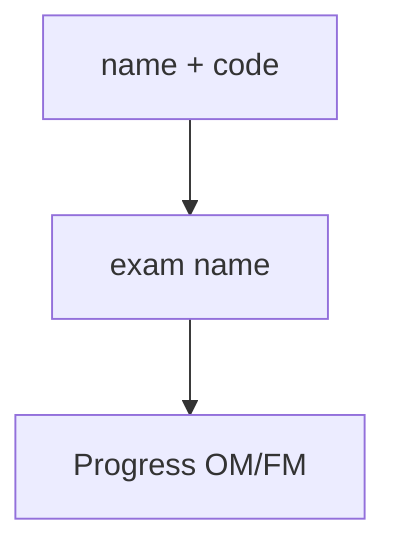
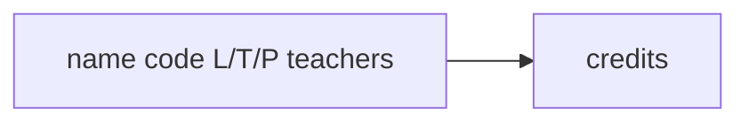
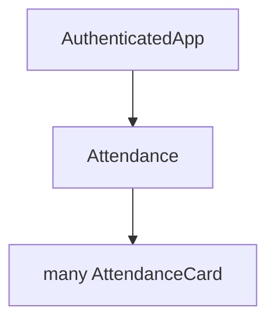

# Custom feature components

Attendance cards, progress rings, marks and subject cards.

Related: [Base UI Components](5.3-base-ui-components), [Theme & Navigation Components](5.2-theme-and-navigation-components).

## Overview

| Component | Used in |
| --- | --- |
| `AttendanceCard` | Attendance |
| `CircleProgress` | Attendance |
| `MarksCard` | Grades |
| `SubjectInfoCard` | Subjects |

`GradeCard` and `InteractiveGPAChart` sit beside these on the grades page.

## Component architecture

### Component hierarchy

### Data flow pattern

## AttendanceCard component

Props: `subject`, `selectedSubject`, `setSelectedSubject`, `subjectAttendanceData`, `fetchSubjectAttendance`.

#### Card view (collapsed)

#### Detail view (sheet)

Calendar modifiers: `presentSingle`, `absentSingle`, doubles, triples, mixed gradients. Chart from `processAttendanceData()`.

`getDayStatus` formats `DD/MM/YYYY`, filters records, returns booleans. `processAttendanceData` sorts, accumulates, one percentage per day.

## CircleProgress component

### SVG implementation

Props: `percentage`, optional `label`, `className`.

## MarksCard component

### Visual layout

`getProgressColor`: ≥80 outstanding, ≥60 good, ≥40 average, else poor.

## SubjectInfoCard component

### Layout implementation

`L` Lecture, `T` Tutorial, `P` Practical. `isAudit` from grouped data.

## Component integration patterns

### Props drilling pattern

Lazy load: click card → if no `subjectAttendanceData[name]` call `fetchSubjectAttendance`.

Responsive: `max-[390px]` on type and ring size.
