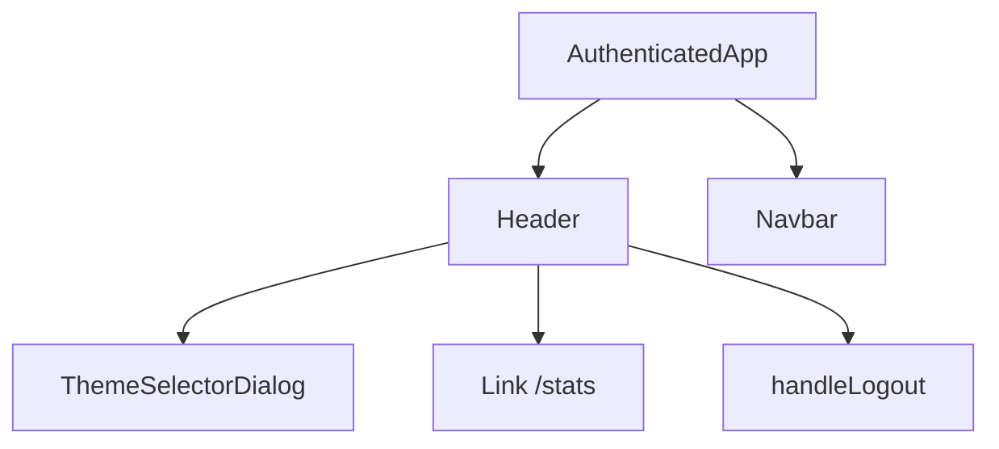
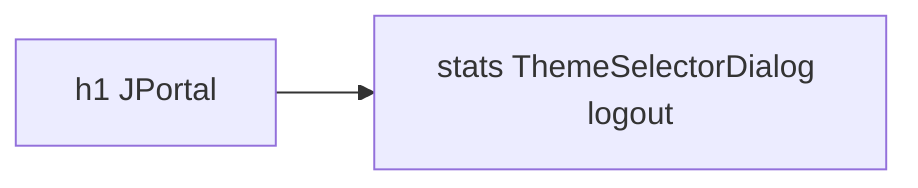
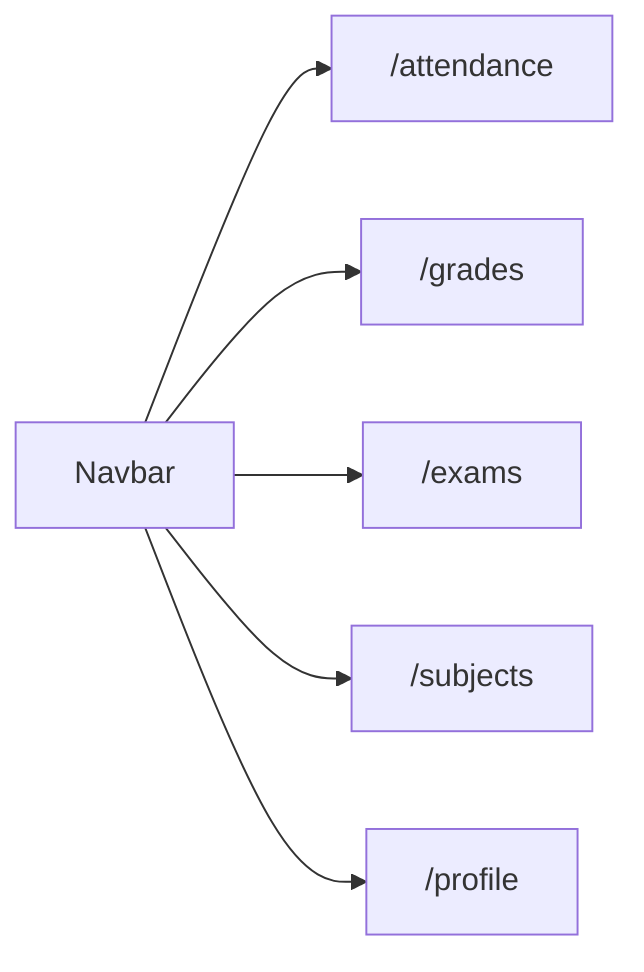
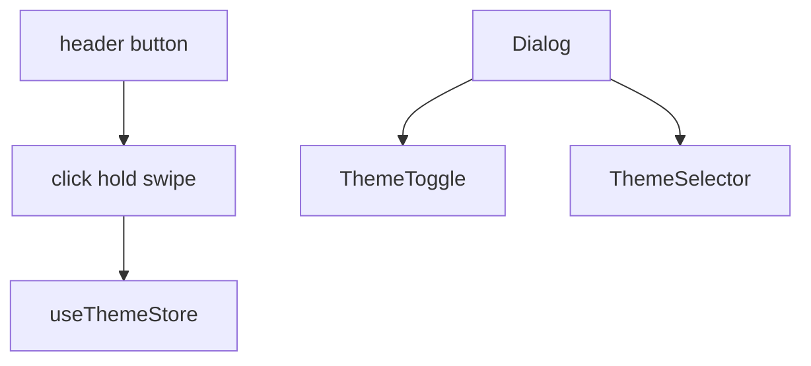
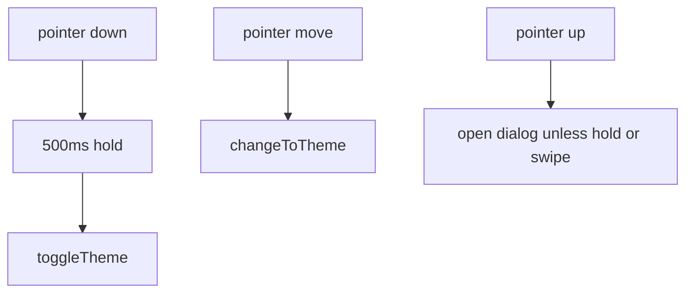
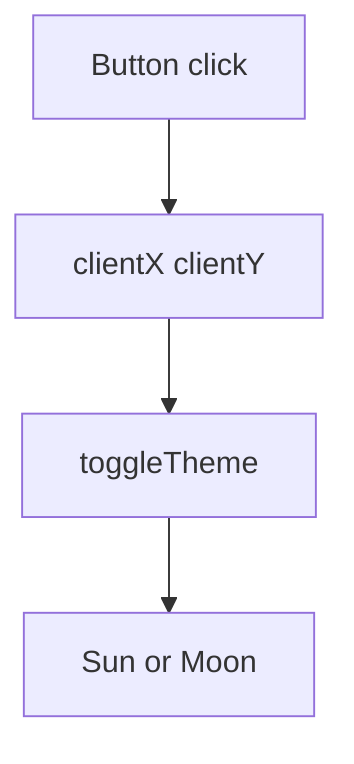
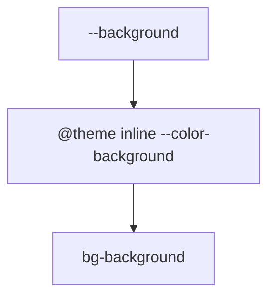
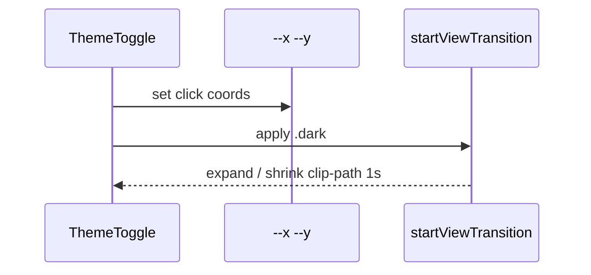
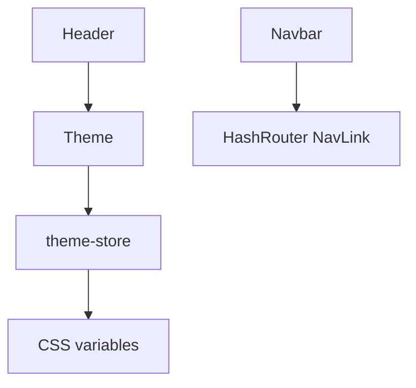

# Theme & navigation components

`Header` and `Navbar` stay on authenticated screens. Theme widgets live in the header.

Related: [UI Components](5-ui-components), [Theme System](3.4-theme-system), [Base UI Components](5.3-base-ui-components).

## Navigation component architecture

### Component hierarchy

## Header component

### Component structure

Props: `setIsAuthenticated`, `setIsDemoMode`.

Logout removes `username`, `password`, `attendanceData`, clears auth and demo, `navigate("/login")`.

`FairyLights` exists in the file but is commented out in the render.

## Navbar component

### Navigation configuration

`navItems` in `Navbar.jsx`. Icons via `?react` from `public/icons/`. Active: `opacity-100`, `bg-primary`, `fill-primary-foreground`. Fixed `bottom-0 left-0`.

## Theme selector dialog

### Component architecture

| Gesture | Action |
| --- | --- |
| Click under 500ms | Open dialog |
| Hold 500ms | Toggle light/dark |
| Swipe X or Y past 50px | Next or previous preset |

Refs: `holdTimeoutRef`, `isHoldingRef`, `touchStartRef`, `hasSwipedRef`.

### Event handler implementation

## Theme toggle component

### Component flow

## CSS variables and theme tokens

### Variable mapping architecture

Radius: `--radius-sm` = `calc(var(--radius) - 4px)` and siblings. Fonts: `--font-sans`, `--font-mono`, `--font-serif`.

Grade and marks tokens in `index.css` (`--color-grade-aa`, `--color-marks-outstanding`, …). Marks bands in `MarksCard` are 80/60/40, not 90/70/50.

## View transition animations

### Animation implementation

`@supports (view-transition-name: none)`. Without it, the class flips with no animation.

## Global styling utilities

Body `bg-background text-foreground`. Scrollbars hidden. Snap utilities `.snap-y`, `.snap-mandatory`, `.snap-start` for the attendance sheet.

## Component integration summary

