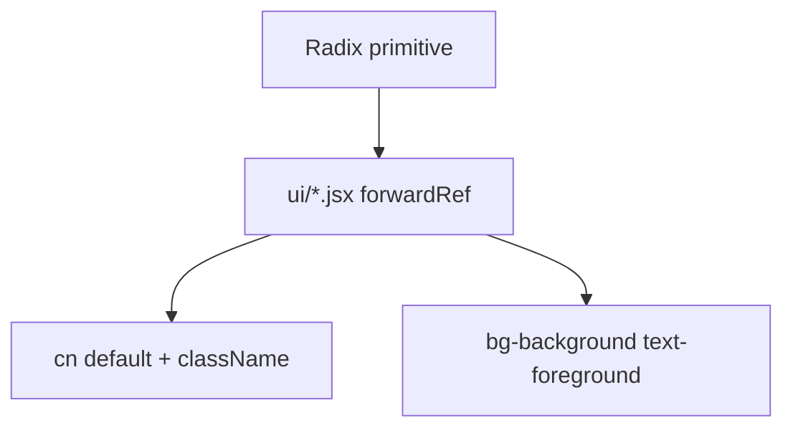
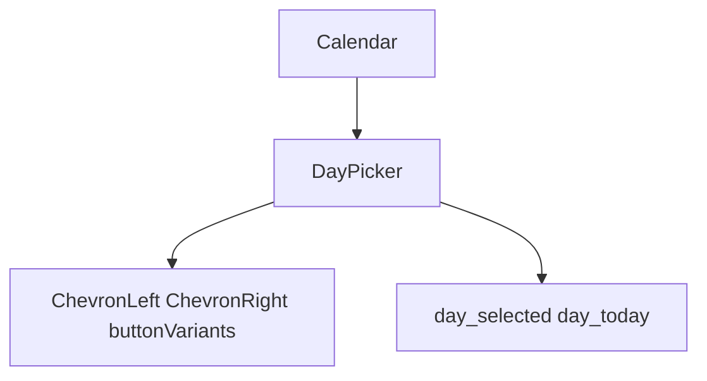
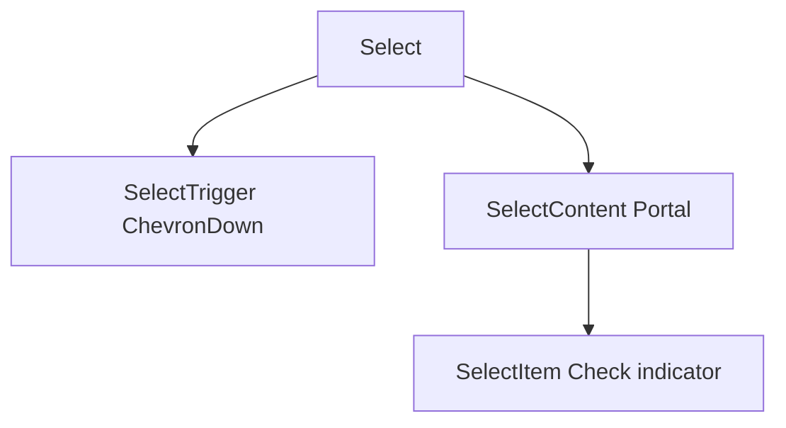
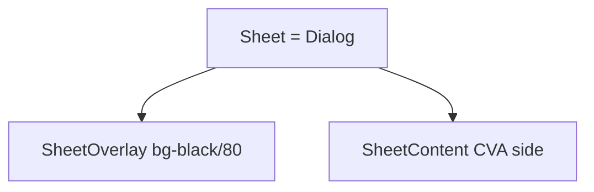
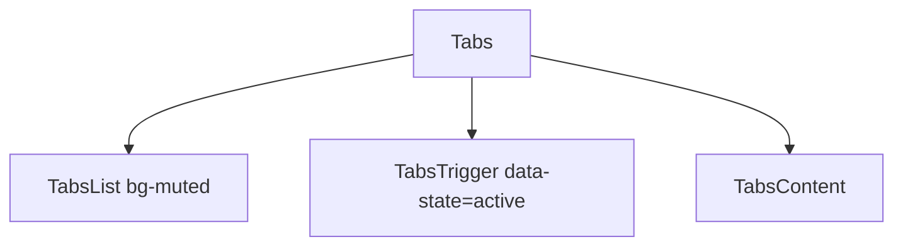
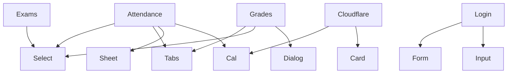

# Base UI components

Files in `src/components/ui/`. Feature cards sit on top of these.

See [Custom Feature Components](5.1-custom-feature-components), [Theme & Navigation Components](5.2-theme-and-navigation-components), [Styling System](5.4-styling-system).

## Architecture overview

Radix + Tailwind + CVA. `forwardRef`, `cn()`, CSS variables.

### Component layer architecture

Also in the folder: `button`, `button-group`, `card`, `chart`, `dialog`, `dropdown-menu`, `form`, `input`, `label`, `popover`, `progress`, `select`, `separator`, `sheet`, `skeleton`, `sonner`, `tabs`, `time-picker*`. There is no tooltip, checkbox, radio, switch, slider, badge, or avatar wrapper in this tree.

## Common component patterns

`React.forwardRef` on Calendar, Select, Sheet, Tabs. `displayName` copied from the primitive.

`cn()` from `src/lib/utils.js`. Theme via `bg-background`, `border-input`, `ring-ring`.

## Component catalog

### Calendar component

#### Component structure

Selected: `bg-primary`. Today: `bg-accent`.

### Select component

#### Component composition

Used for semesters and exam events.

### Sheet component

#### Component architecture

Sides: top, bottom, left, right (default). Attendance uses bottom sheets.

### Tabs component

#### Component composition

Attendance overview/daily. Grades three tabs. Subjects registered/choices. Profile sections.

## Button component reference

`src/components/ui/button.jsx` exports `Button` and `buttonVariants`. Calendar nav and day cells reuse `buttonVariants`.

## Styling integration

Tailwind utilities from `@theme inline`. Animate plugin: `animate-in`, `fade-in-0`, `slide-in-from-*`. Sheet width `sm:max-w-sm`.

## Other base components

Present: Dialog, Popover, Dropdown Menu, Input, Label, Form, Card, Separator, Skeleton, Progress, Chart, Sonner, Time picker. Do not document missing shadcn pieces as if they shipped.

## Integration with feature modules

