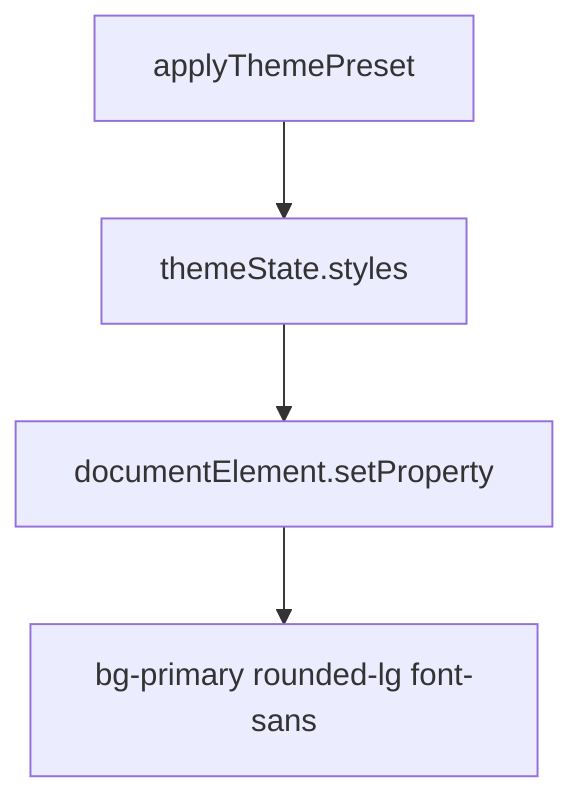
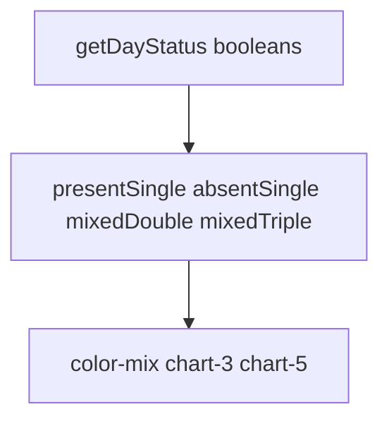

# Styling system

Tailwind CSS v4, CSS variables, theme tokens, and how components consume them.

Related: [Theme System](3.4-theme-system), [Base UI Components](5.3-base-ui-components).

## Architecture overview

Presets → CSS variables → `@theme inline` → utilities → JSX className.

## Tailwind CSS v4 setup

`index.css`:

```
@import "tailwindcss";
@plugin 'tailwindcss-animate';
@custom-variant dark (&:is(.dark *));
```

No `tailwind.config.js`. PostCSS uses `@tailwindcss/postcss`.

## CSS variables & theme tokens

`@theme inline` maps `--color-background: var(--background)` so `bg-background` tracks the preset.

`:root` holds fallbacks (HSL/hex). Zustand overwrites them at runtime.

### Dynamic theme application



Switching to Violet Bloom updates `--primary`, `--radius`, `--font-sans`.

## Color system

Semantic names: background, card, primary, muted, accent, destructive, border, input, ring.

Charts: `--chart-1` … `--chart-5`.

JPortal extras: `--grade-aa` … `--grade-f`, `--marks-outstanding` / `good` / `average` / `poor`.

## Component-specific styling examples

### AttendanceCard calendar styling



Mixed two-class days use a 90deg split gradient. Triple mixed days use a conic gradient. Snap classes in `index.css` keep the sheet sections aligned.
