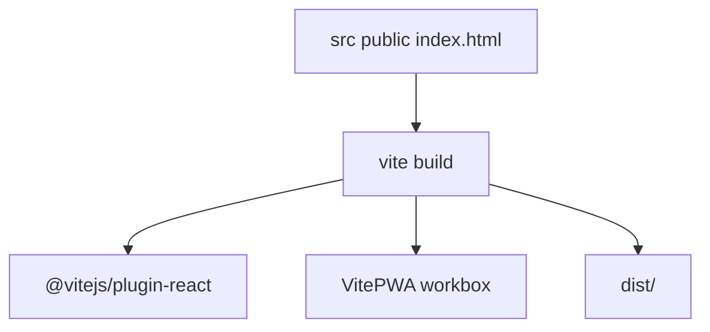
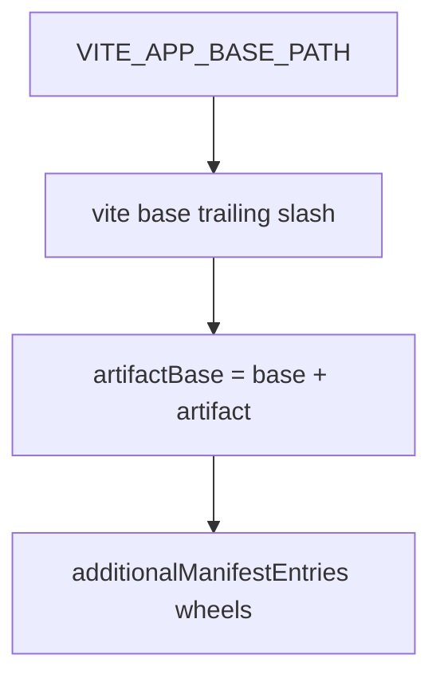
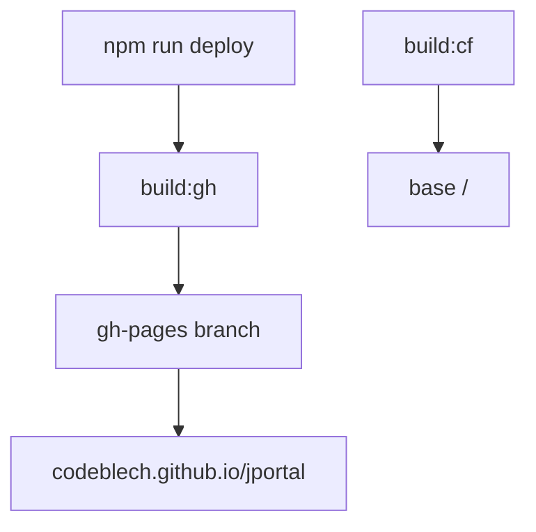
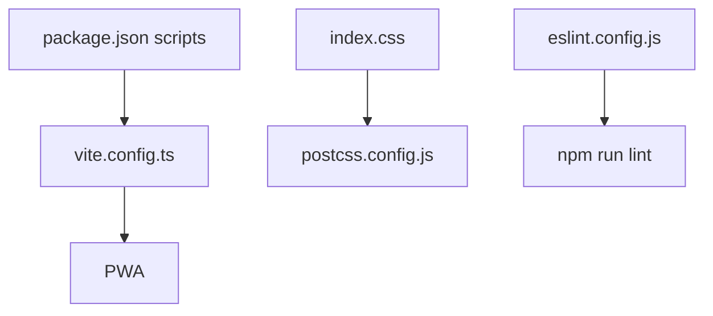

# Build & deployment

Vite 7, PWA packaging, GitHub Pages and Cloudflare Pages bases.

Related: [PWA Configuration](6.1-pwa-configuration), [Development Workflow](6.2-development-workflow).

## Build system architecture

| Tool | Purpose | Config |
| --- | --- | --- |
| Vite 7.3.1 | Dev and build | `vite.config.ts` |
| TypeScript | Check `.ts`/`.tsx` | `tsconfig.json` |
| ESLint | Lint | `eslint.config.js` |
| PostCSS | Tailwind 4 | `postcss.config.js` |
| VitePWA | SW + manifest | `VitePWA({...})` |
| SVGR | SVG as React | `vite-plugin-svgr` |

There is no `tailwind.config.ts`.

## Build pipeline flow



## NPM scripts

| Script | Command |
| --- | --- |
| `dev` | `vite` |
| `build` | `vite build` |
| `build:gh` | `VITE_APP_BASE_PATH=/jportal/ vite build` |
| `build:cf` | `VITE_APP_BASE_PATH=/ vite build` |
| `lint` | `eslint .` |
| `preview` | `vite preview` |
| `predeploy` | `npm run build:gh` |
| `deploy` | `gh-pages -d dist` |

### Build command execution



## Vite configuration

`base` is `VITE_APP_BASE_PATH` or `/`, always with a trailing slash. It is not hardcoded to `/jportal/` except in `build:gh`.

Plugins: React, SVGR, VitePWA.

Alias `@` → `./src`. Extra alias pins `lucide-react` to `dist/esm/lucide-react.js` for Vite 7.

Dev proxy `/api/cloudflare` → `https://api.cloudflare.com` with `VITE_CLOUDFLARE_API_TOKEN`.

## PWA build configuration

`registerType: autoUpdate`, `injectRegister: auto`, `devOptions.enabled: true`.

Workbox: 30MB max, glob `js,css,html,ico,png,svg,whl`. CacheFirst Pyodide 0.23.4. Precache wheels at `${base}artifact/`.

See [PWA Configuration](6.1-pwa-configuration).

## Deployment process



| Setting | Value |
| --- | --- |
| Homepage | `https://codeblech.github.io/jportal` |
| GH base | `/jportal/` |
| CF base | `/` |
| Branch | `gh-pages` |

## Build artifacts structure

```
dist/
├── index.html
├── assets/
├── manifest.webmanifest
├── sw.js
├── workbox-*.js
├── pwa-icons/
└── artifact/*.whl
```

Pyodide script and Cloudflare beacon stay as CDN tags in `index.html`. Beacon token is `577196b322974e1ab3ca0d3e9a8f78b5`.

## Build optimization techniques

Vite splits vendor chunks by import graph. Feature pages are static imports in `App.jsx`, not `React.lazy`. Do not claim route-level lazy loading.

Hashes on assets, Workbox precache, CDN cache for Pyodide.

## Environment variables

`loadEnv(mode, process.cwd(), "")`.

| Variable | Use |
| --- | --- |
| `VITE_APP_BASE_PATH` | `base` and wheel URLs |
| `VITE_CLOUDFLARE_API_TOKEN` | Dev proxy Authorization |

Production analytics secrets live on the Pages function, not in `VITE_*`.

## Ignored files

`node_modules/`, `dist/`, `dev-dist/`, `.vite/`, `*.local`, `*.env`.

## Build configuration files


