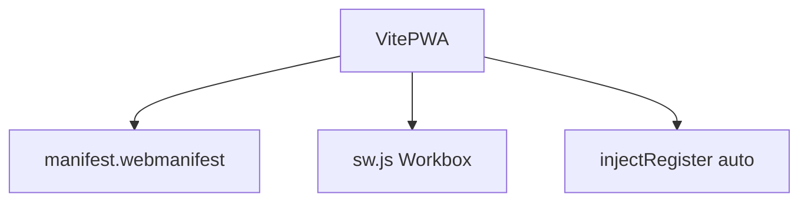
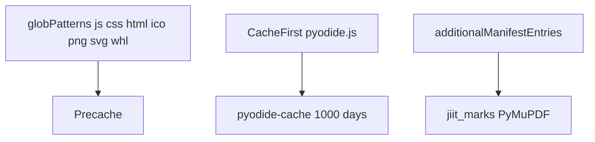
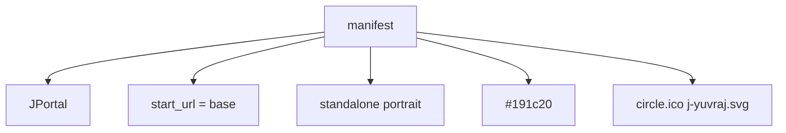
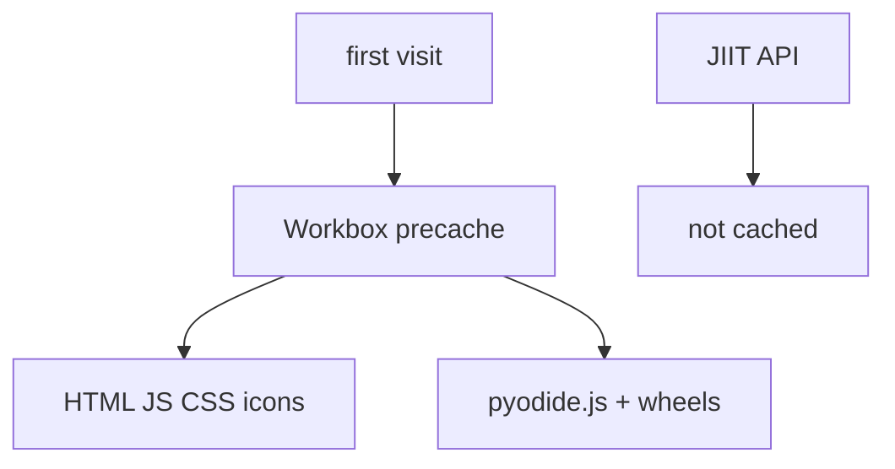
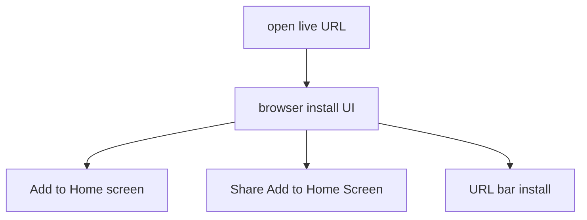

# PWA configuration

`vite-plugin-pwa` in `vite.config.ts`. Workbox generates `dist/sw.js`. There is no `public/sw.js`.

Related: [Build & Deployment](6-build-and-deployment), [Development Workflow](6.2-development-workflow).

## Overview

Offline shell, install prompts, large cache for Pyodide and wheels.

## VitePWA plugin integration

| Property | Value |
| --- | --- |
| `registerType` | `autoUpdate` |
| `injectRegister` | `auto` |
| `devOptions.enabled` | `true` |

## Workbox caching configuration

`maximumFileSizeToCacheInBytes` is 30MB.

Wheel URLs use `${artifactBase}` so GitHub Pages (`/jportal/artifact/...`) and Cloudflare (`/artifact/...`) both work.

`fakedata.json` is bundled from `src/assets`, not `public/`. JSON is not in `globPatterns`. Demo still works online because the JSON is in the JS bundle.

## Web app manifest

| Field | Value |
| --- | --- |
| name / short_name | JPortal |
| description | A web portal for students to view attendance and grades. |
| start_url | `base` from Vite |
| display | standalone |
| background_color / theme_color | `#191c20` |
| orientation | portrait |

Icons: 48 ico, maskable svg 72/96, svg 128/256, svg 512.

## Offline capabilities

Portal responses are not stored in the SW. Offline is the app shell plus demo bundle, not live attendance.

## Installation flow

Dev mode: `npm run dev` still registers a worker because `devOptions.enabled` is true.
