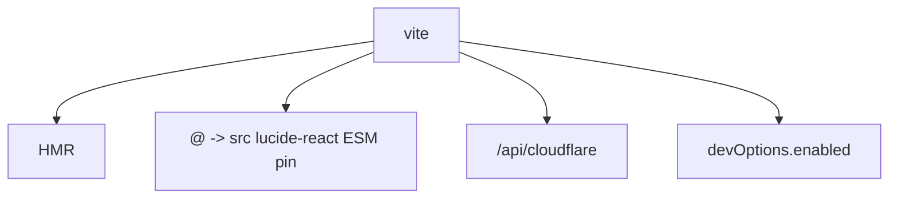
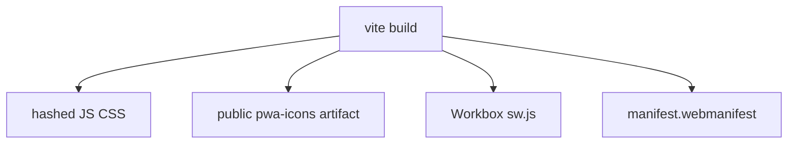
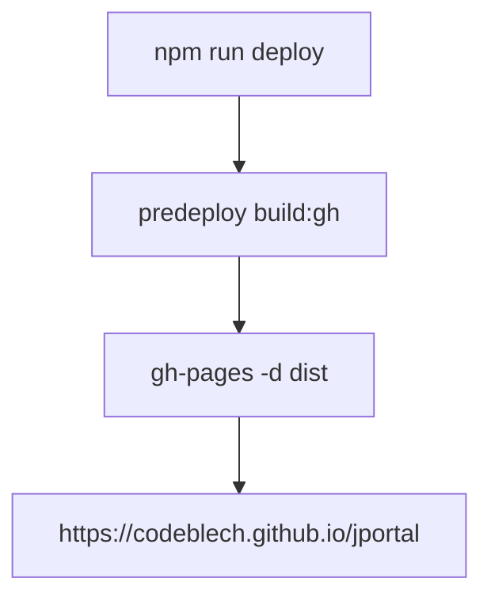
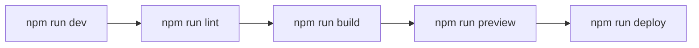

# Development workflow

npm scripts, local Vite, lint, production builds, GitHub Pages deploy.

See [PWA Configuration](6.1-pwa-configuration).

## Available scripts

| Script | Command |
| --- | --- |
| `dev` | `vite` |
| `build` | `vite build` |
| `build:gh` | `VITE_APP_BASE_PATH=/jportal/ vite build` |
| `build:cf` | `VITE_APP_BASE_PATH=/ vite build` |
| `lint` | `eslint .` |
| `preview` | `vite preview` |
| `predeploy` | `npm run build:gh` |
| `deploy` | `gh-pages -d dist` |

## Development server workflow

```
npm run dev
```

### Development server configuration



Default `base` is `/`. Use `build:gh` when you need `/jportal/`.

`VITE_` vars from `.env`. `.env` is gitignored.

## Production build process

```
npm run build
```



Outputs: `dist/index.html`, `dist/assets/*`, `dist/sw.js`, `dist/manifest.webmanifest`, icons, wheels.

## Code linting

```
npm run lint
```

Plugins: `@eslint/js`, `eslint-plugin-react`, `react-hooks`, `react-refresh`, `@tanstack/eslint-plugin-query`.

## Preview mode

```
npm run preview
```

Serves `dist/` (often port 4173). Use it to test the worker and base path.

## Deployment to GitHub pages

```
npm run deploy
```



`homepage` in `package.json` matches that URL. Router is `HashRouter` so Pages needs no rewrites.

## Complete development lifecycle



## Development dependencies

Vite 7, plugin-react, vite-plugin-pwa, vite-plugin-svgr, Tailwind 4 PostCSS, TypeScript 5.9, ESLint 9, gh-pages 6.2.
