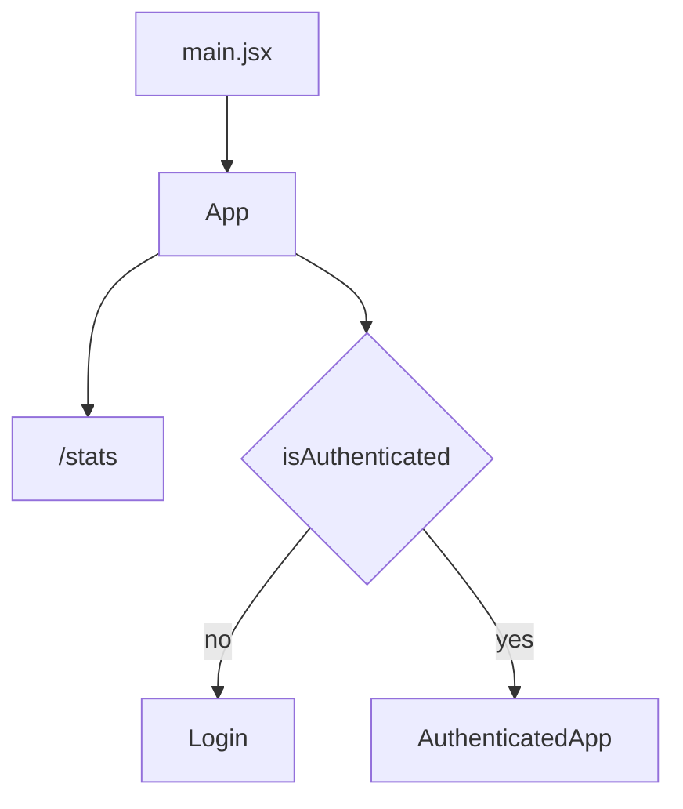
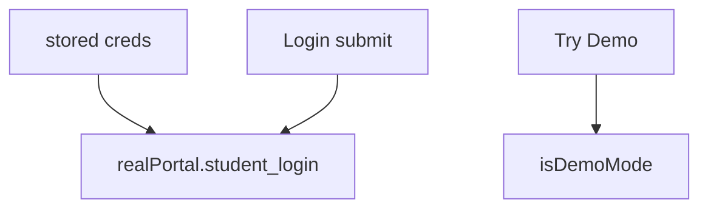
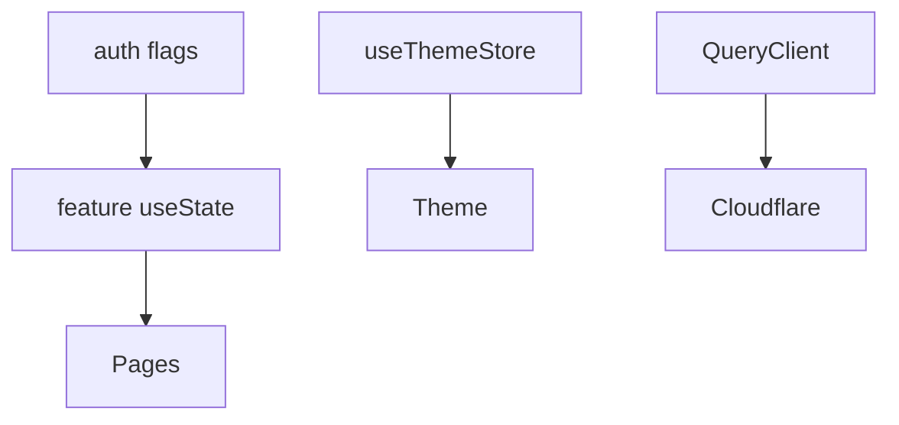
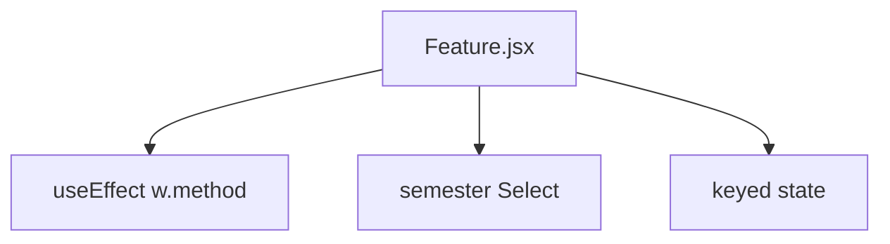
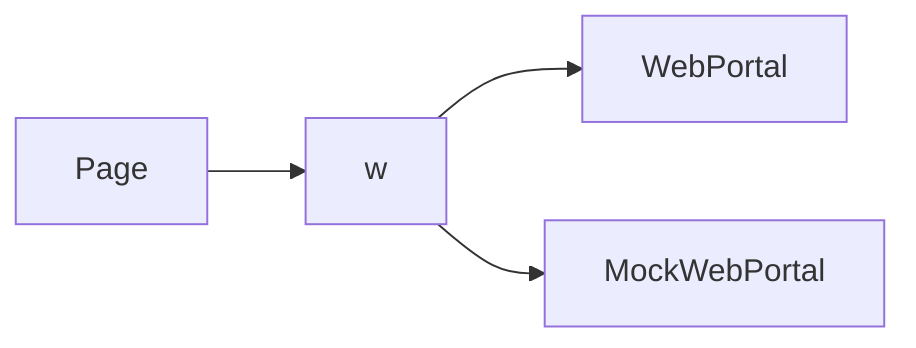
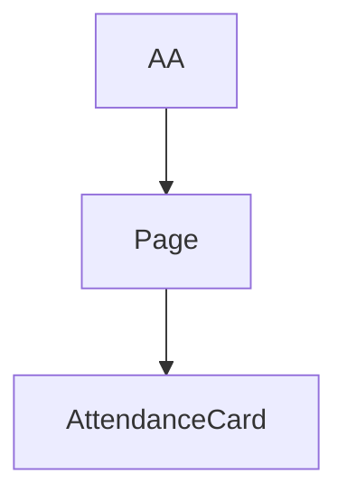
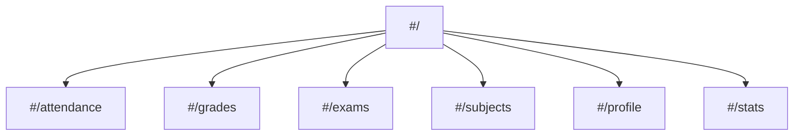

# Development guide

Layout of the code, patterns, and how to extend it.

Related: [Build & Deployment](6-build-and-deployment), [Mock Data System](7.1-mock-data-system), [Adding New Features](7.2-adding-new-features).

## Project setup

```
git clone https://github.com/tashifkhan/jportal
cd jportal/jportal
npm install
```

| Command | Purpose |
| --- | --- |
| `npm run dev` | Vite |
| `npm run build` | Production |
| `npm run build:gh` | `/jportal/` |
| `npm run preview` | Serve dist |
| `npm run lint` | ESLint |
| `npm run deploy` | Pages |

## Technology stack

| Library | Version | Purpose |
| --- | --- | --- |
| React | 18.3.1 | UI |
| React Router DOM | 6.27.0 | HashRouter |
| Vite | 7.3.1 | Build |
| Tailwind | 4.1.12 | CSS |
| TypeScript | 5.9.2 | `.ts` files |
| Zustand | 5.0.8 | Theme |
| TanStack Query | 5.90.2 | `/stats` |
| jsjiit | 0.0.27 CDN | Portal |
| Pyodide | 0.23.4 | Marks PDF |

## Code organization

```
jportal/
├── src/
│   ├── components/     # features, MockWebPortal.js, theme-*, ui/
│   ├── assets/fakedata.json
│   ├── hooks/cloudflare.ts
│   ├── lib/api.ts utils.js
│   ├── stores/theme-store.ts
│   ├── utils/theme-presets.ts fonts.ts
│   ├── App.jsx
│   └── main.jsx
├── public/artifact public/icons public/pwa-icons
├── vite.config.ts
└── index.html
```

`MockWebPortal` is `.js`, not `.jsx`. Theme store is `src/stores/theme-store.ts`, not `src/lib`.

## Application entry point and routing

### Main entry flow



## Authentication system

```
const realPortal = new WebPortal({
  useProxy: true,
  proxyUrl: "https://jportal-cors-proxy.onrender.com",
});
const mockPortal = new MockWebPortal();
const activePortal = isDemoMode ? mockPortal : realPortal;
```

Methods match jsjiit (`get_attendance`, `get_sgpa_cgpa`, …), not a fictional `get_grades()`.

### Authentication state flow



## State management architecture

### Multi-layer state pattern



Attendance goal example stays on `AuthenticatedApp`.

## Feature module patterns

### Standard feature module structure



Every module gets `w`, data, setters, metadata, selection, UI flags.

## Portal API integration pattern

### The `w` prop



Typical fetch: set loading, `await w.get_something`, set data, catch, finally clear loading.

## Component communication patterns

### Props drilling



Theme uses Zustand instead:

```
const { themeState, setThemeState } = useThemeStore();
```

File: `src/stores/theme-store.ts`.

## Local storage usage

`username`, `password`, `attendanceGoal`, Zustand persist for theme.

## Error handling patterns

`LoginError` branches in `Login.jsx` and `App.jsx`. Toasts via sonner `Toaster` in `App`.

## Development notes

`.jsx` for most UI, `.ts`/`.tsx` for theme and analytics. Name caches `attendanceData`, setters `setAttendanceData`.

## Routing and navigation



Header top, Navbar bottom.

## Linting and code quality

ESLint 9 with React, hooks, refresh, TanStack Query plugin.
