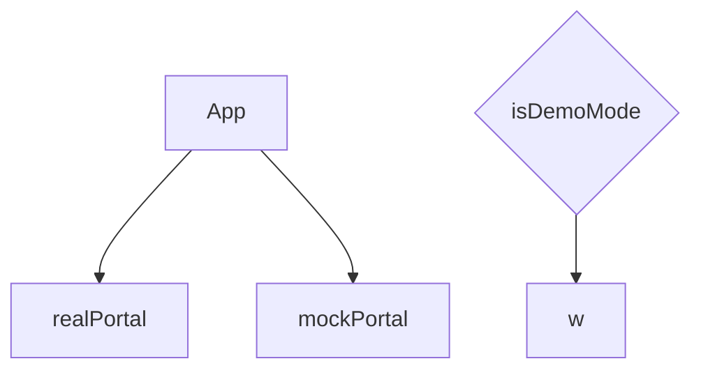
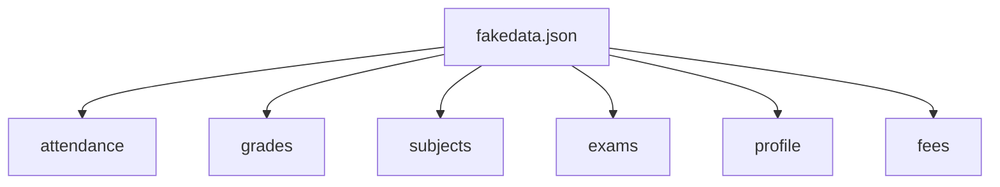
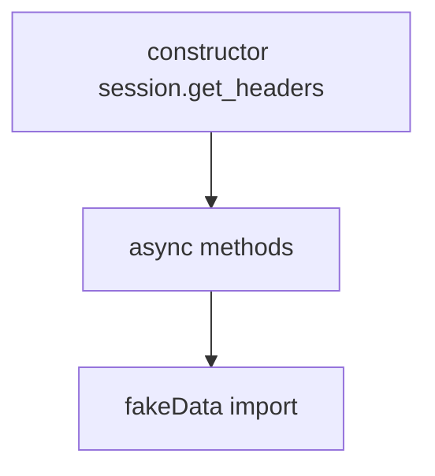
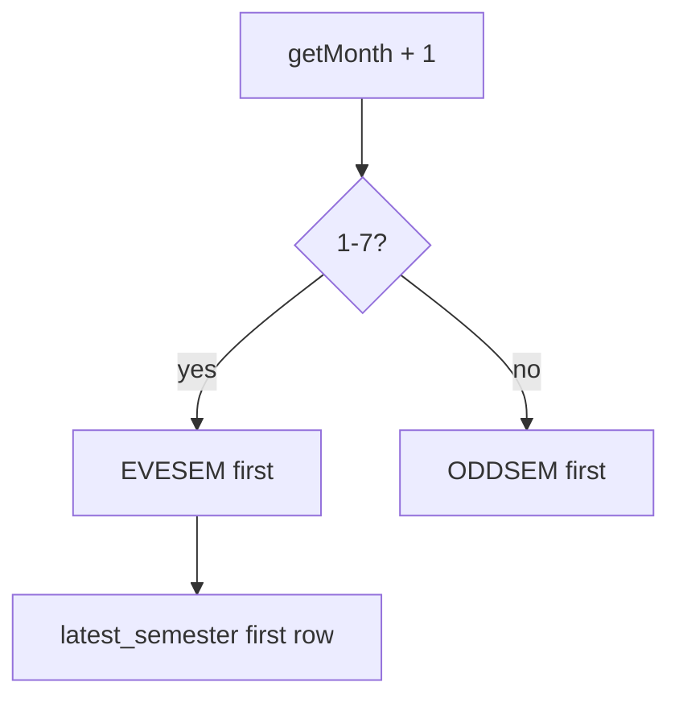
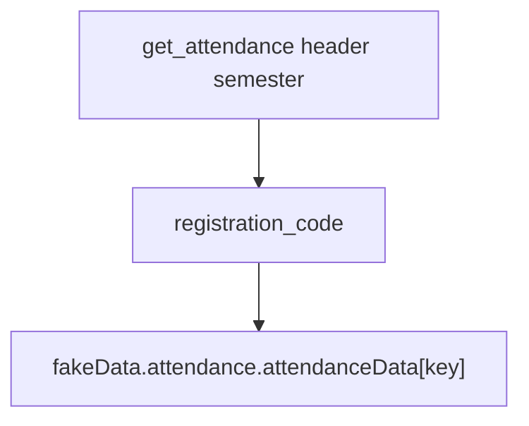
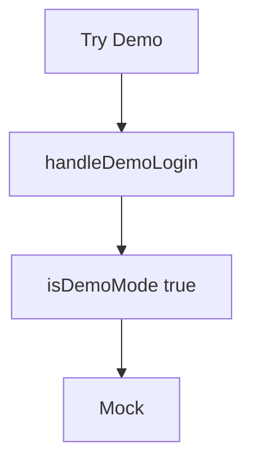

# Mock data system

`MockWebPortal` plus `src/assets/fakedata.json`. Try Demo uses this path. No JIIT network.

See [Data Layer & API Integration](3.3-data-layer-and-api-integration).

Jobs: offline UI work, public demo, stable fixtures.

## Architecture overview

### Portal abstraction pattern

### Interface compatibility

| Category | Methods |
| --- | --- |
| Auth | `student_login` |
| Attendance | `get_attendance_meta`, `get_attendance`, `get_subject_daily_attendance` |
| Grades | `get_sgpa_cgpa`, `get_semesters_for_grade_card`, `get_grade_card`, `get_semesters_for_marks`, `download_marks` |
| Exams | `get_semesters_for_exam_events`, `get_exam_events`, `get_exam_schedule` |
| Subjects | `get_registered_semesters`, `get_registered_subjects_and_faculties`, `get_subject_choices` |
| Profile | `get_personal_info` |
| Unused UI | `get_fee_summary`, `get_fines_msc_charges` |

## Data organization (fakedata.json)

### Domain structure

Attendance: `semestersData`, `attendanceData[semCode].studentattendancelist`, `subjectAttendanceData[individualsubjectcode]`.

Grades: `gradesData`, `gradeCardSemesters`, `gradeCards`, `marksSemesters`, `marksData`.

Exams: `examSemesters`, `examEvents`, `examSchedule`.

Subjects: `semestersData`, `subjectData`, `choiceSubjects`.

Profile: object returned as-is from `get_personal_info`.

## MockWebPortal implementation

### Class structure

JSON is a static import, not `fetch('/fakedata.json')`. File is `MockWebPortal.js`.

### Intelligent semester ordering

## Data retrieval pattern

Empty fallbacks: `{ studentattendancelist: [] }`, `{ gradecard: [] }`, `{ courses: [] }`, `{ subjectpreferencegrid: [] }`.

## Enabling demo mode

`VITE_USE_FAKE_DATA` is typed but unused. Do not document it as the switch.
