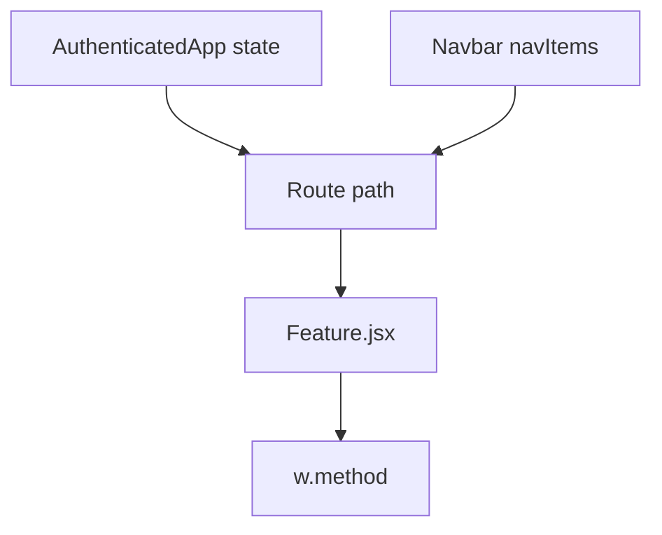
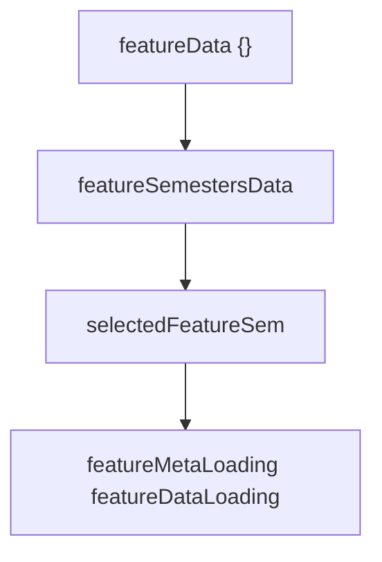
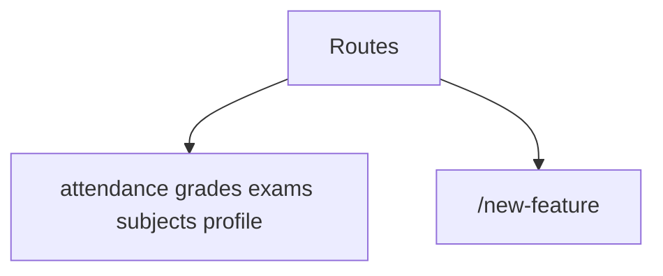
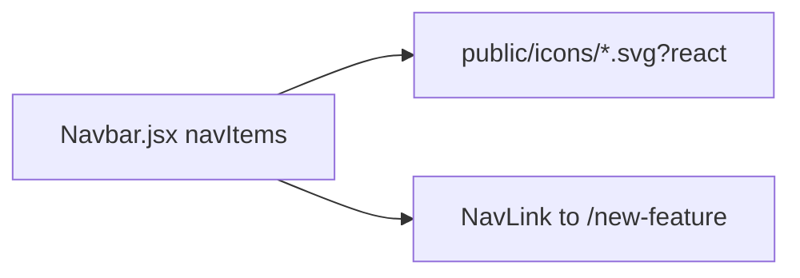
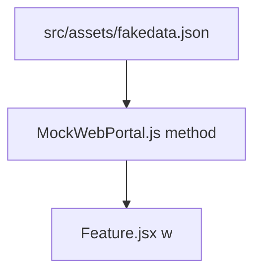
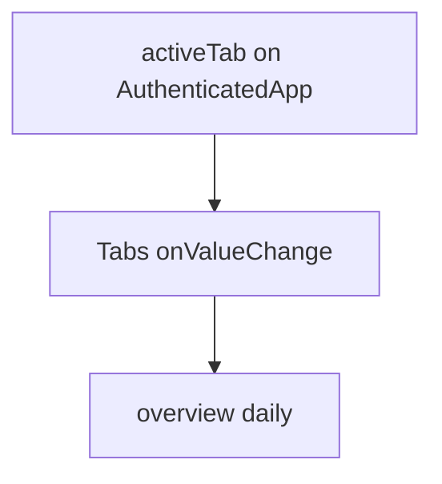

# Adding new features

Checklist for a new authenticated module.

Related: [Architecture Overview](3-architecture-overview), [Mock Data System](7.1-mock-data-system), [UI Components](5-ui-components).

## Feature module architecture

### Core pattern

| Aspect | Implementation |
| --- | --- |
| State | Declared in `AuthenticatedApp` |
| Props | Data + setters |
| Data | `w` |
| Cache | Keyed by `registration_id` |
| Loading | Dedicated booleans |

Sticky `top-14` for selectors. try/catch around portal calls.

## Step-by-step implementation guide

### Step 1: create the feature component

`src/components/NewFeature.jsx`. Accept `w`, caches, setters. Fetch in `useEffect`. Use `Select` from `@/components/ui/select`.

### Step 2: define state in AuthenticatedApp

Names: `featureData`, `selectedFeatureSem`, `isFeatureLoading`, `activeFeatureTab`.

### Step 3: add route configuration

Hash URL: `https://codeblech.github.io/jportal/#/new-feature`.

### Step 4: update navigation component

Push onto `navItems` in `Navbar.jsx`. Prefer an SVG in `public/icons/` with `?react`, same as attendance. lucide is fine if you skip a custom icon. Labels stay short.

### Step 5: implement mock data support

Add a domain in `fakedata.json`. Implement snake_case methods that match jsjiit. Import JSON at the top of `MockWebPortal.js`. Do not fetch `/fakedata.json` from `public/`.

### Step 6: add WebPortal API methods (real mode)

Call existing jsjiit methods. If the portal has no method, extend jsjiit first.

| Method | Feature |
| --- | --- |
| `get_attendance_meta`, `get_attendance` | Attendance |
| `get_sgpa_cgpa`, `get_grade_card` | Grades |
| `get_registered_semesters`, `get_registered_subjects_and_faculties`, `get_subject_choices` | Subjects |
| `get_semesters_for_exam_events`, `get_exam_schedule` | Exams |
| `get_personal_info` | Profile |

## Advanced patterns

### Multi-tab features

Attendance, Grades, and Subjects already do this. Keep tab state on the parent so it survives leaving the route.
