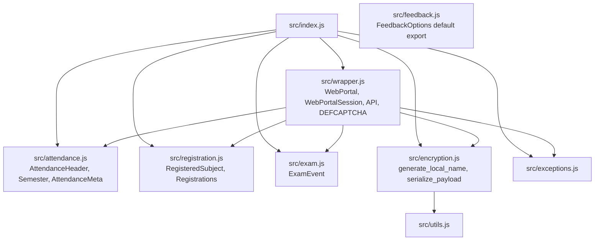
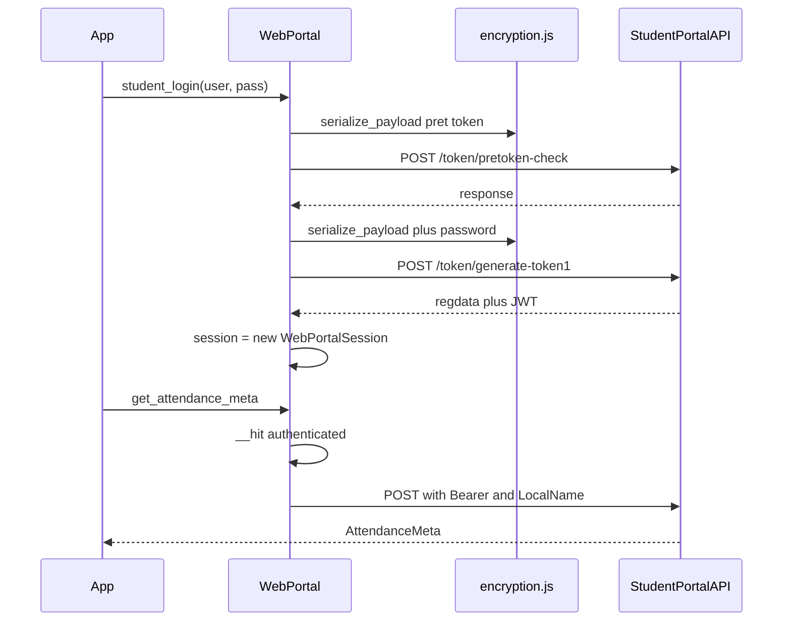
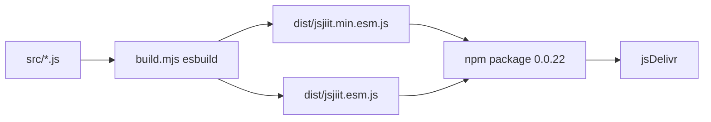

# Home

jsjiit is a browser JavaScript wrapper for the JIIT student WebPortal. It logs in, encrypts payloads, and calls `StudentPortalAPI` so a web app can read attendance, grades, exams, and account data without the portal UI.

This page matches package **0.0.22** in the clone at `/tmp/docs-refresh/jsjiit`. The README still shows CDN `jsjiit@0.0.20`. Pin **0.0.22** unless you have checked [npm](https://www.npmjs.com/package/jsjiit) or jsDelivr for a newer publish. JPortal has imported CDN **0.0.27**; that build may add things such as `useProxy` / `proxyUrl`. Those fields are **not** in this repo's `src/wrapper.js`. Do not assume they exist here.

Source: [tashifkhan/jsjiit](https://github.com/tashifkhan/jsjiit) (fork of [codeblech/jsjiit](https://github.com/codeblech/jsjiit)). Upstream Python: [pyjiit](https://github.com/codelif/pyjiit).

Install: [Getting started](2-getting-started). Methods: [API reference](3-api-reference). Internals: [Architecture and design](4-architecture-and-design).

## What it does

- Login through `student_login` with `DEFCAPTCHA` so you do not solve the image CAPTCHA
- Attendance metadata, semester totals, daily subject rows
- Registered subjects and faculty, subject choice print
- Exam events and schedules
- Grade card, SGPA/CGPA, marks PDF download
- Personal info, bank details, password change, hostel allocation, fee summary, pending fines
- Feedback submit via `fill_feedback_form`

It is an ES module (`"type": "module"`). Runtime is the browser: `fetch` plus `window.crypto.subtle`. There is no Node-compatible HTTP layer in 0.0.22.

## Modules

`src/index.js` re-exports the public surface. `src/wrapper.js` owns HTTP. Domain files own models.



`FeedbackOptions` lives in `src/feedback.js` and is **not** re-exported from `src/index.js`. Call `fill_feedback_form` with strings such as `"EXCELLENT"`.

`WebPortal` holds `this.session`. Authenticated methods hang on `WebPortal`, not on `WebPortalSession`. `WebPortalSession` stores JWT fields and builds headers.

## Login and `__hit`



After login, most calls go through `WebPortal.__hit`. Authenticated requests use `session.get_headers()` (`Authorization: Bearer <jwt>` and `LocalName`). Unauthenticated requests still send `LocalName` from `generate_local_name()`. `__hit` does **not** call `deserialize_payload`. The portal returns JSON. `serialize_payload` encrypts many request bodies; some methods send plain JSON.

## Models and errors

| Class | File | Role |
| --- | --- | --- |
| `AttendanceHeader` | `attendance.js` | `branchdesc`, `name`, `programdesc`, `stynumber` |
| `Semester` | `attendance.js` | `registration_code`, `registration_id` from `registrationcode` / `registrationid` |
| `AttendanceMeta` | `attendance.js` | `headers`, `semesters`, `latest_header()`, `latest_semester()` |
| `RegisteredSubject` | `registration.js` | Faculty, credits, subject ids |
| `Registrations` | `registration.js` | `total_credits`, `subjects` |
| `ExamEvent` | `exam.js` | Event code, ids, `registration_id` |

| Error | Base | When |
| --- | --- | --- |
| `APIError` | `Error` | Default `__hit` failure |
| `LoginError` | `APIError` | Login endpoints |
| `AccountAPIError` | `Error` | `change_password` |
| `SessionError` | `Error` | Session base |
| `SessionExpired` | `SessionError` | HTTP 401 |
| `NotLoggedIn` | `SessionError` | `authenticated()` wrapper, `session == null` |

## Package and build



- Name: `jsjiit`, version **0.0.22**, license ISC, author `codeblech`
- `main`: `src/index.js`
- `module` / `browser` / `exports.import` and `exports.require`: `dist/jsjiit.esm.js`
- `files`: `dist`, `src`
- Scripts: `build` → `node build.mjs`, `prepare` → `npm run build`, `docs` → `jsdoc -c jsdoc.conf.json --verbose`
- Dev deps only: `esbuild@0.24.0`, `jsdoc@^4.0.4`

## Minimal usage

```javascript
import { WebPortal } from "https://cdn.jsdelivr.net/npm/jsjiit@0.0.22/dist/jsjiit.min.esm.js";

const portal = new WebPortal();
await portal.student_login("username", "password");

const meta = await portal.get_attendance_meta();
const attendance = await portal.get_attendance(meta.latest_header(), meta.latest_semester());
```

Put that in `<script type="module">`. Credentials go to `https://webportal.jiit.ac.in:6011/StudentPortalAPI`. CORS and mixed-content rules apply.

## Next

- [Getting started](2-getting-started)
- [API reference](3-api-reference)
- [WebPortal class](3.1-webportal-class)
- [Build system](5.1-build-system)
- [Development guide](7-development-guide)
