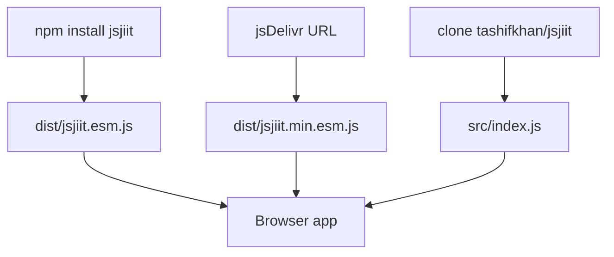
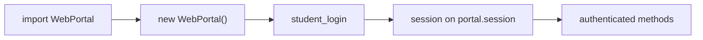
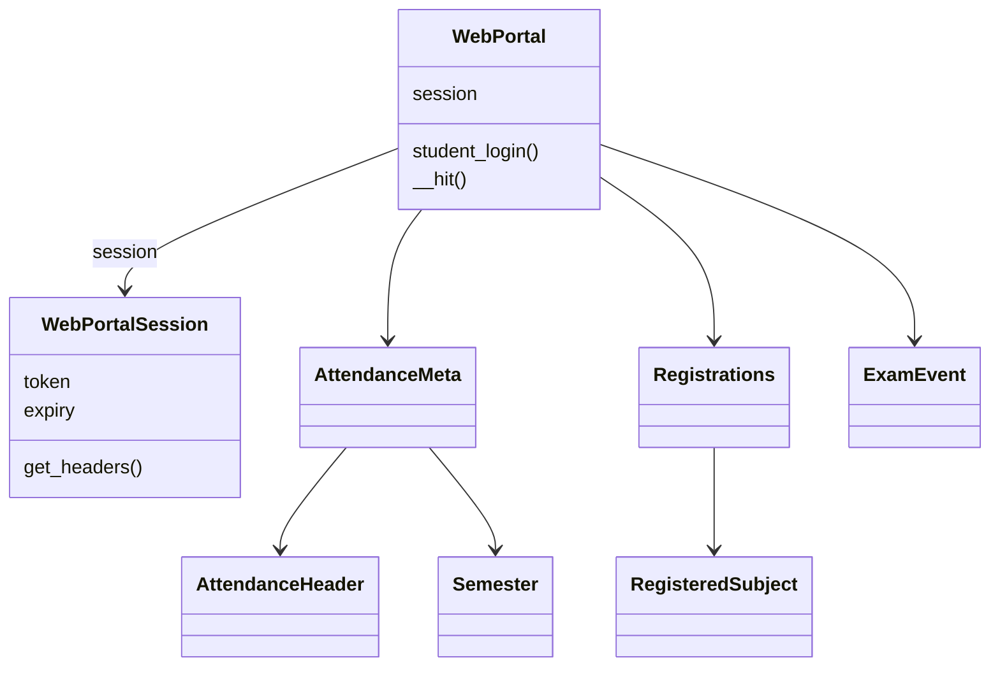
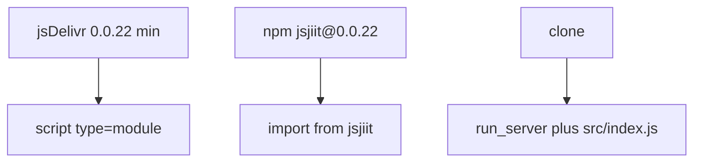

# Getting started

Install jsjiit 0.0.22 and make the first portal calls.

Full install options: [Installation](2.1-installation). Worked examples: [Quick start guide](2.2-quick-start-guide). Method list: [API reference](3-api-reference).

## Prerequisites

The published bundle targets ES2020 in a **browser**. It uses `fetch` and `window.crypto.subtle`. It is not a Node HTTP client.

| Need | Why |
| --- | --- |
| ES modules | `import` / `export`, `"type": "module"` |
| `fetch` | `WebPortal.__hit` and `download_marks` |
| Web Crypto | AES-CBC in `src/encryption.js` |
| Secure context | `crypto.subtle` needs HTTPS or localhost |

To build from this repo you need Node 18+, npm, `esbuild@0.24.0`, and `jsdoc@^4.0.4`. App code that only imports the CDN or `dist/` does not.

## How you get the library



`package.json` 0.0.22 entry points:

| Field | Path |
| --- | --- |
| `main` | `src/index.js` |
| `module` | `dist/jsjiit.esm.js` |
| `browser` | `dist/jsjiit.esm.js` |
| `exports.import` / `exports.require` | `dist/jsjiit.esm.js` |

Both export conditions point at the **unminified** ESM bundle. For a smaller CDN file use `jsjiit.min.esm.js` yourself.

This clone is 0.0.22. The repo README still shows `@0.0.20`. Check npm if you want latest. CDN 0.0.27 used by JPortal is a different publish than this source.

## Workflow



1. Import `WebPortal` from the bundle or `src/index.js`.
2. `const portal = new WebPortal()` sets `session` to `null`. No network yet.
3. `await portal.student_login(username, password)` POSTs encrypted bodies to `/token/pretoken-check` then `/token/generate-token1`, then stores a `WebPortalSession`.
4. Call methods on the same `portal` instance. They need `this.session`.

```javascript
import { WebPortal } from "https://cdn.jsdelivr.net/npm/jsjiit@0.0.22/dist/jsjiit.min.esm.js";

const portal = new WebPortal();
await portal.student_login("your_username", "your_password");

const meta = await portal.get_attendance_meta();
const attendance = await portal.get_attendance(meta.latest_header(), meta.latest_semester());
```

## Classes you actually use



- `WebPortal` in `src/wrapper.js`: login plus every data method
- `WebPortalSession` in `src/wrapper.js`: JWT, institute ids, `get_headers()`
- Models: `AttendanceMeta`, `AttendanceHeader`, `Semester`, `RegisteredSubject`, `Registrations`, `ExamEvent`
- Errors from `src/exceptions.js`: `APIError`, `LoginError`, `SessionError`, `SessionExpired`, `AccountAPIError`, `NotLoggedIn`

Older docs listed `InvalidCredentialsException` and `WebPortalException`. Those names are not in this source.

## Install cheat sheet

| Situation | How |
| --- | --- |
| Static page | `import { WebPortal } from "https://cdn.jsdelivr.net/npm/jsjiit@0.0.22/dist/jsjiit.min.esm.js"` |
| Debug bundle | same host, `jsjiit.esm.js` |
| Bundler | `npm install jsjiit@0.0.22` then `import { WebPortal } from "jsjiit"` |
| This clone | `import { WebPortal } from "./src/index.js"` behind `./run_server` |

GitHub for this fork: [https://github.com/tashifkhan/jsjiit](https://github.com/tashifkhan/jsjiit). Upstream package.json still points at `codeblech/jsjiit`.



## Encryption you do not call

Most encrypted bodies go through `serialize_payload` inside `WebPortal`. `__hit` still `JSON.stringify`s that string as the fetch body when `options.json` is set, or sends it as `options.body` on login. `deserialize_payload` is implemented in `encryption.js` and is **not** used by `wrapper.js` in 0.0.22.

Details: [Encryption and security](4.2-encryption-and-security).

## Next

| Goal | Page |
| --- | --- |
| CDN vs npm | [Installation](2.1-installation) |
| Copy-paste examples | [Quick start guide](2.2-quick-start-guide) |
| Every method | [API reference](3-api-reference) |
| Login failures | [Error handling](3.8-error-handling) |
| Clone and HTTPS server | [Local development setup](7.1-local-development-setup) |
