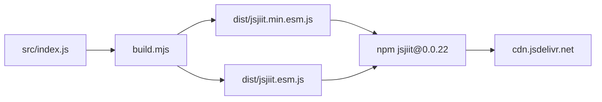
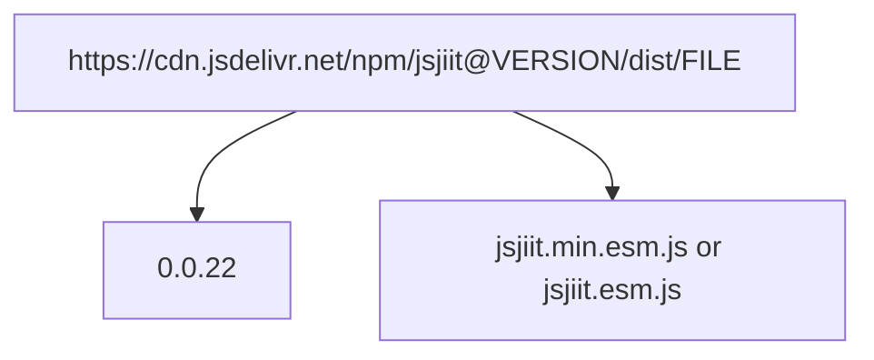
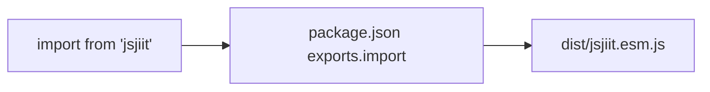
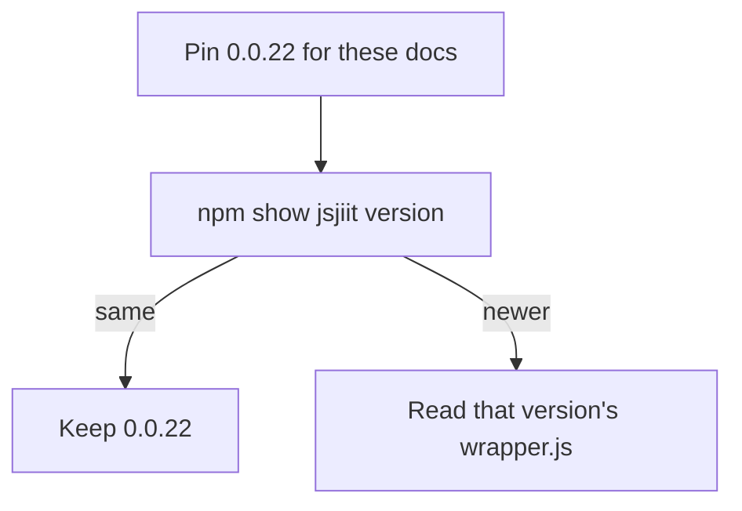

# Installation

Install jsjiit 0.0.22 from jsDelivr or npm. After that, [Quick start guide](2.2-quick-start-guide). Bundles come from [Build and distribution](5-build-and-distribution).

## Channels



Same artifacts, two ways in: a versioned CDN URL, or `npm install jsjiit@0.0.22`.

This documentation is the **0.0.22** tree. Published npm/jsDelivr may already be newer. Confirm with `npm show jsjiit version` before pinning a different tag. Do not copy APIs from a newer CDN into this tree.

## Runtime

| Requirement | Notes |
| --- | --- |
| ES2020+ | `build.mjs` `target: ["es2020"]` |
| Browser | Chrome 80+, Firefox 74+, Safari 13.1+, Edge 80+ is a reasonable floor |
| ESM | `<script type="module">` or a bundler that understands ESM |
| Not Node | `window.crypto.subtle` and `document` in `download_marks` |

## CDN

```html
<script type="module">
  import { WebPortal } from "https://cdn.jsdelivr.net/npm/jsjiit@0.0.22/dist/jsjiit.min.esm.js";
  const portal = new WebPortal();
</script>
```



| URL | Use |
| --- | --- |
| `https://cdn.jsdelivr.net/npm/jsjiit@0.0.22/dist/jsjiit.min.esm.js` | Production, matches this source version |
| `https://cdn.jsdelivr.net/npm/jsjiit@0.0.22/dist/jsjiit.esm.js` | Readable + source map |
| `https://cdn.jsdelivr.net/npm/jsjiit/dist/jsjiit.min.esm.js` | Whatever npm latest is, may not be 0.0.22 |

The README in this clone still documents `@0.0.20`. Treat that as stale.

## npm

```bash
npm install jsjiit@0.0.22
```



```javascript
import { WebPortal } from "jsjiit";
```

Resolution:

| Field | Path | Who looks |
| --- | --- | --- |
| `exports.import` | `./dist/jsjiit.esm.js` | Node ESM, modern bundlers |
| `exports.require` | `./dist/jsjiit.esm.js` | Same file, still ESM |
| `module` / `browser` | `dist/jsjiit.esm.js` | Older bundlers |
| `main` | `src/index.js` | Fallback, needs a bundler |

Tarball contents (`files`: `dist`, `src`):

```
node_modules/jsjiit/
  dist/
    jsjiit.min.esm.js
    jsjiit.min.esm.js.map
    jsjiit.esm.js
    jsjiit.esm.js.map
  src/
    index.js
    wrapper.js
    encryption.js
    attendance.js
    registration.js
    exam.js
    exceptions.js
    feedback.js
    utils.js
  package.json
```

`.npmignore` drops `docs`, `node_modules`, `run_server`, certs, `.vscode`, `index.html`.

## Direct paths

```javascript
import { WebPortal } from "./node_modules/jsjiit/dist/jsjiit.min.esm.js";
import { WebPortal } from "./node_modules/jsjiit/dist/jsjiit.esm.js";
import { WebPortal } from "./node_modules/jsjiit/src/index.js";
```

Source imports pull `wrapper.js` and friends. Serve them as modules or let a bundler follow them.

| File | Minified | Typical use |
| --- | --- | --- |
| `dist/jsjiit.min.esm.js` | yes | CDN / production |
| `dist/jsjiit.esm.js` | no | npm default export |
| `src/index.js` | no | local work |

## Version



```bash
npm list jsjiit
npm show jsjiit version
```

```bash
npm install jsjiit@0.0.22
```

The library does not export its version string. Read `package.json`.

## Smoke test

```html
<script type="module">
  import { WebPortal } from "https://cdn.jsdelivr.net/npm/jsjiit@0.0.22/dist/jsjiit.min.esm.js";
  console.log(typeof WebPortal);
  const portal = new WebPortal();
  console.log(typeof portal.student_login);
</script>
```

| Check | Pass |
| --- | --- |
| Import | no syntax error |
| `typeof WebPortal` | `"function"` |
| `new WebPortal()` | object with `session === null` |
| `portal.student_login` | `"function"` |

| Symptom | Fix |
| --- | --- |
| `Cannot use import statement` | `type="module"` |
| CDN 404 | version not on npm |
| `jsjiit` unresolved after install | import `'jsjiit'`, not a relative guess |
| `crypto.subtle` undefined | HTTPS or localhost |

## Next

[Quick start guide](2.2-quick-start-guide), [API reference](3-api-reference), [Build system](5.1-build-system).
