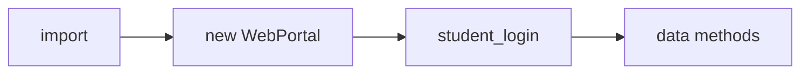
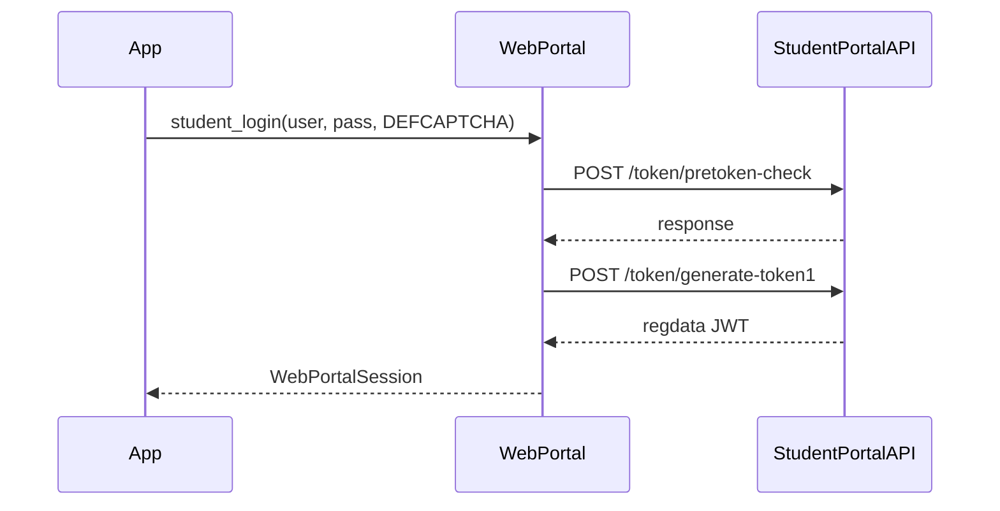
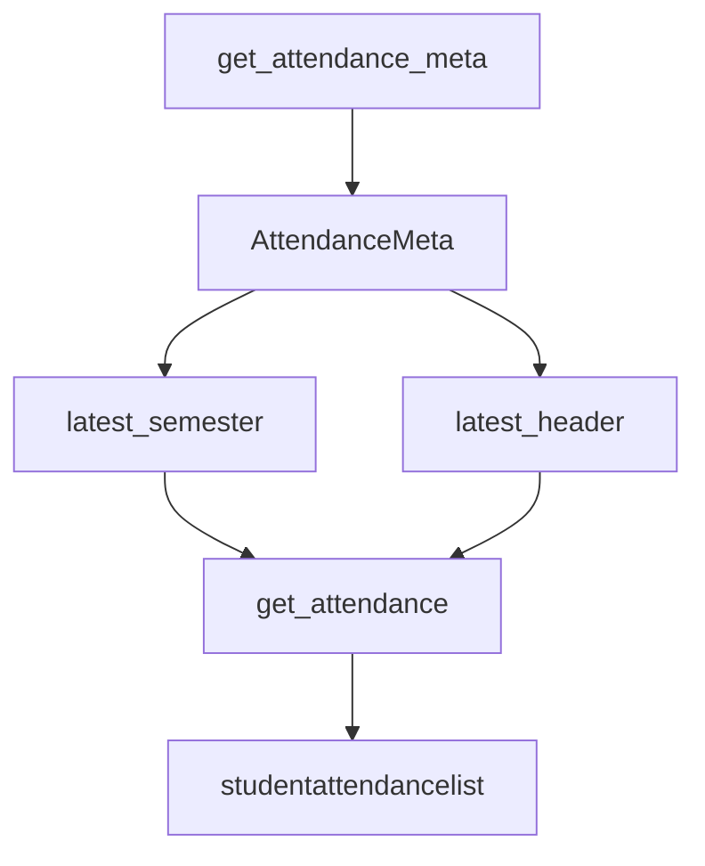

# Quick start guide

Login once, then call methods on the same `WebPortal` instance. Install: [Installation](2.1-installation). Full signatures: [API reference](3-api-reference).

## Flow



All data methods return Promises. They throw `NotLoggedIn` if `portal.session` is still `null`.

## Import

```javascript
import { WebPortal } from "https://cdn.jsdelivr.net/npm/jsjiit@0.0.22/dist/jsjiit.min.esm.js";
```

```javascript
import { WebPortal } from "./src/index.js";
```

| Source | Path |
| --- | --- |
| CDN, this version | `jsjiit@0.0.22/dist/jsjiit.min.esm.js` |
| CDN, npm latest | `jsjiit/dist/jsjiit.min.esm.js` (may not match this source) |
| Local clone | `./src/index.js` |

## Login



```javascript
const portal = new WebPortal();
await portal.student_login("your_username", "your_password");
```

| Arg | Required | Default |
| --- | --- | --- |
| `username` | yes | |
| `password` | yes | |
| `captcha` | no | `DEFCAPTCHA` `{ captcha: "phw5n", hidden: "gmBctEffdSg=" }` |

Session lands on `portal.session`. Later methods read institute id, member id, JWT from there.

## Patterns

### Attendance

```javascript
const meta = await portal.get_attendance_meta();
const sem = meta.latest_semester();
const header = meta.latest_header();
const attendance = await portal.get_attendance(header, sem);
```



### Daily subject attendance

Same list as README / `test.html`:

```javascript
const subjectIndex = 1;
const row = attendance.studentattendancelist[subjectIndex];
const subjectid = row.subjectid;
const individualsubjectcode = row.individualsubjectcode;
const possibleComponentCodes = ["Lsubjectcomponentid", "Psubjectcomponentid", "Tsubjectcomponentid"];
const subjectcomponentids = [];
for (const key of possibleComponentCodes) {
  if (row[key]) subjectcomponentids.push(row[key]);
}
const subjectAttendance = await portal.get_subject_daily_attendance(
  sem,
  subjectid,
  individualsubjectcode,
  subjectcomponentids
);
```

### SGPA / CGPA

```javascript
const sgpaCgpa = await portal.get_sgpa_cgpa();
```

Internally this calls `__get_semester_number` then `/studentsgpacgpa/getallsemesterdata`.

### Grade card

```javascript
const gradeCardSems = await portal.get_semesters_for_grade_card();
const grades = await portal.get_grade_card(gradeCardSems[0]);
```

### Marks PDF

```javascript
const marksSems = await portal.get_semesters_for_marks();
await portal.download_marks(marksSems[0]);
```

`download_marks` uses `fetch` + a temporary `<a download>` in the document. It does not return the PDF bytes.

### Registered subjects

```javascript
const registeredSems = await portal.get_registered_semesters();
const registeredSubjects = await portal.get_registered_subjects_and_faculties(registeredSems[0]);
```

### Exams

```javascript
const examSems = await portal.get_semesters_for_exam_events();
const examEvents = await portal.get_exam_events(examSems[0]);
const examSchedule = await portal.get_exam_schedule(examEvents[0]);
```

### Account extras in 0.0.22

```javascript
const personalInfo = await portal.get_personal_info();
const bank = await portal.get_student_bank_info();
const hostel = await portal.get_hostel_details();
const fees = await portal.get_fee_summary();
const fines = await portal.get_fines_msc_charges();
const choices = await portal.get_subject_choices(registeredSems[0]);
```

`get_fines_msc_charges` still goes through `__hit`, so a portal `"Failure"` with `"NO APPROVED REQUEST FOUND"` becomes `APIError`.

Feedback (see `test.html`):

```javascript
await portal.fill_feedback_form("EXCELLENT");
```

Strings used in `src/feedback.js`: `UNSATISFIED`, `SATISFIED`, `GOOD`, `VERY_GOOD`, `EXCELLENT`. That object is a default export and is not on the `src/index.js` named export list.

## Method map

| Category | Method | Returns |
| --- | --- | --- |
| Auth | `student_login()` | `WebPortalSession` |
| Attendance | `get_attendance_meta()` | `AttendanceMeta` |
| | `get_attendance(header, semester)` | object |
| | `get_subject_daily_attendance(...)` | object |
| Records | `get_sgpa_cgpa()` | object |
| | `get_semesters_for_grade_card()` | `Semester[]` |
| | `get_grade_card(semester)` | object |
| | `get_semesters_for_marks()` | `Semester[]` |
| | `download_marks(semester)` | void (browser download) |
| Registration | `get_registered_semesters()` | `Semester[]` |
| | `get_registered_subjects_and_faculties(semester)` | `Registrations` |
| | `get_subject_choices(semester)` | object |
| Exams | `get_semesters_for_exam_events()` | `Semester[]` |
| | `get_exam_events(semester)` | `ExamEvent[]` |
| | `get_exam_schedule(exam_event)` | object |
| Account | `get_personal_info()` | object |
| | `get_student_bank_info()` | object |
| | `change_password(old, next)` | object |
| | `get_hostel_details()` | object |
| | `get_fee_summary()` | object |
| | `get_fines_msc_charges()` | object |
| | `fill_feedback_form(option)` | void |

## HTML page

```html
<!DOCTYPE html>
<html lang="en">
<head>
  <meta charset="UTF-8">
  <title>jsjiit 0.0.22</title>
</head>
<body>
  <script type="module">
    import { WebPortal, LoginError } from "https://cdn.jsdelivr.net/npm/jsjiit@0.0.22/dist/jsjiit.min.esm.js";

    async function main() {
      const portal = new WebPortal();
      try {
        await portal.student_login("username", "password");
      } catch (e) {
        if (e instanceof LoginError) {
          console.error(e.message);
          return;
        }
        throw e;
      }

      const sgpaCgpa = await portal.get_sgpa_cgpa();
      const meta = await portal.get_attendance_meta();
      const attendance = await portal.get_attendance(meta.latest_header(), meta.latest_semester());
      console.log(sgpaCgpa, attendance);
    }

    main().catch(console.error);
  </script>
</body>
</html>
```

`test.html` in the repo imports `./src/index.js` and currently calls `fill_feedback_form("EXCELLENT")` after login.

## Errors

```javascript
import { WebPortal, LoginError, NotLoggedIn, SessionExpired, APIError } from "./src/index.js";
```

| Class | Typical cause |
| --- | --- |
| `LoginError` | pret token / generate-token failure |
| `NotLoggedIn` | method before `student_login` |
| `SessionExpired` | HTTP 401 |
| `APIError` | other `__hit` failures, HTTP 513, CORS TypeError |
| `AccountAPIError` | `change_password` |

More: [Error handling](3.8-error-handling).

## Typed returns

| Class | From | Fields you will use |
| --- | --- | --- |
| `WebPortalSession` | `student_login` | `token`, `memberid`, `name`, `enrollmentno`, `expiry` |
| `AttendanceMeta` | `get_attendance_meta` | `headers`, `semesters` |
| `Semester` | semester list methods | `registration_id`, `registration_code` |
| `AttendanceHeader` | `meta.headers` | `stynumber` |
| `Registrations` | subjects + faculties | `subjects`, `total_credits` |
| `ExamEvent` | `get_exam_events` | `exam_event_id`, `registration_id` |

Models: [Data models](3.9-data-models). Session lifetime: [Authentication and session management](3.2-authentication-and-session-management).
