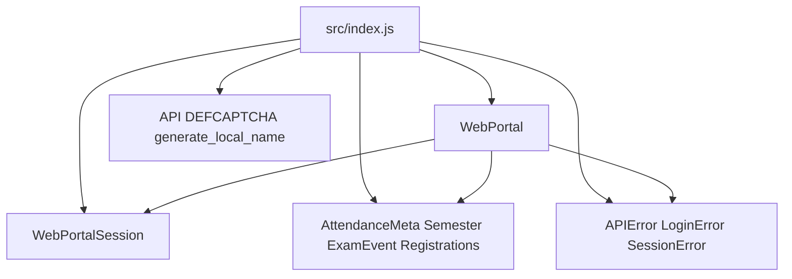
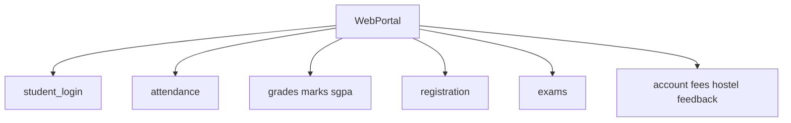
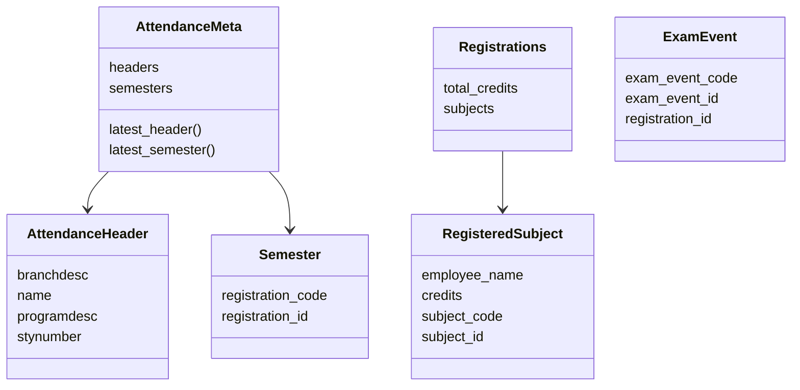
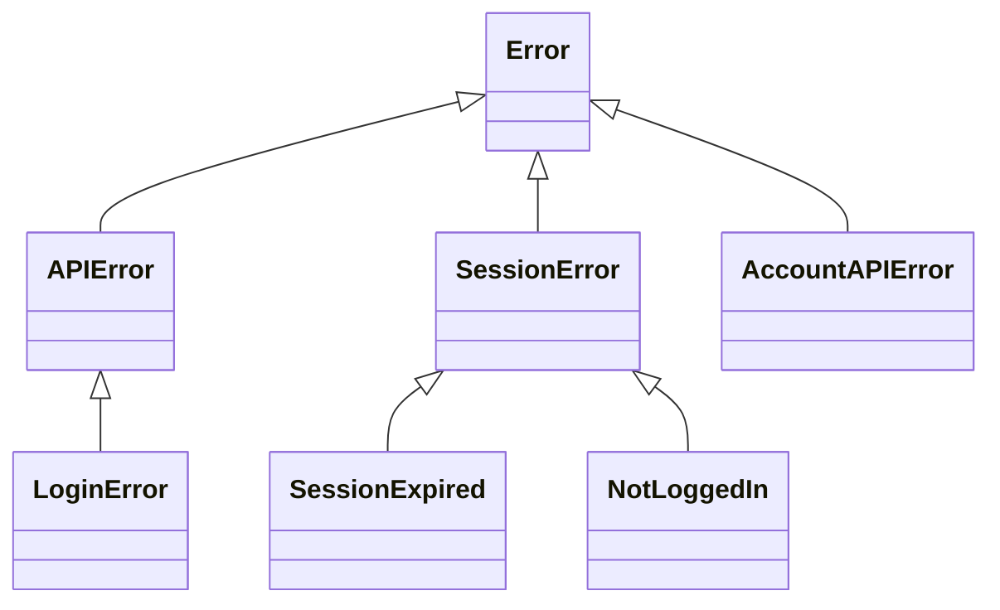
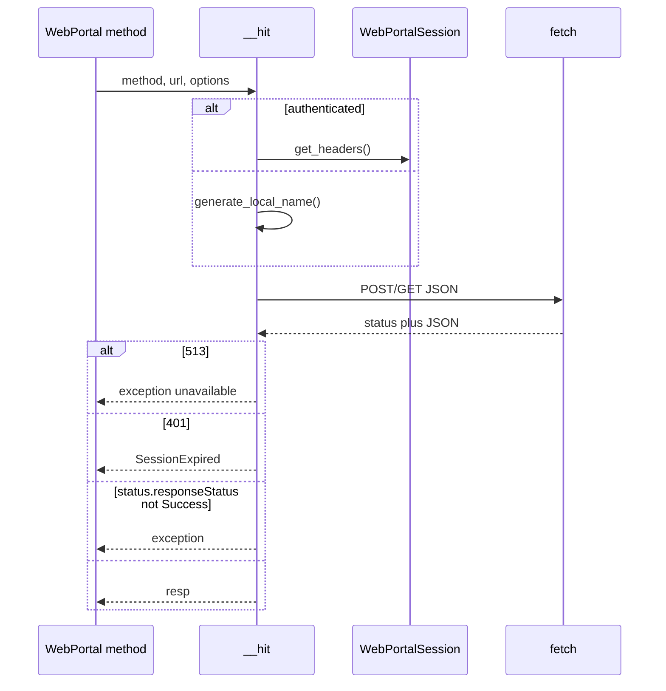

# API reference

Public surface of jsjiit **0.0.22**. Architecture: [Architecture and design](4-architecture-and-design). Examples: [Quick start guide](2.2-quick-start-guide).

`src/index.js` is the only public barrel.

## Exports

| Name | Kind | Defined in |
| --- | --- | --- |
| `WebPortal` | class | `src/wrapper.js` |
| `WebPortalSession` | class | `src/wrapper.js` |
| `API` | string | `src/wrapper.js` |
| `DEFCAPTCHA` | object | `src/wrapper.js` |
| `AttendanceHeader` | class | `src/attendance.js` |
| `Semester` | class | `src/attendance.js` |
| `AttendanceMeta` | class | `src/attendance.js` |
| `RegisteredSubject` | class | `src/registration.js` |
| `Registrations` | class | `src/registration.js` |
| `ExamEvent` | class | `src/exam.js` |
| `APIError` | class | `src/exceptions.js` |
| `LoginError` | class | `src/exceptions.js` |
| `AccountAPIError` | class | `src/exceptions.js` |
| `NotLoggedIn` | class | `src/exceptions.js` |
| `SessionError` | class | `src/exceptions.js` |
| `SessionExpired` | class | `src/exceptions.js` |
| `generate_local_name` | function | `src/encryption.js` |

`FeedbackOptions` is a default export of `src/feedback.js` and is **not** in this list.

This clone has no `useProxy` or `proxyUrl` on `WebPortal`. If a newer CDN build has them, they are not documented here.



## WebPortal methods



| Method | Auth | Returns |
| --- | --- | --- |
| `student_login(username, password, captcha)` | no | `Promise<WebPortalSession>` |
| `get_attendance_meta()` | yes | `Promise<AttendanceMeta>` |
| `get_attendance(header, semester)` | yes | `Promise<Object>` |
| `get_subject_daily_attendance(semester, subjectid, individualsubjectcode, subjectcomponentids)` | yes | `Promise<Object>` |
| `get_registered_semesters()` | yes | `Promise<Semester[]>` |
| `get_registered_subjects_and_faculties(semester)` | yes | `Promise<Registrations>` |
| `get_semesters_for_exam_events()` | yes | `Promise<Semester[]>` |
| `get_exam_events(semester)` | yes | `Promise<ExamEvent[]>` |
| `get_exam_schedule(exam_event)` | yes | `Promise<Object>` |
| `get_semesters_for_marks()` | yes | `Promise<Semester[]>` |
| `download_marks(semester)` | yes | `Promise<void>` |
| `get_semesters_for_grade_card()` | yes | `Promise<Semester[]>` |
| `get_grade_card(semester)` | yes | `Promise<Object>` |
| `get_sgpa_cgpa()` | yes | `Promise<Object>` |
| `get_personal_info()` | yes | `Promise<Object>` |
| `get_student_bank_info()` | yes | `Promise<Object>` |
| `change_password(old_password, new_password)` | yes | `Promise<Object>` |
| `get_hostel_details()` | yes | `Promise<Object>` |
| `get_fee_summary()` | yes | `Promise<Object>` |
| `get_fines_msc_charges()` | yes | `Promise<Object>` |
| `get_subject_choices(semester)` | yes | `Promise<Object>` |
| `fill_feedback_form(feedback_option)` | **not wrapped** | `Promise<void>` |

`fill_feedback_form` is **missing** from `authenticatedMethods`. Calling it with `session === null` still blows up later when it reads `this.session.instituteid`.

Private helpers used by public methods: `__hit`, `__get_program_id`, `__get_semester_number`. Those two helpers **are** in `authenticatedMethods`.

Pages:

- [Authentication and session management](3.2-authentication-and-session-management)
- [Attendance methods](3.3-attendance-methods)
- [Registration and subject methods](3.4-registration-and-subject-methods)
- [Exam and schedule methods](3.5-exam-and-schedule-methods)
- [Academic records methods](3.6-academic-records-methods)
- [Feedback and account methods](3.7-feedback-and-account-methods)

## WebPortalSession

Created by `student_login`. Do not construct it yourself unless you have a login `response` object.

| Property | Type |
| --- | --- |
| `raw_response` | object |
| `regdata` | object |
| `institute` | string (`institutelist[0].label`) |
| `instituteid` | string (`institutelist[0].value`) |
| `memberid` | string |
| `userid` | string |
| `token` | JWT string |
| `expiry` | `Date` from JWT `exp` |
| `clientid` | string |
| `membertype` | string |
| `name` | string |
| `enrollmentno` | string |

`get_headers()` returns `{ Authorization: "Bearer " + token, LocalName }`. `download_marks` calls `this.session.get_headers(localname)` with an extra argument that **`get_headers` ignores**.

There is no `branch_id` assignment in the constructor. `get_grade_card` still sends `branchid: this.session.branch_id`.

## Models



[Data models](3.9-data-models).

## Errors



[Error handling](3.8-error-handling).

## Constants

```javascript
export const API = "https://webportal.jiit.ac.in:6011/StudentPortalAPI";
export const DEFCAPTCHA = { captcha: "phw5n", hidden: "gmBctEffdSg=" };
```

`generate_local_name(date?)` returns a base64 AES-CBC blob for the `LocalName` header. `__hit` and `get_headers` already call it.

## `__hit` path



`__hit` logs `options` and the fetch call with `console.log`.

## `authenticated` wrapper

```javascript
const authenticatedMethods = [
  "get_personal_info",
  "get_student_bank_info",
  "change_password",
  "get_attendance_meta",
  "get_attendance",
  "get_subject_daily_attendance",
  "get_registered_semesters",
  "get_registered_subjects_and_faculties",
  "get_semesters_for_exam_events",
  "get_exam_events",
  "get_exam_schedule",
  "get_semesters_for_marks",
  "download_marks",
  "get_semesters_for_grade_card",
  "__get_program_id",
  "get_grade_card",
  "__get_semester_number",
  "get_sgpa_cgpa",
  "get_hostel_details",
  "get_fines_msc_charges",
  "get_fee_summary",
  "get_subject_choices",
];
```

`fill_feedback_form` is not in this array.

## Endpoints

Base: `https://webportal.jiit.ac.in:6011/StudentPortalAPI`

| Method | Path |
| --- | --- |
| `student_login` | `/token/pretoken-check`, `/token/generate-token1` |
| `get_personal_info` | `/studentpersinfo/getstudent-personalinformation` |
| `get_student_bank_info` | `/studentbankdetails/getstudentbankinfo` |
| `change_password` | `/clxuser/changepassword` |
| `get_attendance_meta` | `/StudentClassAttendance/getstudentInforegistrationforattendence` |
| `get_attendance` | `/StudentClassAttendance/getstudentattendancedetail` |
| `get_subject_daily_attendance` | `/StudentClassAttendance/getstudentsubjectpersentage` |
| `get_registered_semesters` | `/reqsubfaculty/getregistrationList` |
| `get_registered_subjects_and_faculties` | `/reqsubfaculty/getfaculties` |
| `get_semesters_for_exam_events` | `/studentcommonsontroller/getsemestercode-withstudentexamevents` |
| `get_exam_events` | `/studentcommonsontroller/getstudentexamevents` |
| `get_exam_schedule` | `/studentsttattview/getstudent-examschedule` |
| `get_semesters_for_marks` | `/studentcommonsontroller/getsemestercode-exammarks` |
| `download_marks` | `/studentsexamview/printstudent-exammarks/{instituteid}/{registration_id}/{registration_code}` |
| `get_semesters_for_grade_card` | `/studentgradecard/getregistrationList` |
| `__get_program_id` | `/studentgradecard/getstudentinfo` |
| `get_grade_card` | `/studentgradecard/showstudentgradecard` |
| `__get_semester_number` | `/studentsgpacgpa/checkIfstudentmasterexist` |
| `get_sgpa_cgpa` | `/studentsgpacgpa/getallsemesterdata` |
| `get_hostel_details` | `/myhostelallocationdetail/gethostelallocationdetail` |
| `get_fines_msc_charges` | `/collectionpendingpayments/getpendingpaymentsdata` |
| `get_fee_summary` | `/studentfeeledger/loadfeesummary` |
| `get_subject_choices` | `/studentchoiceprint/getsubjectpreference` |
| `fill_feedback_form` | `/feedbackformcontroller/getFeedbackEvent`, `getGriddataForFeedback`, `getIemQuestion`, `savedatalist` |

`get_exam_events` sends `registationid` (portal spelling). `get_personal_info` sends `clinetid: "SOAU"`.

## Call order

```javascript
import { WebPortal } from "jsjiit";

const portal = new WebPortal();
await portal.student_login(username, password);
const meta = await portal.get_attendance_meta();
```

Version in this clone: **0.0.22**. CDN:

```javascript
import { WebPortal } from "https://cdn.jsdelivr.net/npm/jsjiit@0.0.22/dist/jsjiit.min.esm.js";
```
