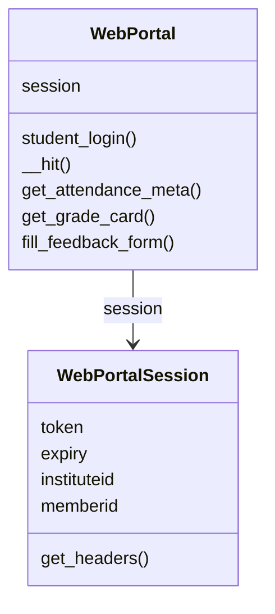
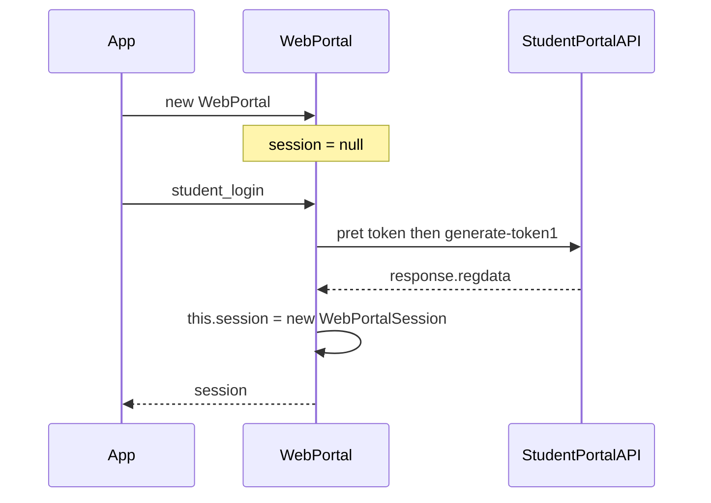
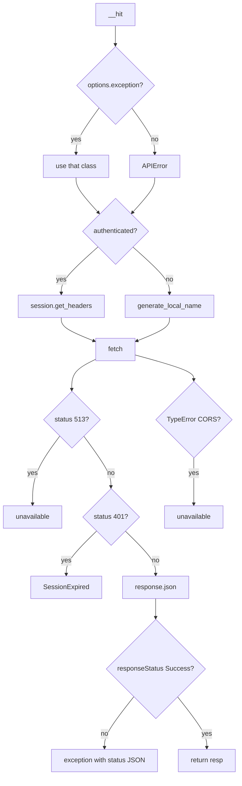
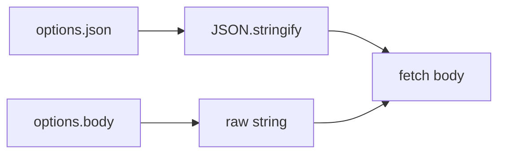
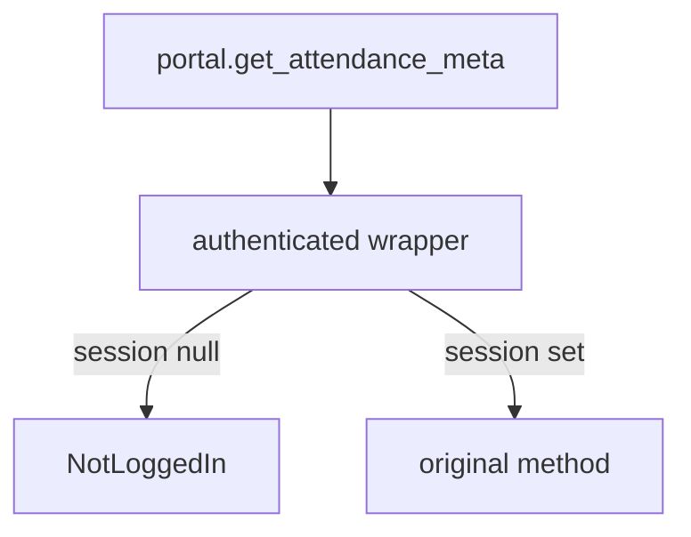
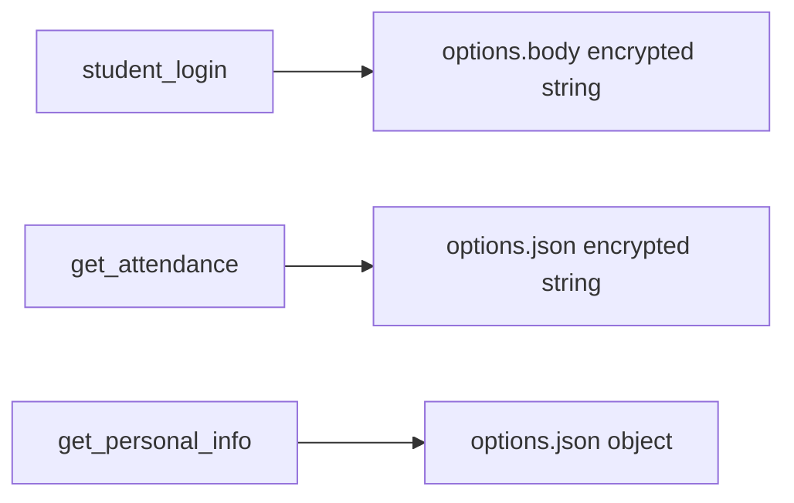

# WebPortal class

`WebPortal` in `src/wrapper.js` is the object you construct. It stores one `WebPortalSession` and talks to `StudentPortalAPI` through `__hit`.

Related:

- [Authentication and session management](3.2-authentication-and-session-management)
- [Attendance methods](3.3-attendance-methods)
- [Registration and subject methods](3.4-registration-and-subject-methods)
- [Exam and schedule methods](3.5-exam-and-schedule-methods)
- [Academic records methods](3.6-academic-records-methods)
- [Feedback and account methods](3.7-feedback-and-account-methods)
- [Error handling](3.8-error-handling)
- [Data models](3.9-data-models)

## Shape

```javascript
constructor() {
  this.session = null;
}
```

No constructor options in 0.0.22. No proxy fields.



## Session



`WebPortalSession` fields from login `regdata`:

| Property | Source |
| --- | --- |
| `raw_response` | full constructor arg |
| `regdata` | `resp.regdata` |
| `institute` | `institutelist[0].label` |
| `instituteid` | `institutelist[0].value` |
| `memberid` | `regdata.memberid` |
| `userid` | `regdata.userid` |
| `token` | `regdata.token` |
| `expiry` | JWT payload `exp` × 1000 |
| `clientid` | `regdata.clientid` |
| `membertype` | `regdata.membertype` |
| `name` | `regdata.name` |
| `enrollmentno` | `regdata.enrollmentno` |

First institute in `institutelist` wins. Multi-institute accounts are not selectable.

## `__hit`

```javascript
async __hit(method, url, options = {})
```

| Option | Meaning |
| --- | --- |
| `headers` | merged after LocalName / Bearer |
| `json` | `JSON.stringify` into the body |
| `body` | raw body if `json` is absent |
| `authenticated` | use `session.get_headers()` |
| `exception` | error class, default `APIError` |





GET with no body still sets `fetchOptions.body` to `undefined` because the `json` / `body` branch always assigns `body`. `download_marks` skips `__hit` and calls `fetch` itself.

`Content-Type: application/json` is always set.

## Login

```javascript
async student_login(username, password, captcha = DEFCAPTCHA)
```

Throws `LoginError`. Payload is `serialize_payload` then `__hit` with `options.body` (already a string). See [Authentication and session management](3.2-authentication-and-session-management).

## Authenticated methods

After login, methods on **`WebPortal`** (not on the session object) hit portal routes. Each group has its own page.

`authenticated(method)` wraps the prototype:

```javascript
if (this.session == null) throw new NotLoggedIn();
return method.apply(this, args);
```



`fill_feedback_form` is not wrapped. `download_marks` is wrapped but talks to `fetch` directly.

## Constants on the same module

```javascript
export const API = "https://webportal.jiit.ac.in:6011/StudentPortalAPI";
export const DEFCAPTCHA = { captcha: "phw5n", hidden: "gmBctEffdSg=" };
```

Every URL is `API + ENDPOINT`.

## Payload encryption vs plain JSON

Encrypted with `serialize_payload` then usually passed as `options.json` (so the encrypted string is JSON-stringified again): attendance detail, daily attendance, registration lists, exam lists, marks semester list, grade card, SGPA, fines, subject choices, parts of feedback.

Plain JSON objects: personal info, bank info, change password, attendance meta, fee summary, hostel, feedback event list.

Login uses `options.body` with the encrypted string, not `json`.



## `download_marks` oddity

```javascript
const localname = await generate_local_name();
let _headers = await this.session.get_headers(localname);
```

`get_headers` takes no parameters, so `localname` is unused. Headers still get a fresh `LocalName` from inside `get_headers`.

## Logging

`__hit` prints `console.log(options)` and `console.log("fetching", url, "with options", fetchOptions)`. That includes request headers. Expect noise in the browser console.
