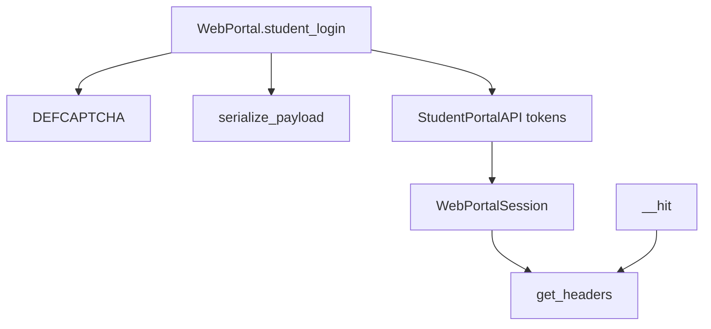
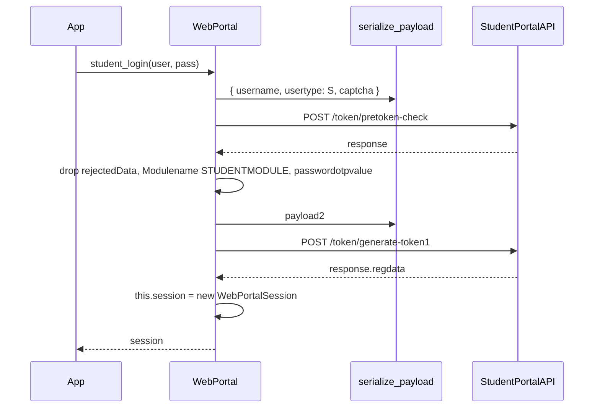
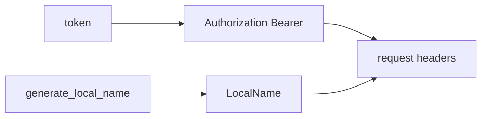
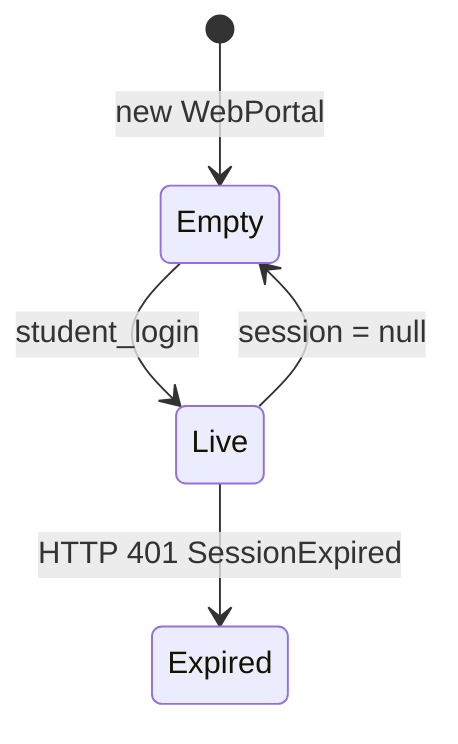

# Authentication and session management

Login, CAPTCHA constants, JWT session, request headers, and the `authenticated` gate. Crypto details: [Encryption and security](4.2-encryption-and-security). Failures: [Error handling](3.8-error-handling).

## Pieces



## Two-step login

```javascript
async student_login(username, password, captcha = DEFCAPTCHA)
```



Phase 1 body:

```javascript
{ username, usertype: "S", captcha }
```

`captcha` defaults to `DEFCAPTCHA`. Both phases use `LoginError` as `options.exception`.

Phase 2 copies `resp.response`, deletes `rejectedData`, sets `Modulename` to `"STUDENTMODULE"` and `passwordotpvalue` to the password.

## DEFCAPTCHA

```javascript
export const DEFCAPTCHA = { captcha: "phw5n", hidden: "gmBctEffdSg=" };
```

Same trick as pyjiit: a canned captcha pair instead of the image. If the portal rotates the challenge, login starts throwing `LoginError`.

```mermaid
flowchart LR
  def[DEFCAPTCHA phw5n] --> pret[/token/pretoken-check]
  pret --> tok[/token/generate-token1]
```

## Session object

```javascript
let expiry_timestamp = JSON.parse(atob(this.token.split(".")[1]))["exp"];
this.expiry = new Date(expiry_timestamp * 1000);
```

The library stores `expiry`. `__hit` does **not** compare it to `Date.now()` before sending. Expiry shows up as HTTP 401 → `SessionExpired`.

```javascript
async get_headers() {
  const localname = await generate_local_name();
  return {
    Authorization: `Bearer ${this.token}`,
    LocalName: localname,
  };
}
```



Unauthenticated `__hit` (login) still sends `LocalName` without Bearer.

## Gate

```javascript
function authenticated(method) {
  return function (...args) {
    if (this.session == null) {
      throw new NotLoggedIn();
    }
    return method.apply(this, args);
  };
}
```

Applied to the list in [API reference](3-api-reference). `student_login` is not wrapped. `fill_feedback_form` is not wrapped.

There is no logout method. Set `portal.session = null` if you need to drop credentials in memory.



## Header vs body encryption

| Piece | Encrypted? |
| --- | --- |
| Login bodies | yes, `serialize_payload`, sent as `body` |
| `LocalName` | yes, `generate_local_name` |
| JWT | portal-issued, sent in Authorization |
| Many later JSON bodies | `serialize_payload` then `options.json` |
| Personal info, bank, password, hostel, fee summary, attendance meta | plain JSON |

`__hit` never decrypts responses.
