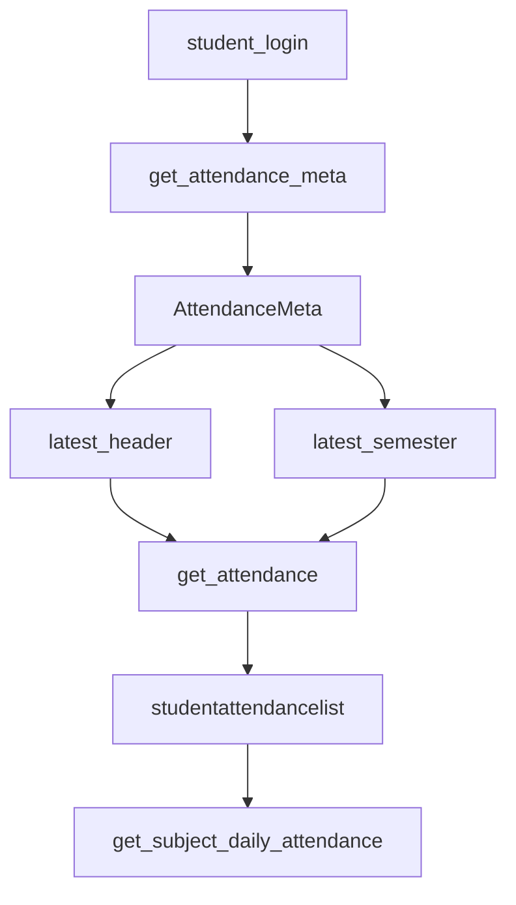
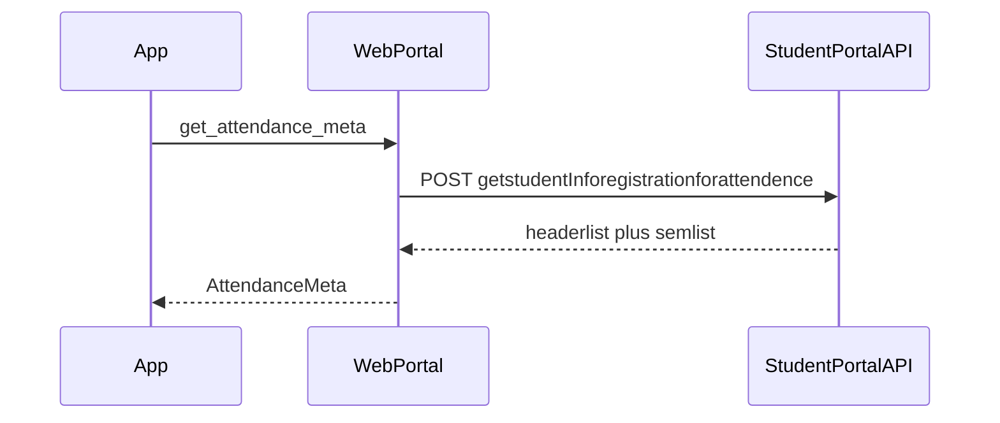
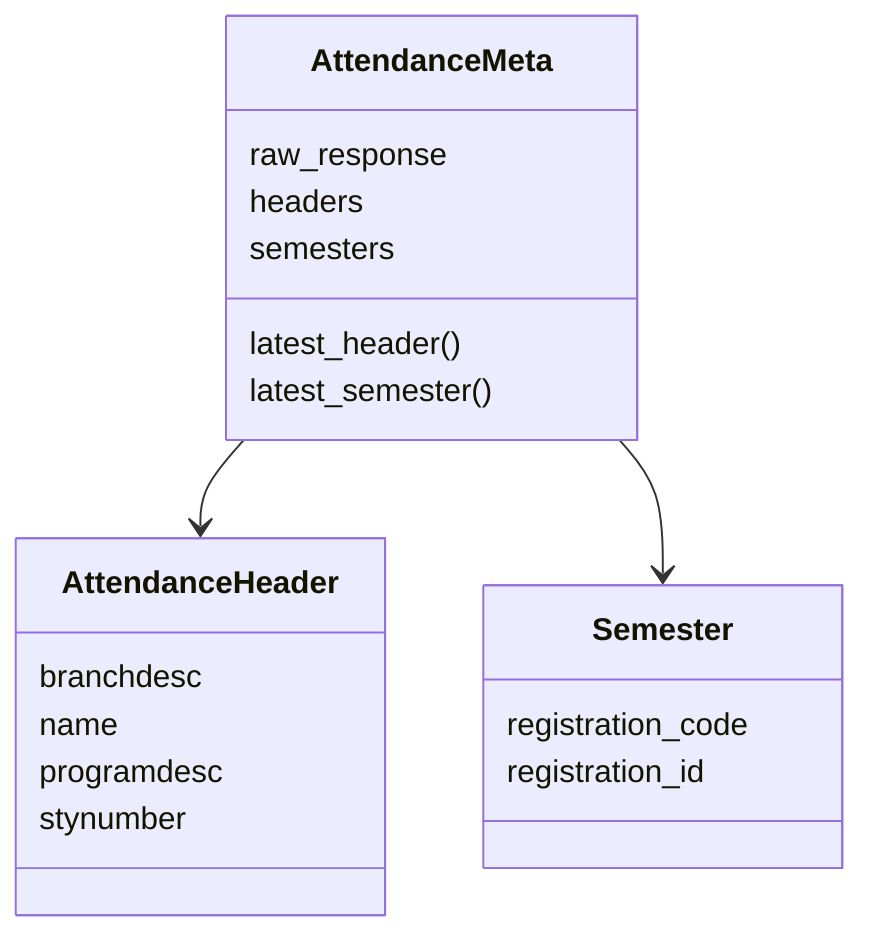
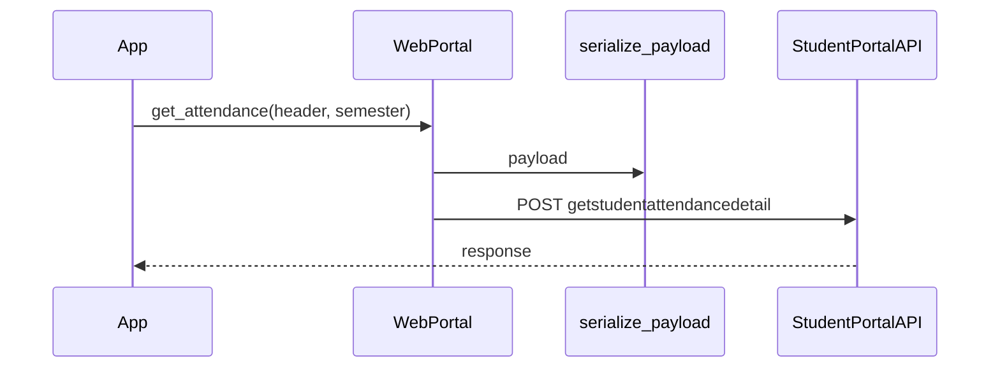
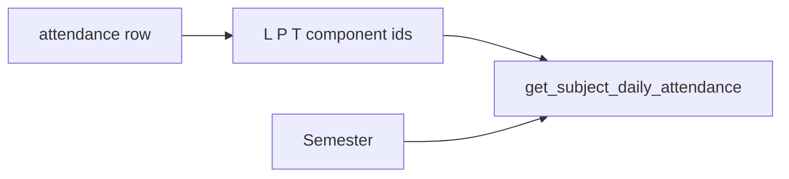
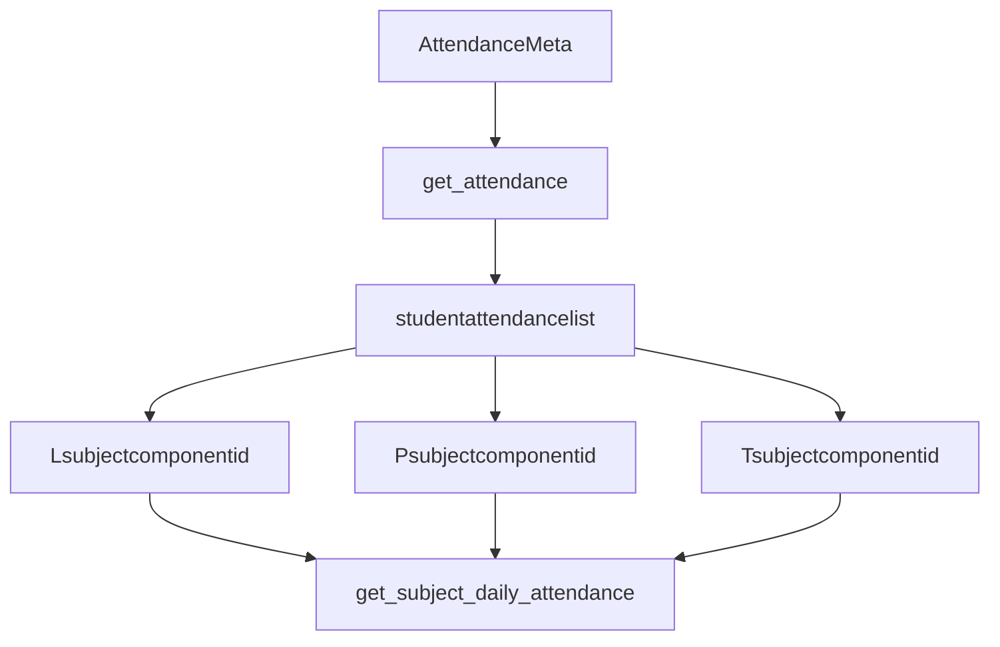

# Attendance methods

Three `WebPortal` methods plus the models in `src/attendance.js`. Models: [Data models](3.9-data-models).

## Call chain



## `get_attendance_meta`

```javascript
async get_attendance_meta()
```

`POST /StudentClassAttendance/getstudentInforegistrationforattendence`

Plain JSON:

```javascript
{
  clientid: this.session.clientid,
  instituteid: this.session.instituteid,
  membertype: this.session.membertype,
}
```

Returns `new AttendanceMeta(resp.response)`.



`AttendanceMeta` maps `headerlist` → `AttendanceHeader` and `semlist` → `Semester`. `latest_header()` / `latest_semester()` return index `0`.



`AttendanceHeader.from_json` reads `branchdesc`, `name`, `programdesc`, `stynumber`.

`Semester.from_json` reads `registrationcode` and `registrationid`.

## `get_attendance`

```javascript
async get_attendance(header, semester)
```

`POST /StudentClassAttendance/getstudentattendancedetail`

Body is `serialize_payload` of:

```javascript
{
  clientid,
  instituteid,
  registrationcode: semester.registration_code,
  registrationid: semester.registration_id,
  stynumber: header.stynumber,
}
```

That encrypted string is passed as `options.json`. Returns `resp.response` (raw). Typical key: `studentattendancelist`.



## `get_subject_daily_attendance`

```javascript
async get_subject_daily_attendance(semester, subjectid, individualsubjectcode, subjectcomponentids)
```

`POST /StudentClassAttendance/getstudentsubjectpersentage` (portal spelling).

Encrypted payload:

```javascript
{
  cmpidkey: subjectcomponentids.map((id) => ({ subjectcomponentid: id })),
  clientid,
  instituteid,
  registrationcode: semester.registration_code,
  registrationid: semester.registration_id,
  subjectcode: individualsubjectcode,
  subjectid,
}
```

Component ids usually come from `Lsubjectcomponentid`, `Psubjectcomponentid`, `Tsubjectcomponentid` on a row of `studentattendancelist`. See [Quick start guide](2.2-quick-start-guide).



## Auth

All three names are in `authenticatedMethods`. Call them only after `student_login`.


