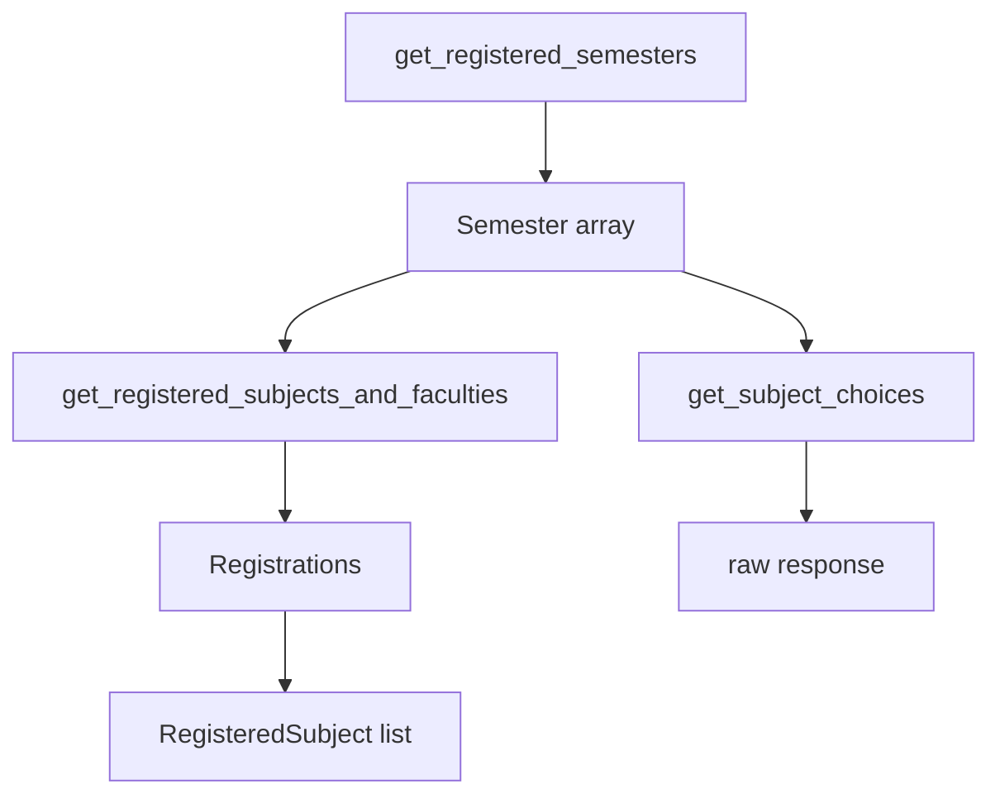
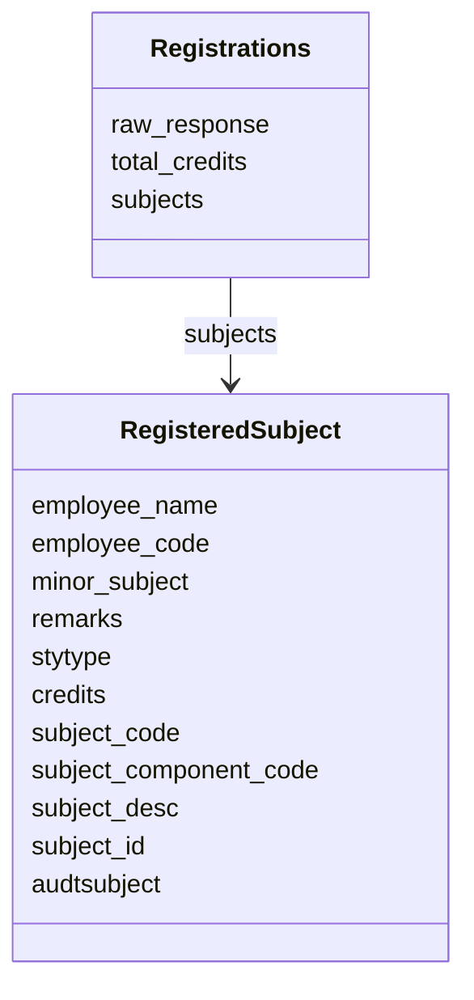
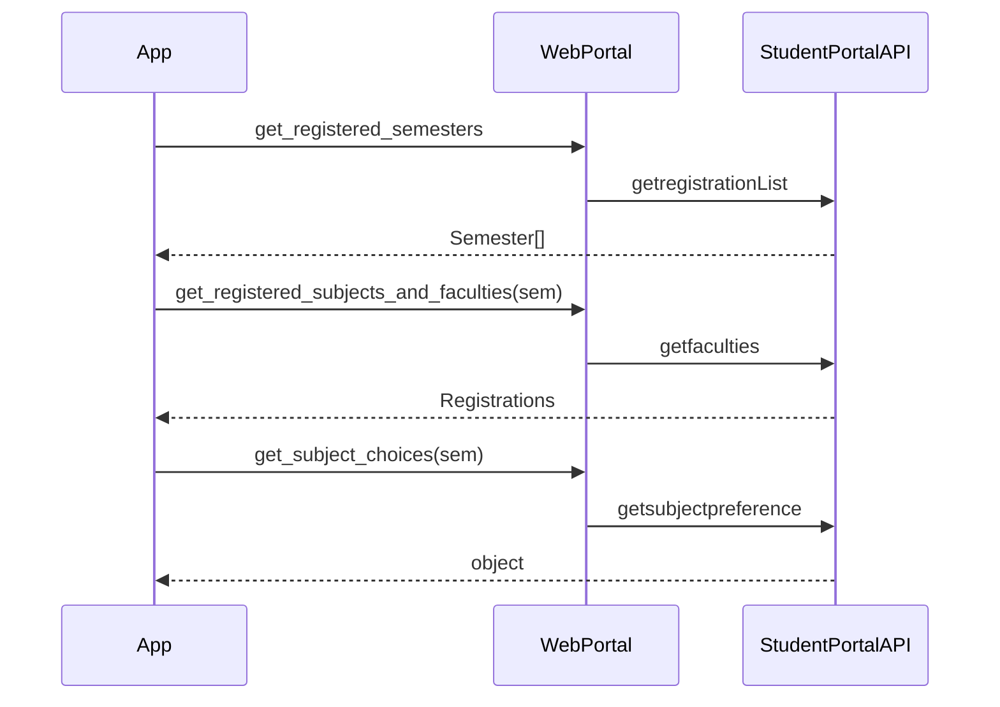
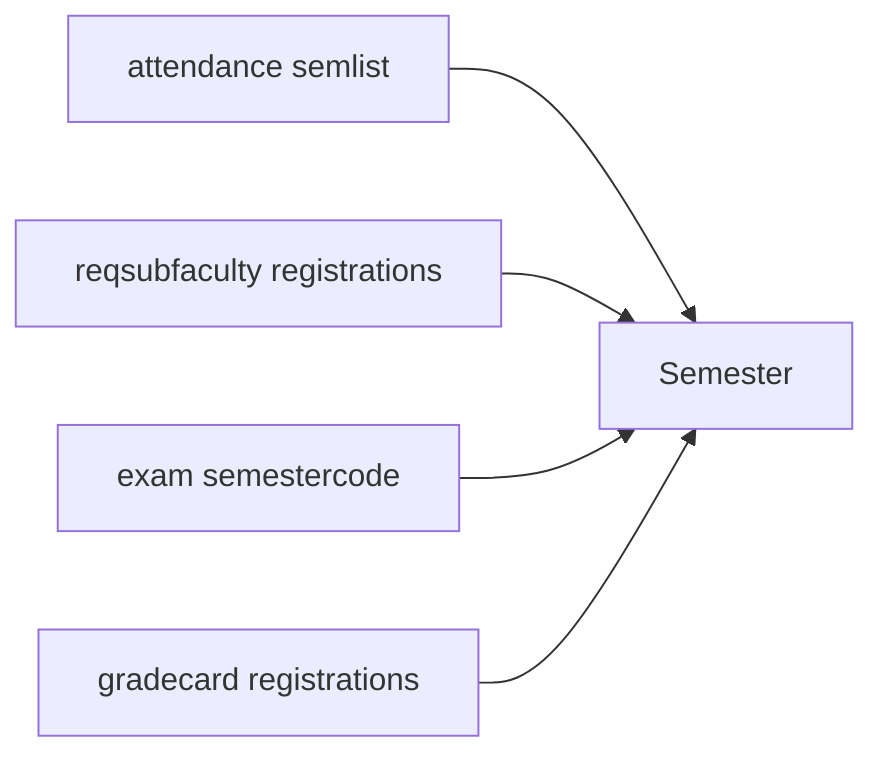
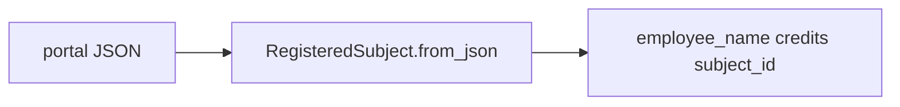

# Registration and subject methods

Registered semesters, faculty list, and subject preference print. Models live in `src/registration.js`. `Semester` is reused from `src/attendance.js`.

## Flow



## `get_registered_semesters`

```javascript
async get_registered_semesters()
```

`POST /reqsubfaculty/getregistrationList`

Encrypted JSON:

```javascript
{ instituteid, studentid: this.session.memberid }
```

Maps `resp.response.registrations` with `Semester.from_json`.

## `get_registered_subjects_and_faculties`

```javascript
async get_registered_subjects_and_faculties(semester)
```

`POST /reqsubfaculty/getfaculties`

```javascript
{
  instituteid,
  studentid: this.session.memberid,
  registrationid: semester.registration_id,
}
```

Returns `new Registrations(resp.response)`.



`Registrations` reads `totalcreditpoints` and maps `registrations` through `RegisteredSubject.from_json`. JSON keys are flattened names (`employeename`, `subjectcode`, …).

## `get_subject_choices`

```javascript
async get_subject_choices(semester)
```

`POST /studentchoiceprint/getsubjectpreference`

```javascript
{
  instituteid,
  clientid: this.session.clientid,
  registrationid: semester.registration_id,
}
```

Returns `resp.response` unchanged.



## Semester identity

`Semester` is the same class attendance uses. Pass a `Semester` from **this** list into faculty / choices. A semester from grade-card or exam endpoints has the same fields but may not be valid for `/reqsubfaculty`.



All four lists parse with `Semester.from_json`. Do not mix them blindly across endpoints.

These three methods are in `authenticatedMethods`.


