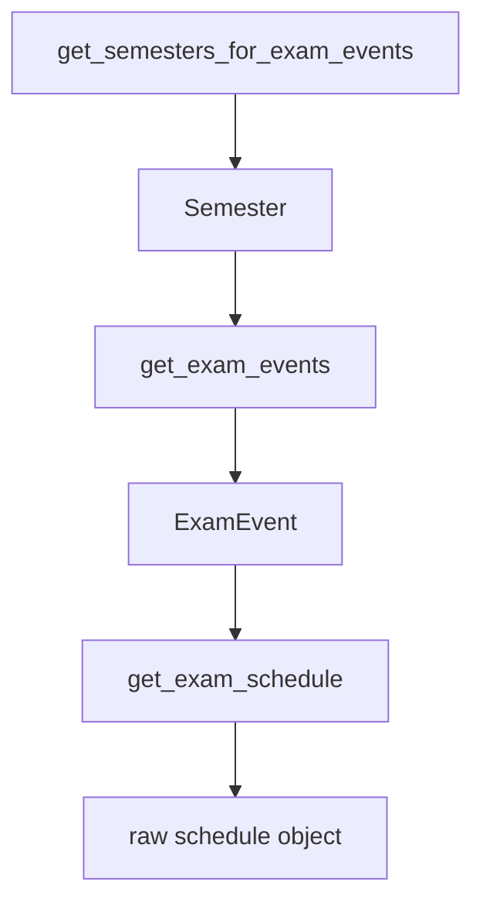
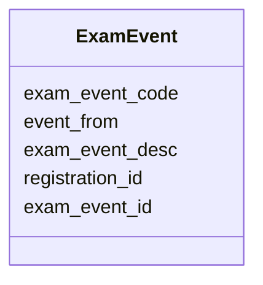
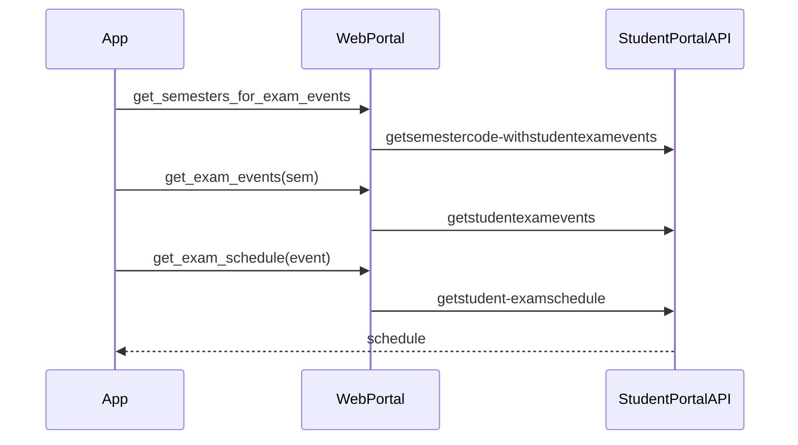

# Exam and schedule methods

Three calls: list semesters that have exam events, list events, fetch a schedule. `ExamEvent` is `src/exam.js`.

## Order



## `get_semesters_for_exam_events`

```javascript
async get_semesters_for_exam_events()
```

`POST /studentcommonsontroller/getsemestercode-withstudentexamevents`

```javascript
{ clientid, instituteid, memberid: this.session.memberid }
```

Maps `resp.response.semesterCodeinfo.semestercode` with `Semester.from_json`.

## `get_exam_events`

```javascript
async get_exam_events(semester)
```

`POST /studentcommonsontroller/getstudentexamevents`

```javascript
{
  instituteid,
  registationid: semester.registration_id, // portal key spelling
}
```

Maps `resp.response.eventcode.examevent` with `ExamEvent.from_json`.



JSON → fields: `exameventcode`, `eventfrom`, `exameventdesc`, `registrationid`, `exameventid`.

## `get_exam_schedule`

```javascript
async get_exam_schedule(exam_event)
```

`POST /studentsttattview/getstudent-examschedule`

```javascript
{
  instituteid,
  registrationid: exam_event.registration_id,
  exameventid: exam_event.exam_event_id,
}
```

Returns `resp.response`. Venue and paper rows stay as the portal sent them.



All three methods encrypt the payload with `serialize_payload` and sit on `authenticatedMethods`.
