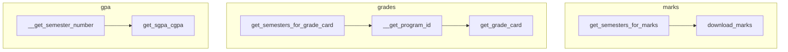
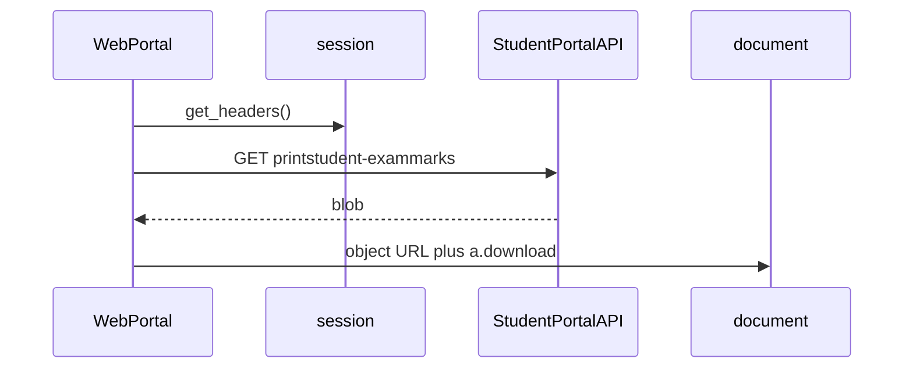
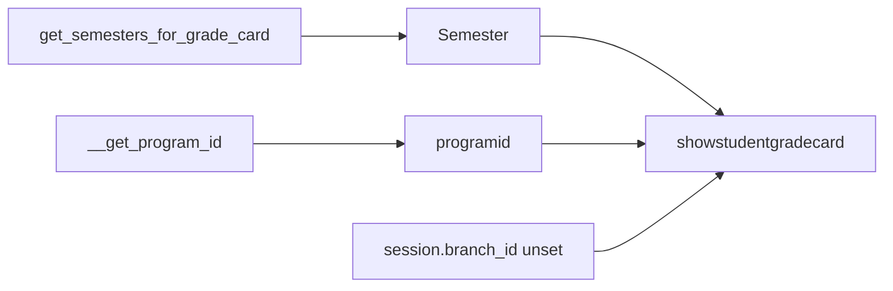
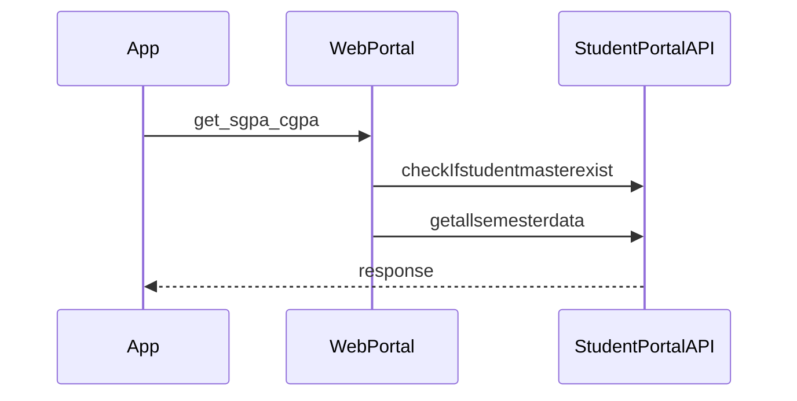

# Academic records methods

Marks PDF, grade card, SGPA/CGPA. Private helpers `__get_program_id` and `__get_semester_number` sit on the same prototype.

## Groups



## Marks

### `get_semesters_for_marks`

`POST /studentcommonsontroller/getsemestercode-exammarks`

```javascript
{ instituteid, studentid: this.session.memberid }
```

Maps `resp.response.semestercode` to `Semester`.

### `download_marks(semester)`

Does **not** use `__hit`. GET:

```
/studentsexamview/printstudent-exammarks/{instituteid}/{registration_id}/{registration_code}
```

Commented-out code in the source used to put `memberid` in the path. 0.0.22 does not.



Creates `marks_{registration_code}.pdf`, clicks it, revokes the URL. Throws `APIError` wrapping the caught error. Needs a real `document`.

`get_headers(localname)` is called with an extra argument that the method ignores.

## Grade card

### `get_semesters_for_grade_card`

`POST /studentgradecard/getregistrationList` with `{ instituteid }`. Maps `resp.response.registrations`.

### `__get_program_id`

`POST /studentgradecard/getstudentinfo` with `{ instituteid }`. Returns `resp.response.programid`.

### `get_grade_card(semester)`

Calls `__get_program_id`, then `POST /studentgradecard/showstudentgradecard`:

```javascript
{
  branchid: this.session.branch_id,
  instituteid,
  programid,
  registrationid: semester.registration_id,
}
```

`WebPortalSession` never sets `branch_id`. The field is `undefined` unless you assign it.



## SGPA / CGPA

### `__get_semester_number`

`POST /studentsgpacgpa/checkIfstudentmasterexist`

```javascript
{
  instituteid,
  studentid: this.session.memberid,
  name: this.session.name,
  enrollmentno: this.session.enrollmentno,
}
```

Returns `resp.response.studentlov.currentsemester`.

### `get_sgpa_cgpa`

`POST /studentsgpacgpa/getallsemesterdata`

```javascript
{
  instituteid,
  studentid: this.session.memberid,
  stynumber: await this.__get_semester_number(),
}
```

Returns `resp.response`.



All of these except the inner `fetch` of `download_marks` encrypt payloads. The five public names plus both helpers are in `authenticatedMethods`.
