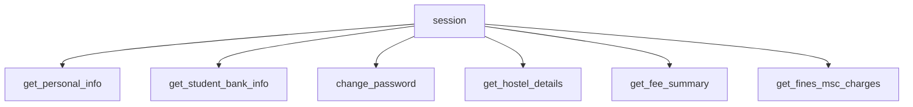
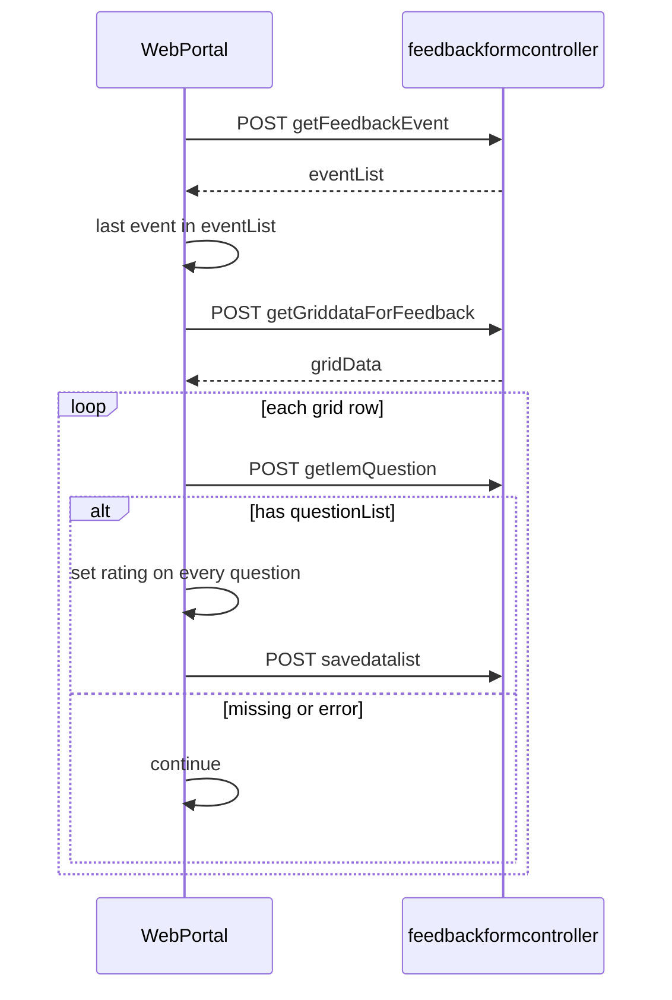
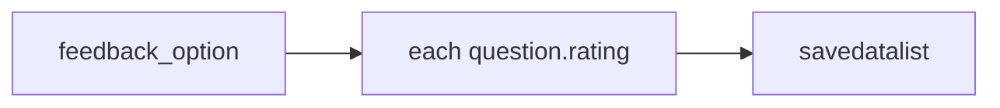

# Feedback and account methods

Personal data, bank, password, hostel, fees, fines, and `fill_feedback_form`.

## Account reads and password



### `get_personal_info`

`POST /studentpersinfo/getstudent-personalinformation`

```javascript
{ clinetid: "SOAU", instituteid }
```

Portal key is `clinetid`. Plain JSON. Returns `resp.response`.

### `get_student_bank_info`

`POST /studentbankdetails/getstudentbankinfo`

```javascript
{ instituteid, studentid: this.session.memberid }
```

Plain JSON.

### `change_password(old_password, new_password)`

`POST /clxuser/changepassword`

```javascript
{
  membertype: this.session.membertype,
  oldpassword: old_password,
  newpassword: new_password,
  confirmpassword: new_password,
}
```

Uses `exception: AccountAPIError`. Plain JSON.

### `get_hostel_details`

`POST /myhostelallocationdetail/gethostelallocationdetail`

```javascript
{ clientid, instituteid, studentid: this.session.memberid }
```

If `resp.response` is missing, throws `new Error("Hostel details not found")` (native `Error`, not `APIError`).

### `get_fee_summary`

`POST /studentfeeledger/loadfeesummary` with `{ instituteid }`. Plain JSON.

### `get_fines_msc_charges`

`POST /collectionpendingpayments/getpendingpaymentsdata` with encrypted `{ instituteid, studentid }`.

JSDoc in source says a `"NO APPROVED REQUEST FOUND"` failure is possible. `__hit` still throws `APIError` when `responseStatus !== "Success"`. Catch that if an empty fines list is normal.

These six names are in `authenticatedMethods`.

## `fill_feedback_form`

```javascript
async fill_feedback_form(feedback_option)
```

Not in `authenticatedMethods`. `test.html` calls `fill_feedback_form("EXCELLENT")`.



1. `POST /feedbackformcontroller/getFeedbackEvent` with `{ instituteid }`. Takes **last** item in `eventList` (`semesters[semesters.length - 1]`).
2. `POST /feedbackformcontroller/getGriddataForFeedback` encrypted `{ instituteid, studentid, eventid }`.
3. For each grid row, `POST /feedbackformcontroller/getIemQuestion` with faculty/subject fields. On throw or missing `questionList`, skip.
4. Every question gets `rating: feedback_option`. `facultycomments` and `coursecomments` are `null`.
5. `POST /feedbackformcontroller/savedatalist` with encrypted payload.

`src/feedback.js` (not re-exported):

```javascript
UNSATISFIED, SATISFIED, GOOD, VERY_GOOD, EXCELLENT
```

There is no per-question UI. One string is written onto every question for every faculty row of the latest event.


