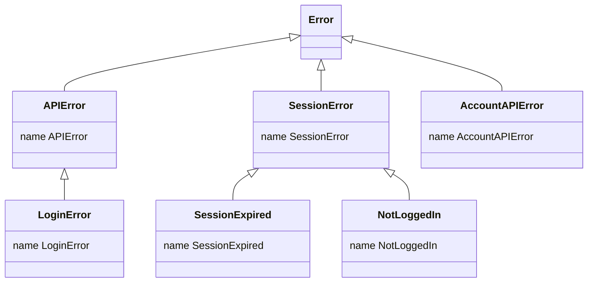
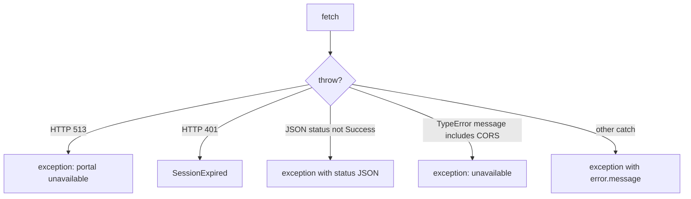
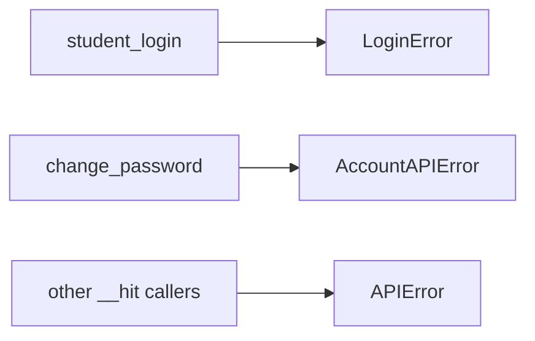
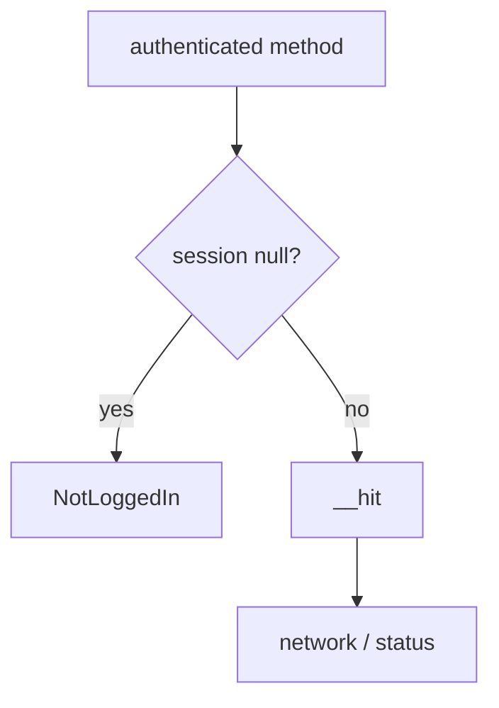
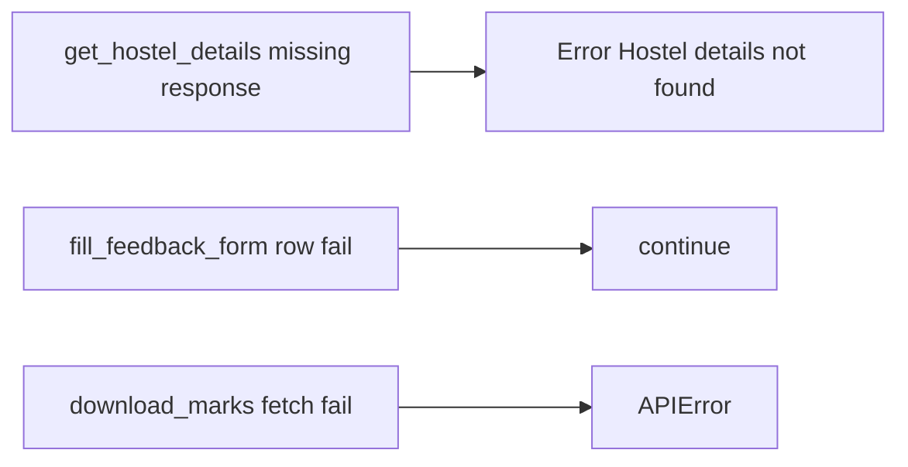

# Error handling

Six classes in `src/exceptions.js`. `__hit` decides which one to throw. The `authenticated` wrapper throws `NotLoggedIn`.

## Hierarchy



`AccountAPIError` does **not** extend `APIError`. `instanceof APIError` will not catch password failures.

| Class | Base | Thrown from |
| --- | --- | --- |
| `APIError` | `Error` | default `__hit`, `download_marks` catch |
| `LoginError` | `APIError` | `student_login` |
| `SessionError` | `Error` | not thrown directly |
| `SessionExpired` | `SessionError` | HTTP 401 in `__hit` |
| `NotLoggedIn` | `SessionError` | `authenticated()` when `session == null` |
| `AccountAPIError` | `Error` | `change_password` |

Each constructor sets `this.name` to the class name.

## `__hit` decisions



| Condition | Class | Message |
| --- | --- | --- |
| status 513 | `options.exception` or `APIError` | `JIIT Web Portal server is temporarily unavailable (HTTP 513). Please try again later.` |
| status 401 | always `SessionExpired` | `response.error` (Response has no `.error`; this is often `undefined`) |
| `resp.status.responseStatus !== "Success"` | `options.exception` | stringified `resp.status` |
| `TypeError` whose message includes `"CORS"` | `options.exception` | unavailable text without 513 |
| other catch | `options.exception` | `error.message` or `"Unknown error"` |

A successful HTTP 200 with a failure payload still throws.



## Catching

```javascript
import { WebPortal, LoginError, NotLoggedIn, SessionExpired, APIError, AccountAPIError } from "jsjiit";

const portal = new WebPortal();
try {
  await portal.student_login(user, pass);
  await portal.get_attendance_meta();
} catch (e) {
  if (e instanceof LoginError) {
    // bad credentials or token endpoints
  } else if (e instanceof NotLoggedIn) {
    // forgot login
  } else if (e instanceof SessionExpired) {
    await portal.student_login(user, pass);
  } else if (e instanceof AccountAPIError) {
    // password change
  } else if (e instanceof APIError) {
    // 513, CORS, non-Success status
  } else {
    throw e;
  }
}
```

`get_hostel_details` can throw a plain `Error`. `fill_feedback_form` swallows per-row failures with `continue`.



There is no retry helper and no automatic re-login.


