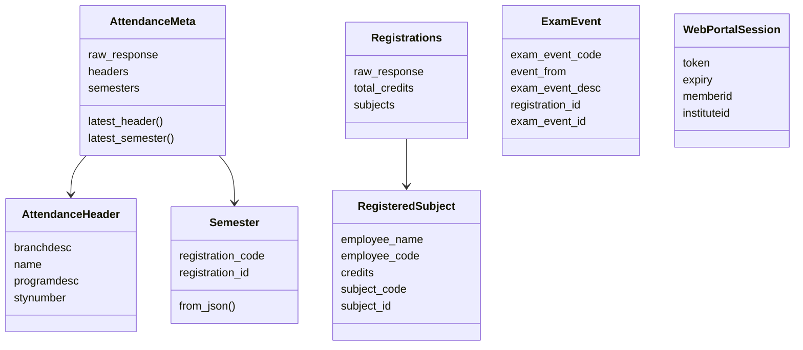
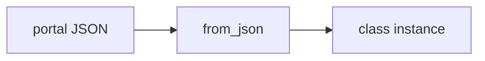
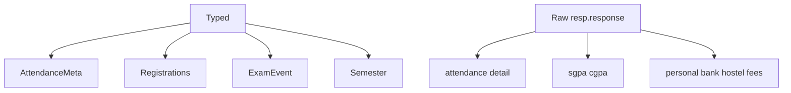

# Data models

Typed wrappers for a few portal payloads. Everything else is a raw `resp.response` object.

## Map



## Attendance (`src/attendance.js`)

### `AttendanceHeader`

Constructor: `branchdesc`, `name`, `programdesc`, `stynumber`.

`from_json(resp)` copies those four keys as-is from the portal.

### `Semester`

Constructor: `registration_code`, `registration_id`.

`from_json` maps `registrationcode` → `registration_code`, `registrationid` → `registration_id`.

Used by attendance, registration, exams, marks, and grade card lists.

### `AttendanceMeta`

```javascript
this.headers = resp.headerlist.map(AttendanceHeader.from_json);
this.semesters = resp.semlist.map(Semester.from_json);
```

`latest_*()` return `[0]`. Empty lists yield `undefined`.

## Registration (`src/registration.js`)

### `RegisteredSubject`

| Field | JSON |
| --- | --- |
| `employee_name` | `employeename` |
| `employee_code` | `employeecode` |
| `minor_subject` | `minorsubject` |
| `remarks` | `remarks` |
| `stytype` | `stytype` |
| `credits` | `credits` |
| `subject_code` | `subjectcode` |
| `subject_component_code` | `subjectcomponentcode` |
| `subject_desc` | `subjectdesc` |
| `subject_id` | `subjectid` |
| `audtsubject` | `audtsubject` |

### `Registrations`

`total_credits` ← `totalcreditpoints`. `subjects` ← `registrations.map(RegisteredSubject.from_json)`.

## Exam (`src/exam.js`)

`ExamEvent.from_json`:

| Field | JSON |
| --- | --- |
| `exam_event_code` | `exameventcode` |
| `event_from` | `eventfrom` |
| `exam_event_desc` | `exameventdesc` |
| `registration_id` | `registrationid` |
| `exam_event_id` | `exameventid` |

## Session (`src/wrapper.js`)

Not a domain DTO, but it is the other structured object you get back. See [Authentication and session management](3.2-authentication-and-session-management).





Raw returns (no class): attendance detail, daily attendance, exam schedule, grade card, SGPA, personal info, bank, hostel, fees, fines, subject choices.

## Feedback enum

`src/feedback.js` default-exports a frozen object. It is not a model class and is not in `src/index.js`.
