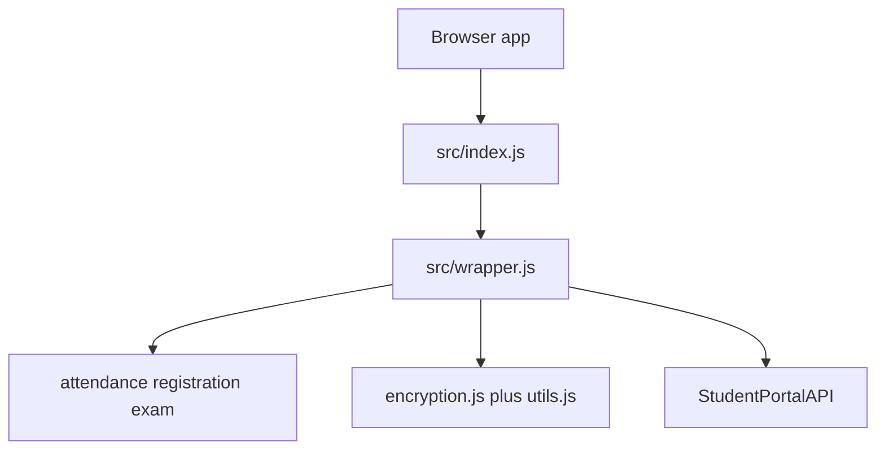
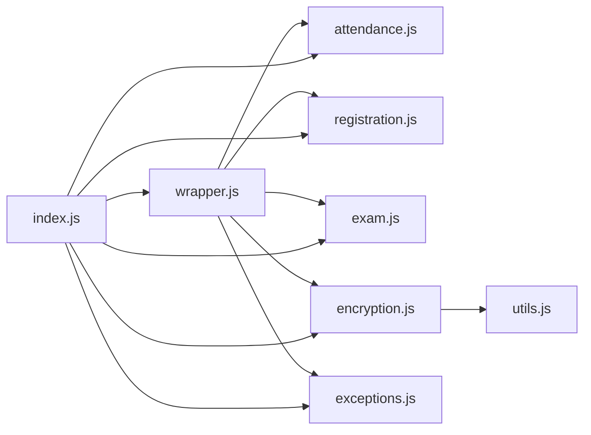
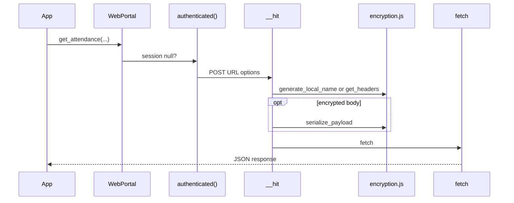
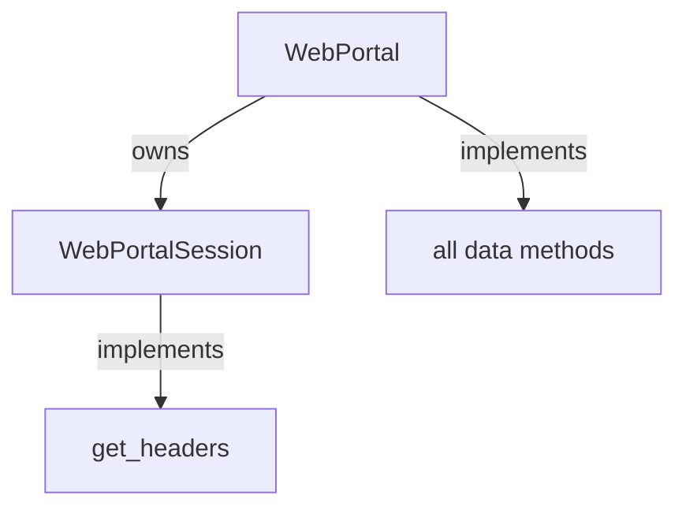
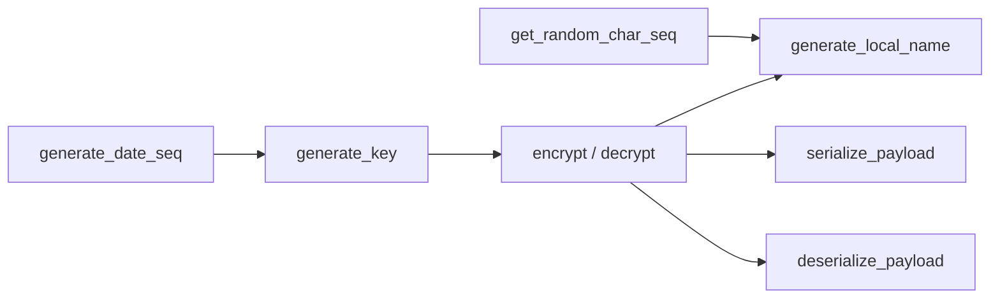
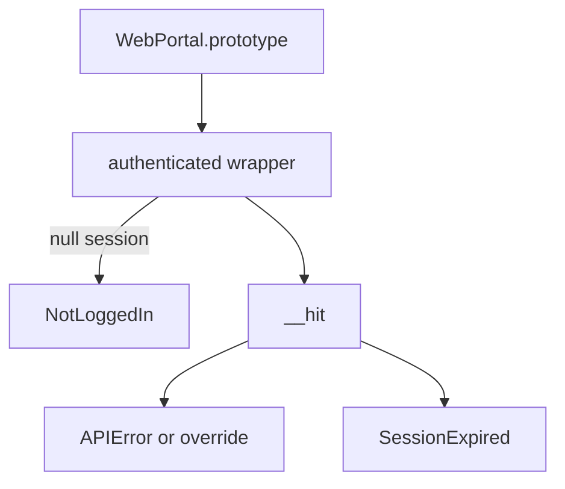
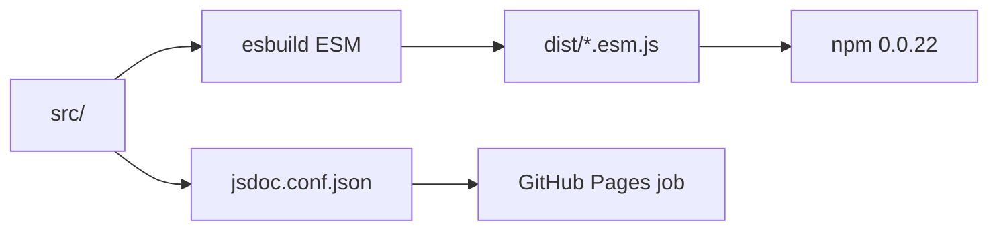

# Architecture and design

How 0.0.22 is split: a thin public barrel, one HTTP wrapper, domain files, Web Crypto, and esbuild. Closer looks: [System architecture overview](4.1-system-architecture-overview), [Encryption and security](4.2-encryption-and-security), [Module organization](4.3-module-organization).

## Layers

The app never talks to the portal except through `WebPortal`. Models do not fetch.

## Source files

`feedback.js` is imported by nobody. `fill_feedback_form` takes a string.

## Request path

## Session vs methods

Older write-ups put `get_attendance` on the session class. In this source they are on `WebPortal`.

## Crypto placement

`deserialize_payload` is unused by the wrapper. See [Encryption and security](4.2-encryption-and-security).

## Errors

## Ship path

No runtime npm dependencies. Browser APIs only.
