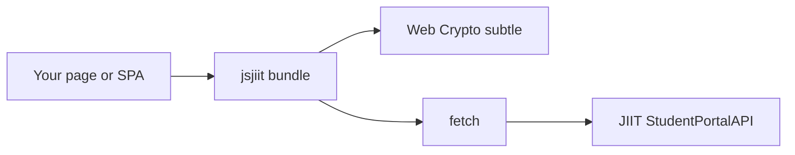
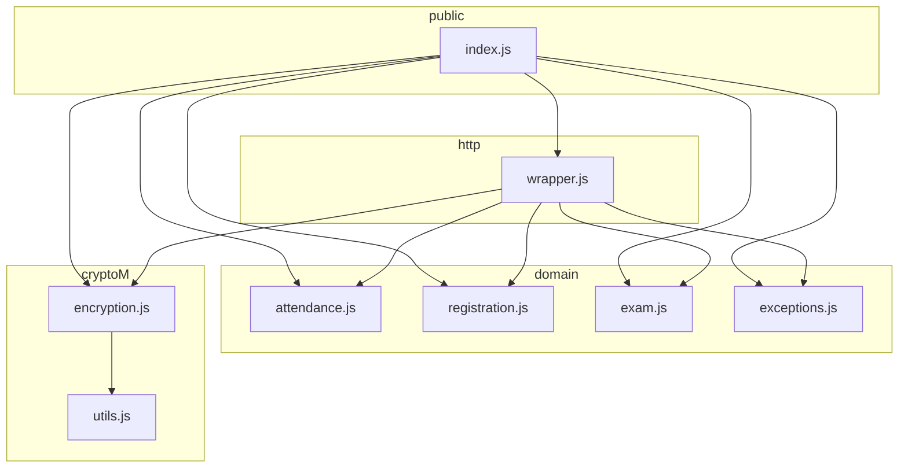
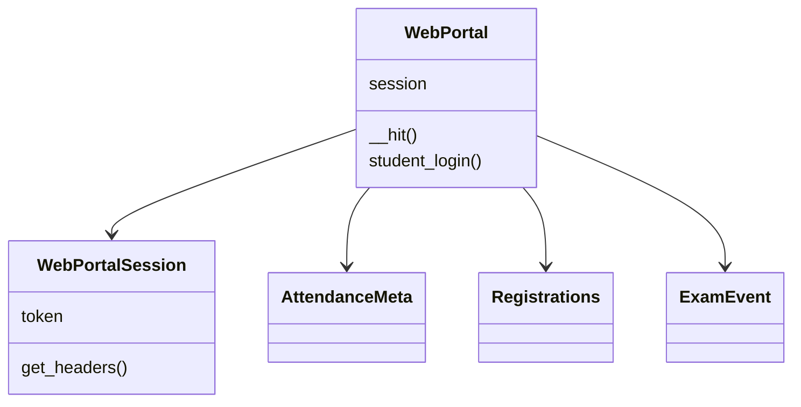
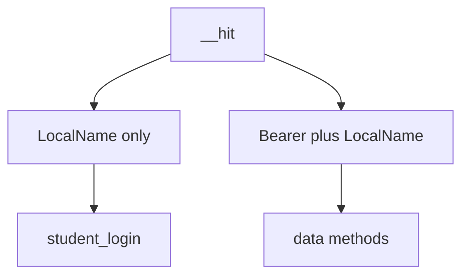
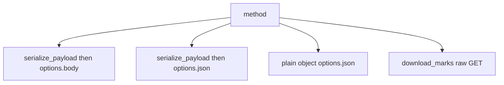
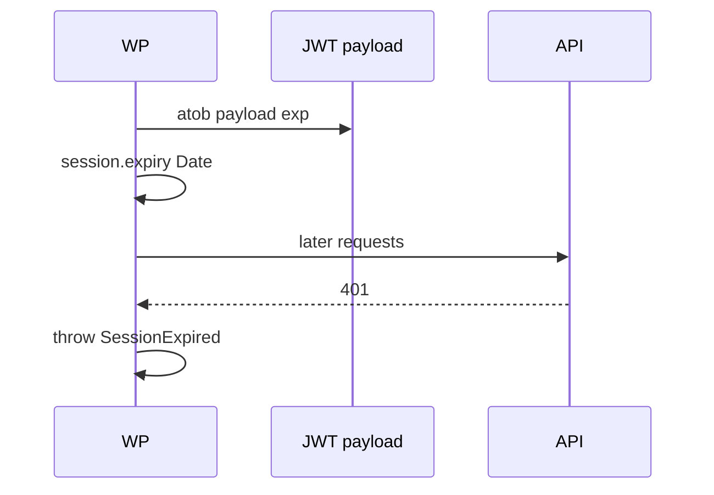
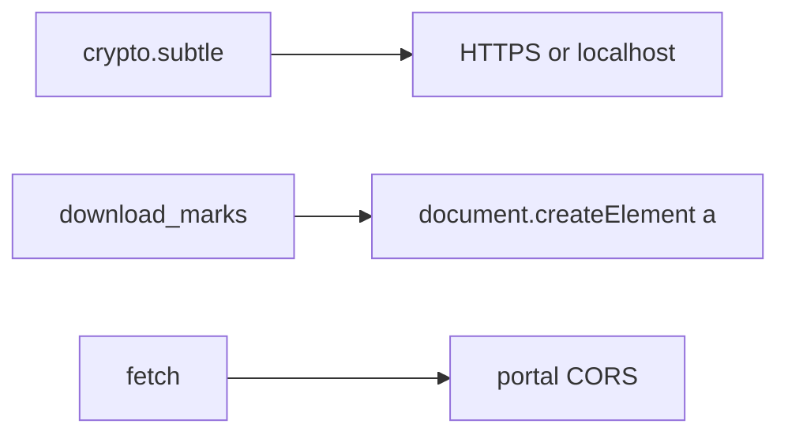
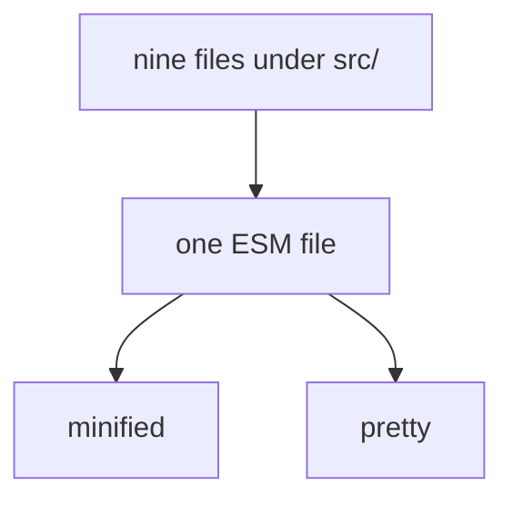

# System architecture overview

Runtime shape of jsjiit 0.0.22 in the browser against `https://webportal.jiit.ac.in:6011/StudentPortalAPI`.

## Context

CORS is the portal's problem. If the browser blocks the request, `__hit` may wrap a `TypeError` whose message contains `"CORS"`.

## Module graph

## Class roles

## Authenticated vs open

Login is the only unauthenticated public method.

## Body styles

| Style | Examples |
| --- | --- |
| encrypted `body` | pret token, generate-token1 |
| encrypted `json` | attendance detail, exams, grade card, SGPA, fines |
| plain `json` | personal info, bank, password, attendance meta, hostel, fees |
| GET blob | `download_marks` |

## Token lifetime

No proactive expiry check.

## Browser constraints

`run_server` exists because `crypto.subtle` is unavailable on plain HTTP except some localhost cases. The script always serves HTTPS on port 8000.

## Build vs source

Consumers of the CDN never see module boundaries. Source maps point back at `src/`.
