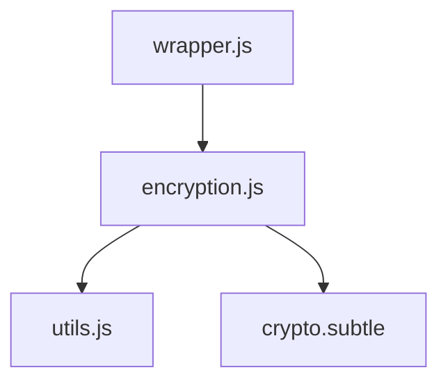
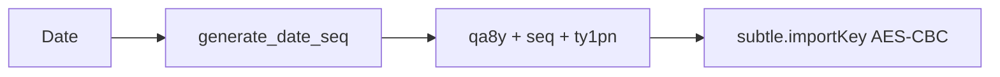
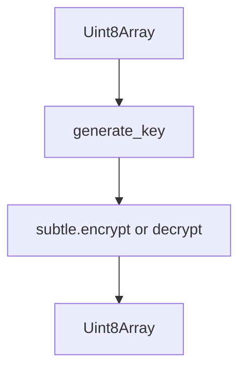
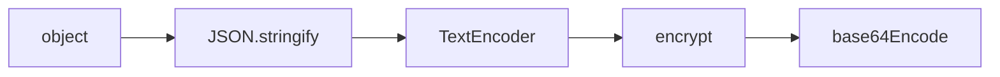
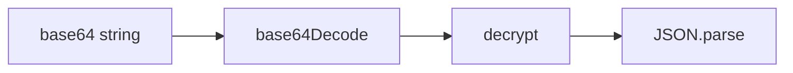
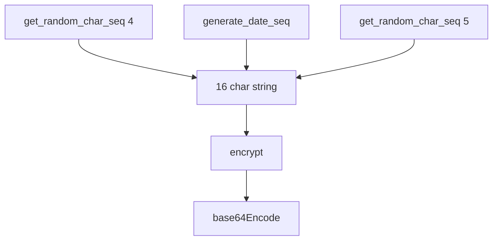
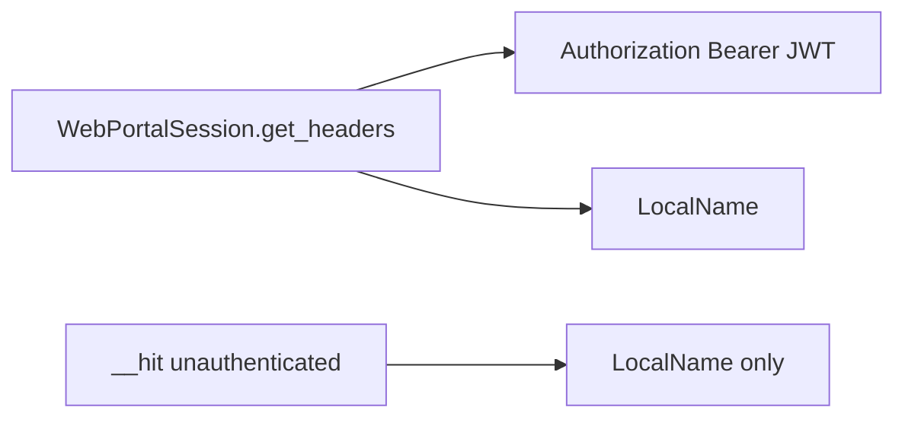
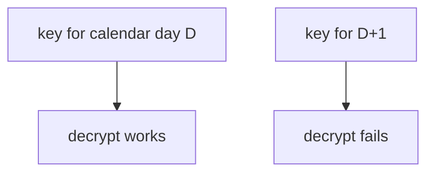
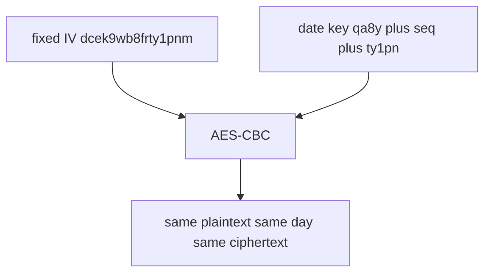

# Encryption and security

AES-CBC via `window.crypto.subtle`, date-derived keys, `LocalName`, and payload serialize helpers in `src/encryption.js` / `src/utils.js`.

## Where it sits



## AES-CBC constants

| Item | Value |
| --- | --- |
| Algorithm | AES-CBC |
| IV | `dcek9wb8frty1pnm` (16 bytes, UTF-8) |
| Key material | `"qa8y" + dateSeq + "ty1pn"` (16 chars) |

```javascript
const IV = new TextEncoder().encode("dcek9wb8frty1pnm");
```

The IV is **fixed**. Same plaintext on the same day encrypts to the same ciphertext. The portal decrypts with the same IV, so the library cannot pick a random IV.

## Date key



`generate_date_seq` (from `utils.js`) concatenates:

| Index | Piece |
| --- | --- |
| 0 | first digit of day (`01`–`31`) |
| 1 | first digit of month |
| 2 | first digit of two-digit year |
| 3 | weekday `getDay()` `0`–`6` |
| 4 | second digit of day |
| 5 | second digit of month |
| 6 | second digit of year |

Example 1 December 2024 (Sunday if `getDay()===0`): day `01`, month `12`, year `24` → `0120` plus remaining digits. Client and server must share the calendar day or decrypt fails.

## `encrypt` / `decrypt`



Both are async. They always call `generate_key()` with the current date (no argument).

## Serialize helpers





`serialize_payload` is what login and many methods call. `deserialize_payload` exists and is **not** imported by `wrapper.js`. Responses are parsed as JSON by `__hit`.

## LocalName



Charset for random pieces: `0-9a-zA-Z`. Header name is `LocalName`.

`generate_local_name` is re-exported from `src/index.js`. Normal apps do not call it.

## Headers



| Request | Headers |
| --- | --- |
| Authenticated | Bearer + LocalName |
| Login / unauthenticated `__hit` | LocalName |

## Which methods encrypt the body

| Method | Encrypt body |
| --- | --- |
| `student_login` both posts | yes (`options.body`) |
| `get_attendance` | yes |
| `get_subject_daily_attendance` | yes |
| `get_registered_semesters` | yes |
| `get_registered_subjects_and_faculties` | yes |
| exam / marks / grade / sgpa / fines / choices | yes |
| feedback grid + save | yes |
| `get_personal_info` | no |
| `get_student_bank_info` | no |
| `change_password` | no |
| `get_attendance_meta` | no |
| `get_fee_summary` | no |
| `get_hostel_details` | no |
| feedback `getFeedbackEvent` / `getIemQuestion` | no |

Password still goes over TLS in the encrypted login blob, not as a top-level JSON field on pret token.

## Base64

```javascript
export function base64Encode(data) {
  return btoa(String.fromCharCode.apply(null, new Uint8Array(data)));
}
export function base64Decode(data) {
  return Uint8Array.from(atob(data), (c) => c.charCodeAt(0));
}
```

`base64Encode` uses `apply` on the byte array. Very large payloads can hit argument-count limits. Portal payloads here are small.

## Daily rotation



A payload encrypted just before midnight can fail after midnight.



Fixed IV and date-based keys are portal constraints, not a design you should copy for new APIs. Credentials still sit in JS memory on `portal.session`.
