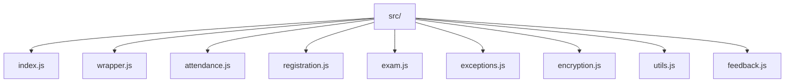
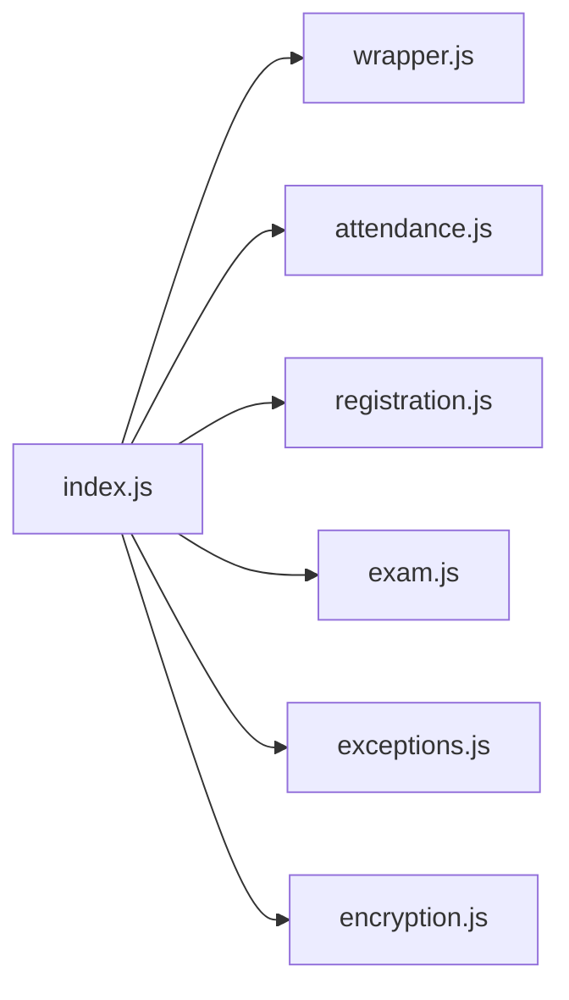
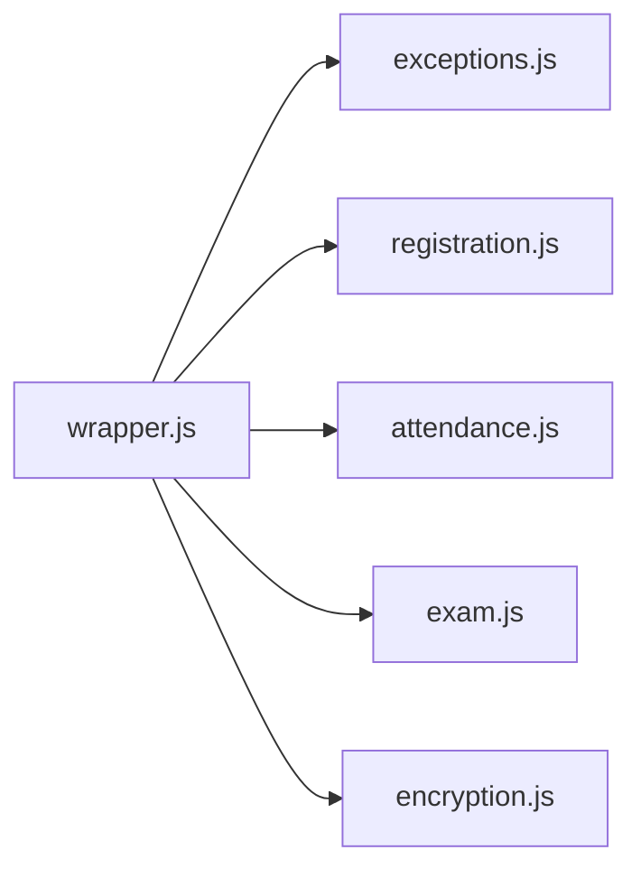
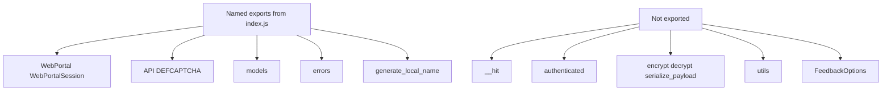
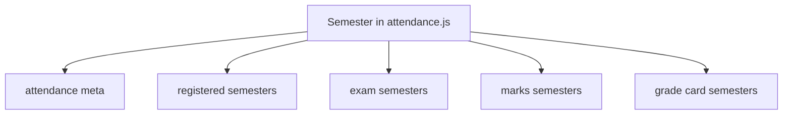
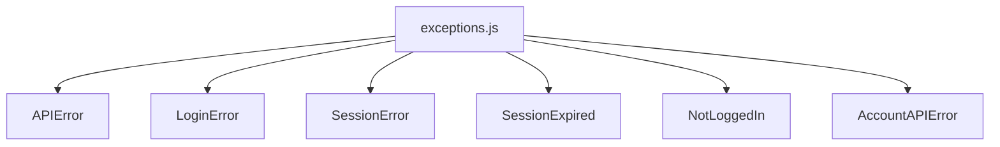
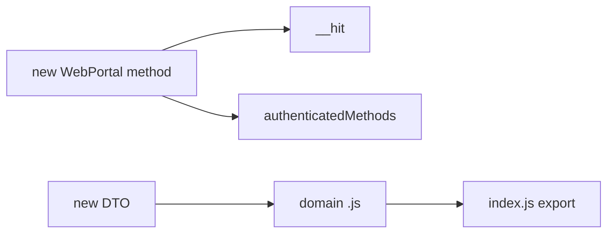

# Module organization

Nine files under `src/`. One public barrel.

## Tree

## Imports

`encryption.js` imports `generate_date_seq` and `get_random_char_seq` from `utils.js`.

`feedback.js` has no importers.

## Responsibility

| File | Owns |
| --- | --- |
| `index.js` | re-exports |
| `wrapper.js` | `API`, `DEFCAPTCHA`, `WebPortal`, `WebPortalSession`, `__hit`, every portal method |
| `attendance.js` | `AttendanceHeader`, `Semester`, `AttendanceMeta` |
| `registration.js` | `RegisteredSubject`, `Registrations` |
| `exam.js` | `ExamEvent` |
| `exceptions.js` | six error classes |
| `encryption.js` | AES helpers, `generate_local_name`, serialize |
| `utils.js` | date seq, random charset |
| `feedback.js` | frozen rating strings |

## Public vs internal

You can still import internal files from `src/` if you ship source. The CDN bundle only exposes what `index.js` exports.

## `Semester` reuse

One class, several endpoints. Keep the instance with the endpoint family that created it.

## Exceptions module

No extra types. No HTTP helper.

## Adding a method

Put the function on `WebPortal`, call `__hit` with `API + ENDPOINT`, add the name to `authenticatedMethods` if it needs a session, export nothing new unless you add a model. Rebuild with `npm run build`.

