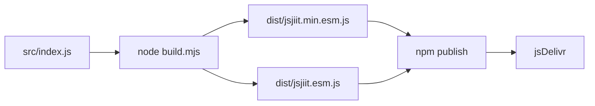
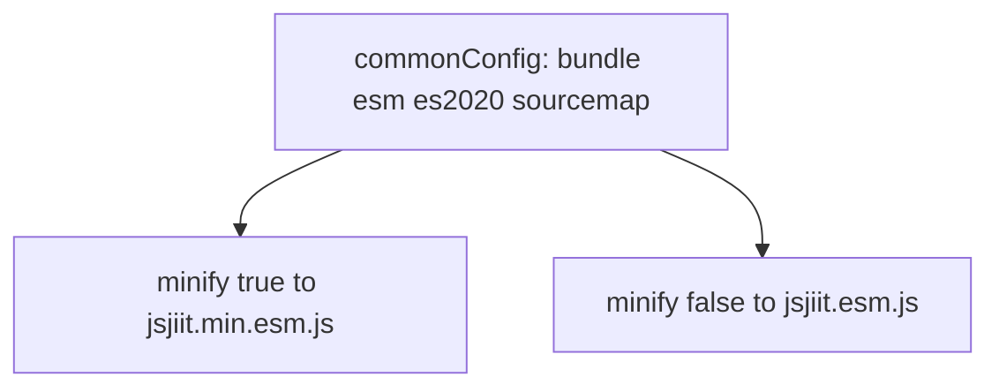
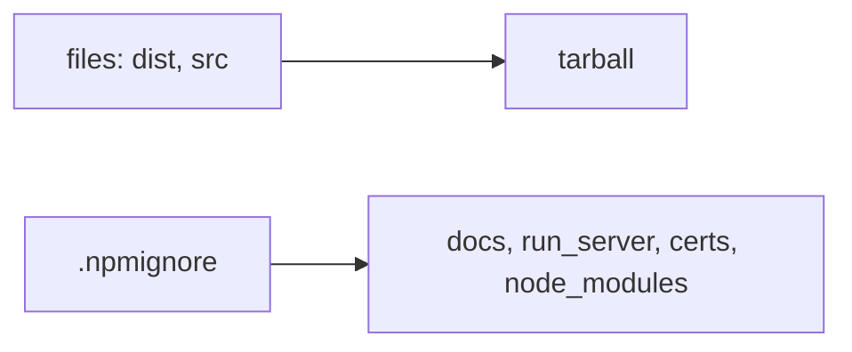
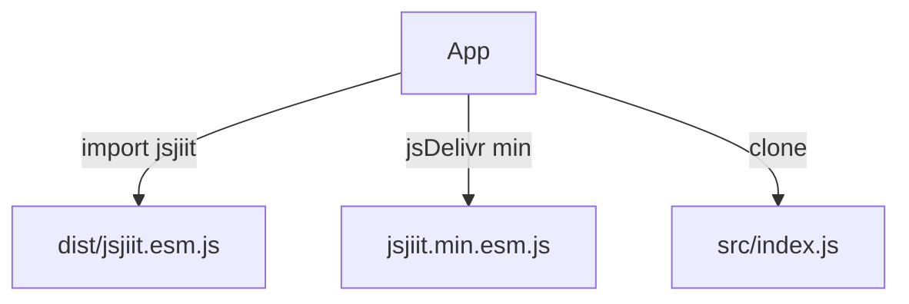

# Build and distribution

esbuild turns `src/index.js` into two ESM files. npm ships `dist/` and `src/`. jsDelivr mirrors the tarball.

Details: [Build system](5.1-build-system), [Package configuration](5.2-package-configuration), [Dependency management](5.3-dependency-management).

## Pipeline

`prepare` runs `npm run build` so a publish always bundles.

## Dual bundle

`package.json` `exports` point at the **unminified** file. CDN examples in these docs use the minified file on purpose.

## What npm includes

`.gitignore` ignores `dist` and `docs`. GitHub does not store bundles. npm does, after `prepare`.

## Consumer paths

Version for this documentation: **0.0.22**. Confirm npm before assuming the registry still matches.
