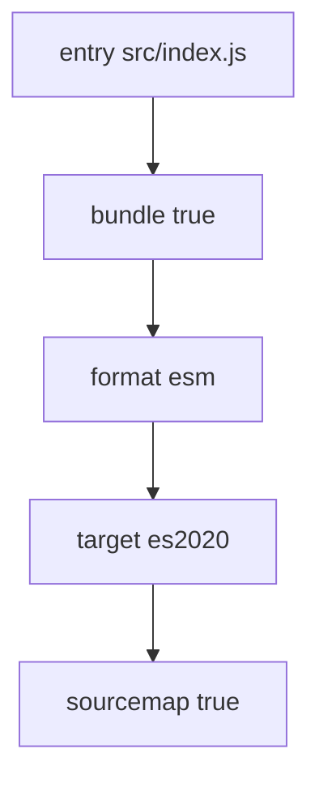
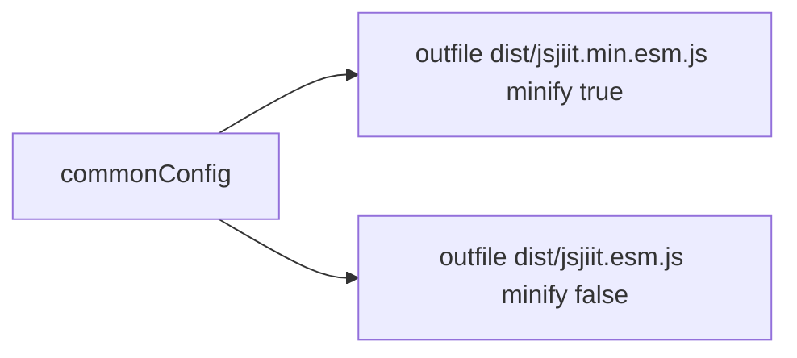
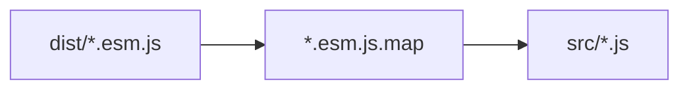
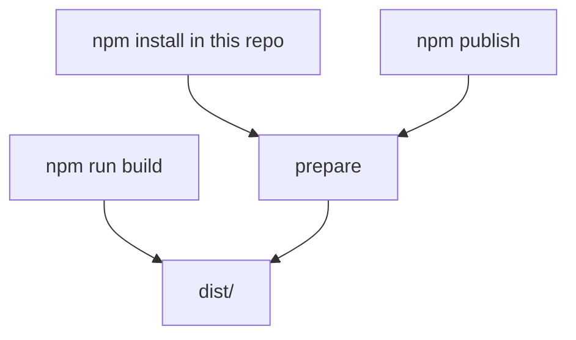

# Build system

`build.mjs` runs two `esbuild.build` calls. Script: `"build": "node build.mjs"`.

## Config

```javascript
const commonConfig = {
  entryPoints: ["src/index.js"],
  bundle: true,
  format: "esm",
  sourcemap: true,
  target: ["es2020"],
};
```



No plugins, no externals, no banner. esbuild walks the static imports from `index.js`. `feedback.js` is **not** in that graph, so it is absent from the bundle unless you import it yourself.

## Two outputs



They run in sequence in one `build()` function. Either failure `process.exit(1)`.

Console on success:

```
✅ Production build complete
✅ Development build complete
🎉 All builds completed successfully!
```

## Source maps



`sourcemap: true` writes sibling `.map` files. DevTools can show `wrapper.js` line numbers.

## When it runs



End users of the published package do not run `build.mjs`. They already have `dist/` in the tarball.

`esbuild` is `0.24.0` (exact) in `devDependencies`.
