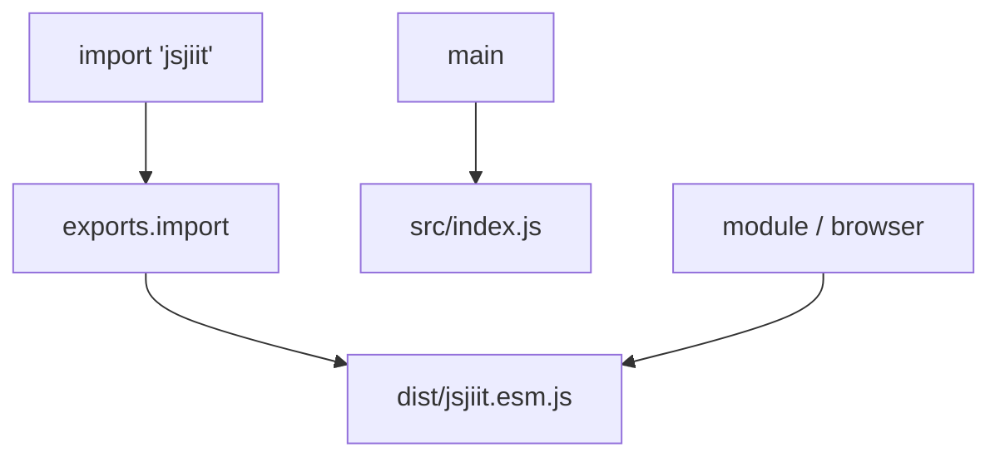
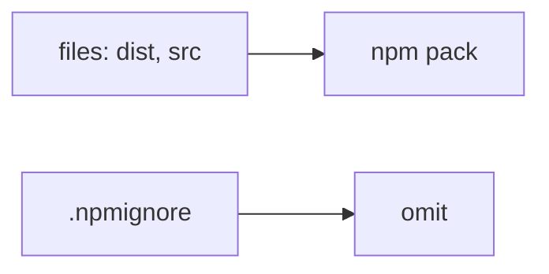
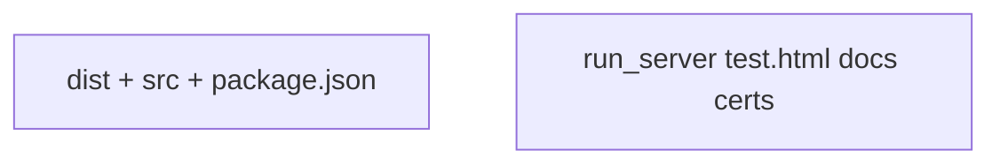
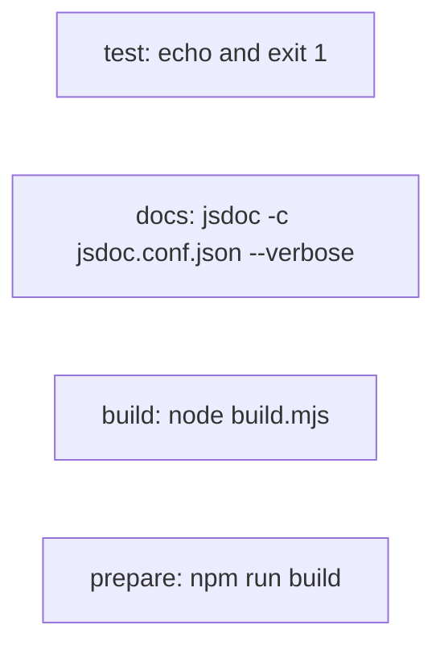
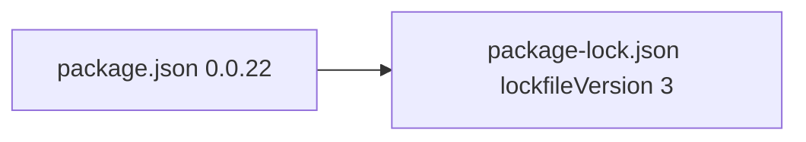
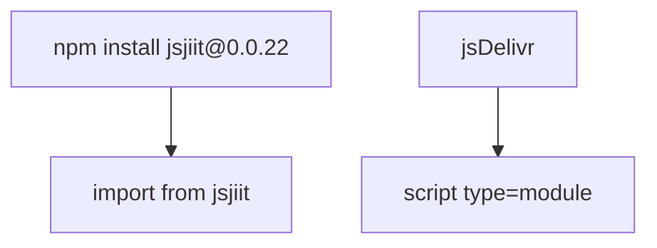
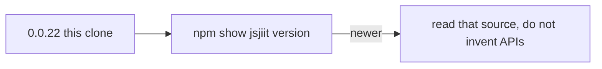
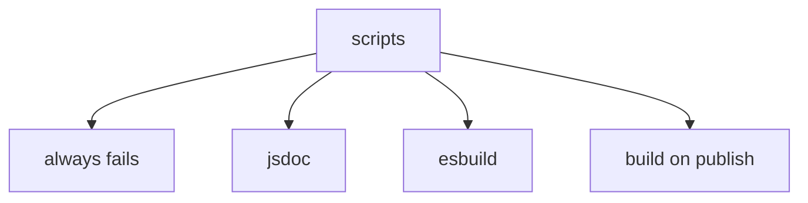
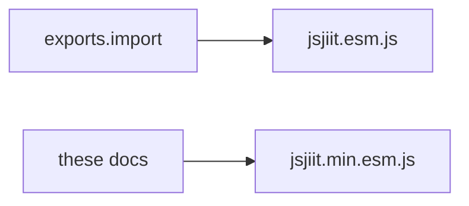

# Package configuration

`package.json` for jsjiit **0.0.22**. Build behavior: [Build system](5.1-build-system). Dev deps: [Dependency management](5.3-dependency-management).

## Identity

| Field | Value |
| --- | --- |
| `name` | `jsjiit` |
| `version` | `0.0.22` |
| `license` | `ISC` |
| `author` | `codeblech` |
| `description` | Browser-compatible API for JIIT WebPortal. Bypasses CAPTCHA. |

`repository` / `bugs` / `homepage` still point at `https://github.com/codeblech/jsjiit`. This fork lives at [tashifkhan/jsjiit](https://github.com/tashifkhan/jsjiit).

## Entry resolution



```json
"type": "module",
"main": "src/index.js",
"module": "dist/jsjiit.esm.js",
"browser": "dist/jsjiit.esm.js",
"exports": {
  "import": "./dist/jsjiit.esm.js",
  "require": "./dist/jsjiit.esm.js"
}
```

`require` still loads ESM. A CJS `require("jsjiit")` will not work in Node.

## Files on npm



`.npmignore`:

```
cert.pem
key.pem
.vscode
docs
node_modules
run_server
index.html
```



`test.html` is not in `.npmignore` and not in `files`. npm `files` whitelist wins, so `test.html` stays out of the tarball.

## Scripts



There is no real test runner. `"test"` always fails.

## Keywords

The keyword list is attendance-heavy (`jaypee-attendance-api`, …). Useful for npm search, not for the API.

## Lockfile



`lockfileVersion` 3. Dev tree includes esbuild and jsdoc (and jsdoc's Babel parser).

## Dual consume





## License field only

ISC in `package.json`. There is no separate `LICENSE` file in the clone listing.




