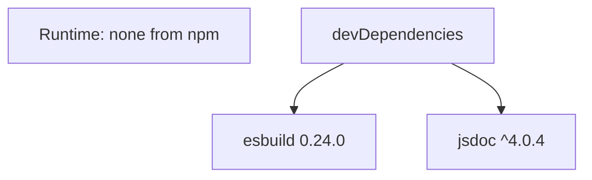
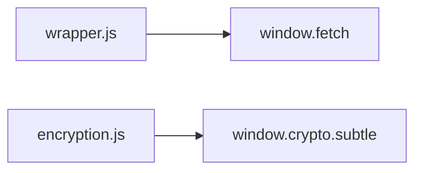
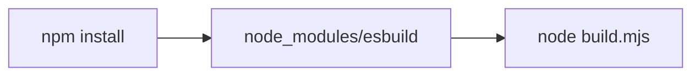
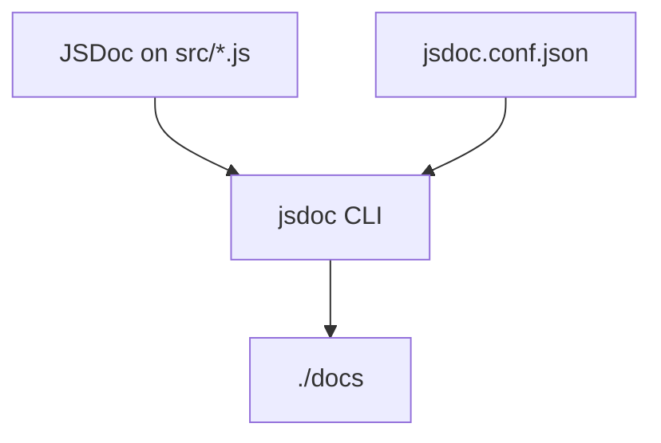
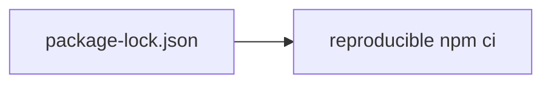
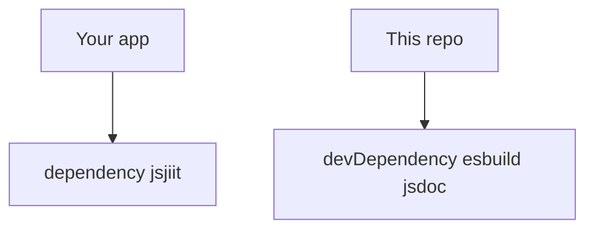

# Dependency management

jsjiit 0.0.22 has **zero** runtime `dependencies`. Two `devDependencies` build and document it. The browser supplies `fetch` and `crypto.subtle`.

## Split

## Why no HTTP library

That is why Node is not a supported runtime.

## esbuild

Pinned **exactly** `0.24.0`. Used only by `build.mjs`.

## jsdoc

`^4.0.4`. `npm run docs` and the GitHub Action `andstor/jsdoc-action@v1` both read `jsdoc.conf.json`. The Action brings its own jsdoc unless you also install locally.

## Lockfile

`package-lock.json` version field `0.0.22`, `lockfileVersion` 3. It pins the jsdoc → `@babel/parser` tree so docs builds do not drift.

## What you install as an app author

Do not add esbuild to an app unless you are patching the library.
