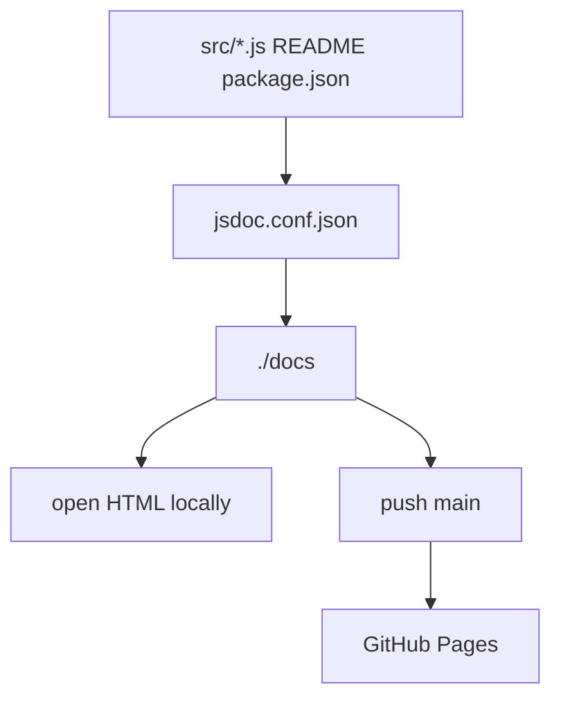
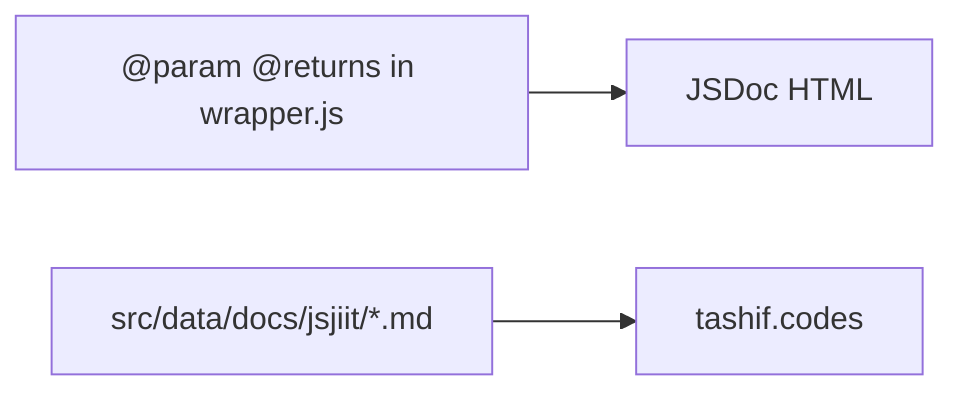
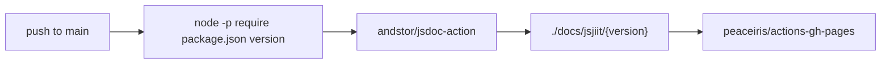

# Documentation system

JSDoc comments in `src/`, `jsdoc.conf.json`, `npm run docs`, and `.github/workflows/jsdoc-build.yaml` on `main`.

Config file: [JSDoc configuration](6.1-jsdoc-configuration). Pages job: [Automated documentation deployment](6.2-automated-documentation-deployment).

## Pieces



JSDoc is API reference generated from comments. These markdown pages on tashif.codes are a separate site.



## Local generate

```bash
npm run docs
```

runs `jsdoc -c jsdoc.conf.json --verbose`. Output directory `./docs` is gitignored.

## CI



The workflow publishes `./docs/jsjiit/${version}`. Default JSDoc output is `./docs` (see `jsdoc.conf.json` `destination`). If the Action does not rewrite the destination, `publish_dir` may not match what JSDoc wrote. Check the workflow logs on a real run.

## Comments

Public classes in `wrapper.js`, models, and exceptions have `@param` / `@returns` / `@throws`. `fill_feedback_form` has almost no JSDoc. `feedback.js` has none.
