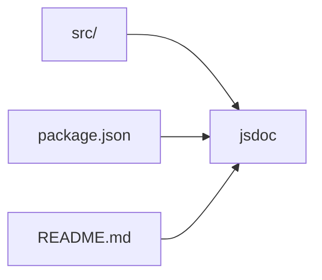
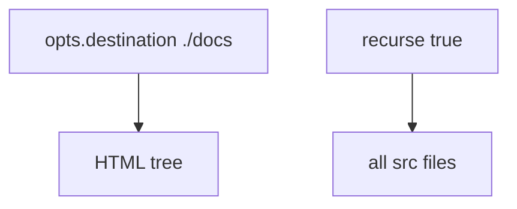
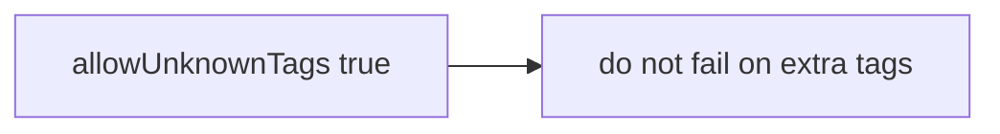
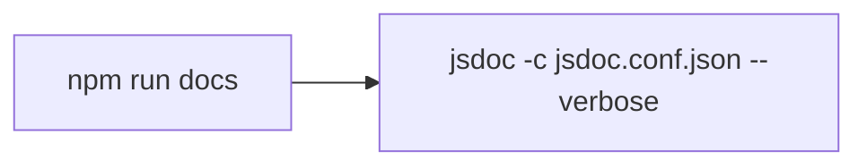

# JSDoc configuration

`jsdoc.conf.json` at the repo root.

## File

```json
{
  "source": {
    "include": ["src", "package.json", "README.md"],
    "exclude": ["node_modules"],
    "includePattern": ".+\\.js(doc|x)?$",
    "excludePattern": "(^|\\/|\\\\)_"
  },
  "opts": {
    "destination": "./docs",
    "recurse": true
  },
  "tags": {
    "allowUnknownTags": true
  },
  "templates": {
    "cleverLinks": true,
    "monospaceLinks": true
  }
}
```

## Inputs



`includePattern` keeps `.js`, `.jsdoc`, `.jsx`. Underscore-prefixed files are dropped. There are none in `src/` today.

README is the JSDoc home page. It still shows CDN `@0.0.20` and a joke tone. Generated docs inherit that.

## Output



No custom template package. Default JSDoc theme. `cleverLinks` / `monospaceLinks` only change how `{@link}` renders.

## Tags



Comments use `@module`, `@class`, `@param`, `@returns`, `@throws`, `@private`, `@constant`.

## npm script



`verbose` prints which files were parsed. Destination `docs/` is in `.gitignore` and `.npmignore`.
