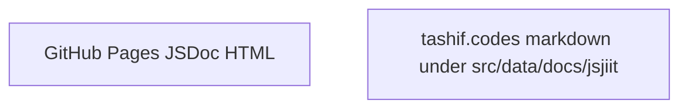

# Automated documentation deployment

Workflow file: `.github/workflows/jsdoc-build.yaml`. Trigger: `push` to `main`.

## Job

```mermaid
flowchart TD
  push[push main] --> co[actions/checkout@v2]
  co --> ver[Get package version]
  ver --> build[andstor/jsdoc-action@v1]
  build --> deploy[peaceiris/actions-gh-pages@v3]
```

Steps in source:

1. Checkout `@v2`
2. `echo "version=$(node -p "require('./package.json').version")" >> $GITHUB_OUTPUT`
3. `andstor/jsdoc-action@v1` with `recurse: true` and `config_file: jsdoc.conf.json`
4. `peaceiris/actions-gh-pages@v3` with `publish_dir: ./docs/jsjiit/${{ steps.get_version.outputs.version }}` and `GITHUB_TOKEN`

`permissions.contents: write` is set on the job. Runner: `ubuntu-latest`.

## Version folder


JSDoc's own config writes `./docs`. The publish directory expects `./docs/jsjiit/{version}`. If pages come out empty, the destination mismatch is the first thing to check. The workflow does not rewrite `jsdoc.conf.json` before the Action.

## What this site is not



This markdown set is hand-written against the 0.0.22 clone. It does not deploy from `jsdoc-build.yaml`.
