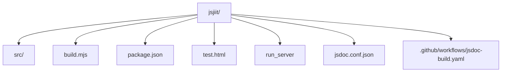
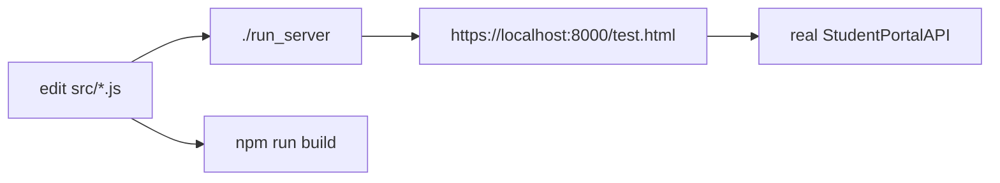
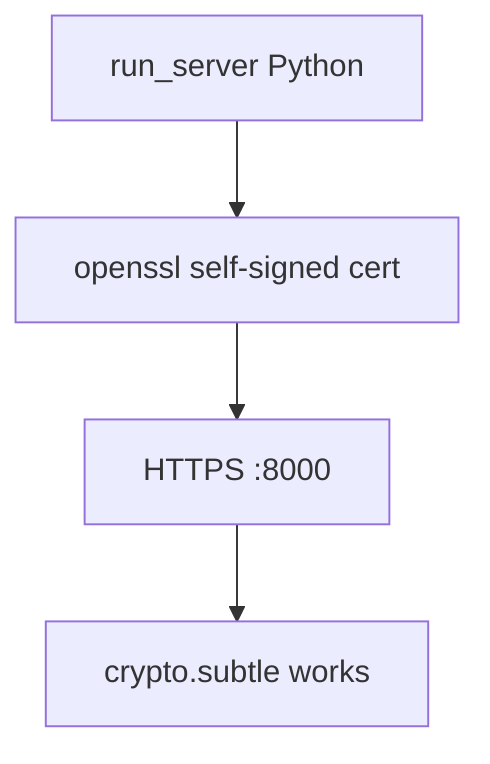
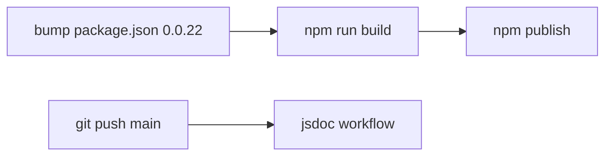

# Development guide

Work on the library clone: install, HTTPS test page, build, JSDoc, release notes.

- [Local development setup](7.1-local-development-setup)
- [Testing and validation](7.2-testing-and-validation)
- [Build and release process](7.3-build-and-release-process)

## Layout

Fork to hack on: [https://github.com/tashifkhan/jsjiit](https://github.com/tashifkhan/jsjiit). Upstream package metadata still names `codeblech/jsjiit`.

## Loop

There is no unit test suite. `"test"` exits 1.

## HTTPS

Plain `python -m http.server` is the wrong tool if `subtle` is missing.

## Release sketch

Publishing npm is not automated in this repo. Only JSDoc on `main` is.
