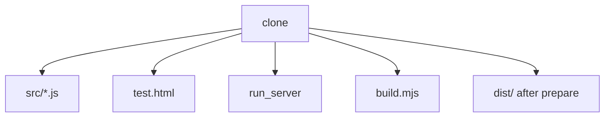
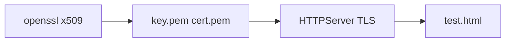
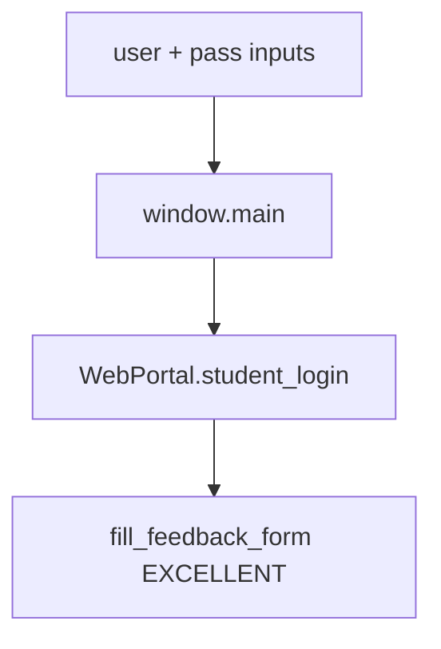
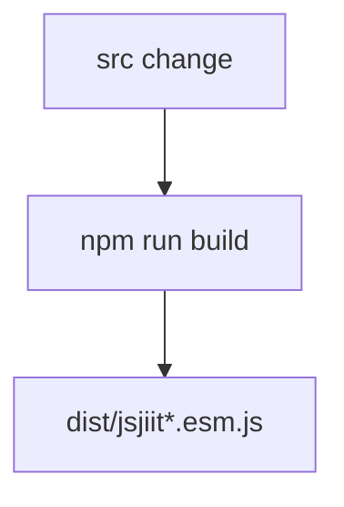

# Local development setup

Clone, `npm install`, serve `test.html` over HTTPS.

Release later: [Build and release process](7.3-build-and-release-process). Manual checks: [Testing and validation](7.2-testing-and-validation).

## Tools

| Tool | Why |
| --- | --- |
| Node 18+ | esbuild, jsdoc |
| npm 7+ | lockfile v3 |
| Python 3 | `run_server` |
| OpenSSL | certs for that script |
| Git | clone |

## Clone

```bash
git clone https://github.com/tashifkhan/jsjiit.git
cd jsjiit
npm install
```

`prepare` runs `npm run build`, so `dist/` appears after install.

Dev deps from `package.json`: `esbuild@0.24.0`, `jsdoc@^4.0.4`.

## Tree



`.gitignore`: `.vscode`, `docs`, `node_modules`, `cert.pem`, `key.pem`, `dist`.

## HTTPS server

`run_server` is a Python 3 script (shebang `#!/usr/bin/python`). It:

1. Runs `openssl req -nodes -x509 -newkey rsa:4096 ... -subj /CN=mylocalhost`
2. Serves the current directory with `HTTPServer` + `ssl.PROTOCOL_TLS_SERVER`
3. Listens on `https://localhost:8000`

```bash
./run_server
```



Trust the self-signed cert in the browser once. The CN is `mylocalhost` while the host is `localhost`. Expect a name mismatch warning.

## `test.html`



The live script imports `./src/index.js` (not the CDN). After login it currently submits feedback as `"EXCELLENT"`. Attendance / exam / grade calls are commented out. Do not click Submit against a real account unless you want that feedback POST.

Commented import lines show older CDN versions (`0.0.17` and unpinned latest).

## Edit cycle


Source modules load unbundled. A hard reload is enough. You do not need `npm run build` until you want `dist/`.


