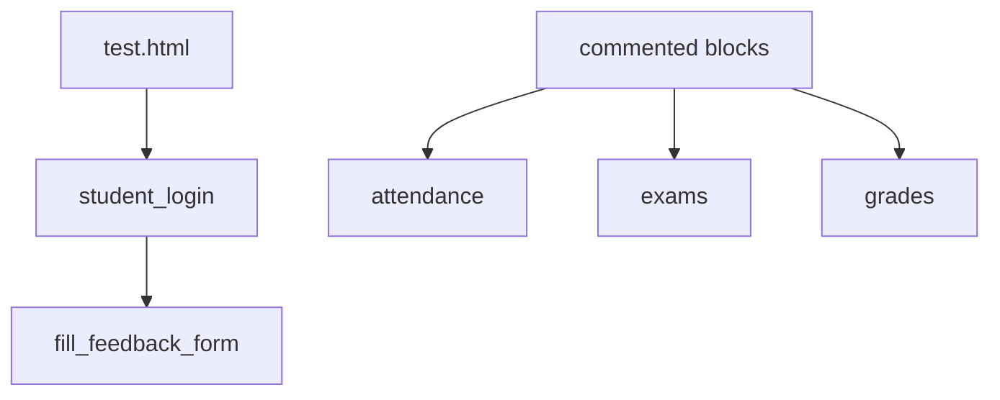
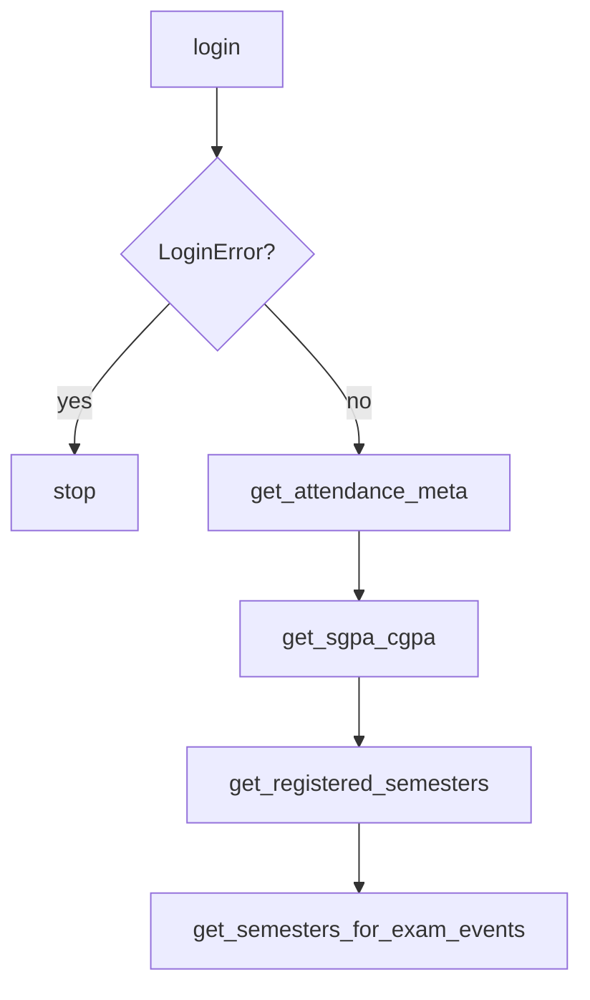
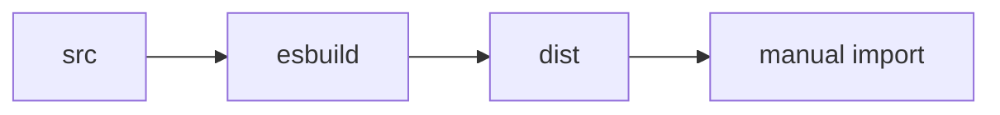

# Testing and validation

There is no automated test runner. `package.json` `"test"` prints `Error: no test specified` and exits 1. Validation is `test.html` plus watching `__hit` logs.

## What exists



`run_server` is required for Web Crypto.

## Suggested manual path



Uncomment the matching blocks in `test.html` instead of using the live `fill_feedback_form` line if you only want reads.

Catch `LoginError` as the file already does.

## `__hit` noise

Every call logs the fetch options, including `Authorization`. Do not paste console dumps.

## Build sanity

```bash
npm run build
ls dist/
```

Expect `jsjiit.esm.js`, `jsjiit.min.esm.js`, and two `.map` files. Import the min bundle from a throwaway page if you are about to publish.



No CI workflow runs tests. The only GitHub Action is JSDoc.
