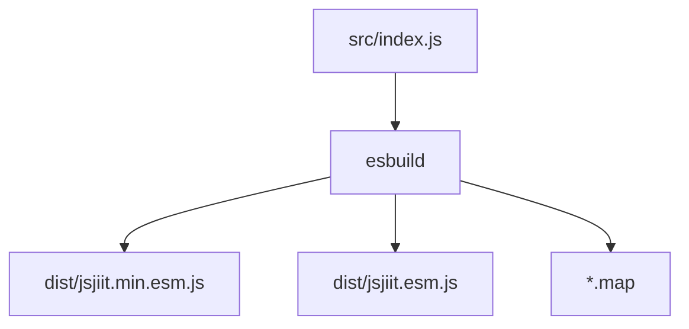
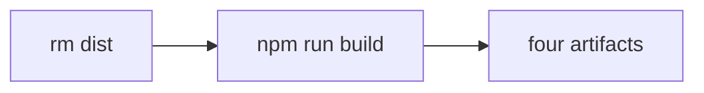
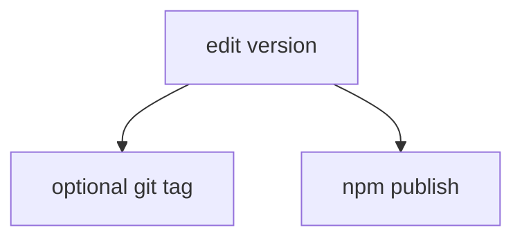
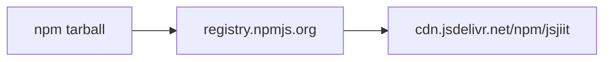
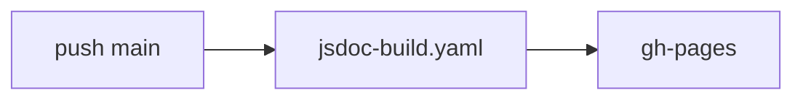
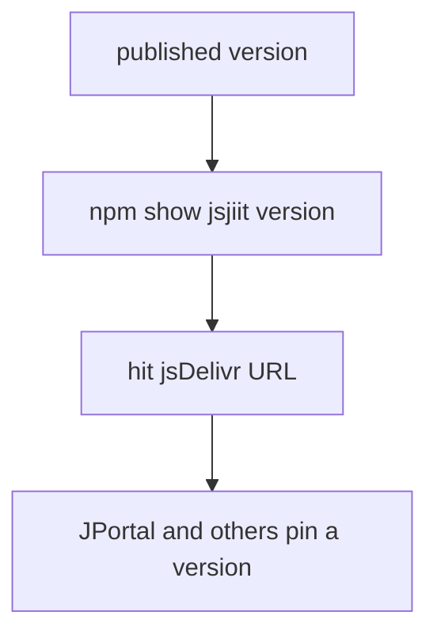

# Build and release process

Build with esbuild, eyeball `dist/`, publish npm yourself, let JSDoc deploy from `main`.

Related: [Build system](5.1-build-system), [Package configuration](5.2-package-configuration), [Automated documentation deployment](6.2-automated-documentation-deployment).

## Build

```bash
npm run build
```

`prepare` also builds on install and before publish.



`commonConfig`: `bundle: true`, `format: "esm"`, `target: ["es2020"]`, `sourcemap: true`.

## Pre-publish checks

```bash
rm -rf dist/
npm run build
ls -lh dist/
```

Success lines from `build.mjs`:

```
✅ Production build complete
✅ Development build complete
🎉 All builds completed successfully!
```



Open `dist/jsjiit.esm.js` and confirm it still exports `WebPortal` and does not contain a `useProxy` you did not write.

## Version

This clone is **0.0.22**. Bump `package.json` (and the lockfile name field) before a new publish. README CDN URLs are already stale (`0.0.20`). Update them in the same commit.



There is no release workflow.

## npm publish

```bash
npm publish
```

`prepare` rebuilds. `files` includes `dist` and `src`. After publish, jsDelivr will serve:

```
https://cdn.jsdelivr.net/npm/jsjiit@0.0.22/dist/jsjiit.min.esm.js
```



You need an npm account with publish rights on `jsjiit`. The package author field is `codeblech`. This fork may not be able to publish that name.

## Docs on push



Not tied to npm. A docs-only commit still deploys JSDoc.

## After a release



Apps that pin `@0.0.27` are not running this source. Do not document their extras until they exist in `wrapper.js`.
