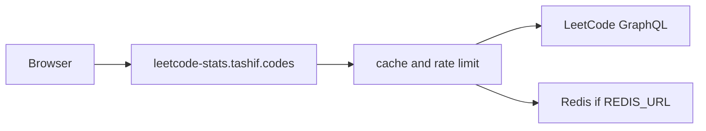

# LeetCode stats API

FastAPI service for public LeetCode profiles: solved counts, contests, rating history, heatmap, badges, and an SVG card. Live at [leetcode-stats.tashif.codes](https://leetcode-stats.tashif.codes). Source is [tashifkhan/LeetCodeStatsAPI](https://github.com/tashifkhan/LeetCodeStatsAPI).

CodeTrace calls this for the DSA ring. Category is `dsa`. No caller token. The server talks to LeetCode's public GraphQL.

## Docs map

- [Overview](1-overview)
- [Dashboard](2-dashboard)
- [Canonical endpoints](3-canonical-endpoints)
- [Envelope and schemas](3.1-envelope-and-schemas)
- [Platform notes](4-platform-notes)
- [Architecture](5-architecture)
- [Request path](5.1-request-path)
- [GraphQL and decoders](5.2-graphql-and-decoders)
- [Canonical mapping](5.3-canonical-mapping)
- [Heatmap and SVG](5.4-heatmap-and-svg)
- [Cache, rate limit, deploy](6-cache-rate-limit-and-deploy)

## What it returns

Type a LeetCode username. You get the shared envelope plus the older flattened fields so old clients still parse `totalSolved` at the top level.

- Solved by Easy / Medium / Hard, plus acceptance rate and ranking.
- Contest rating, global rank, and per-contest history.
- Submission calendar as a heatmap (`view=all|last_365|year`).
- Topic bars from the same stats payload, also at `/{username}/topics`.
- README card at `/{username}/stats/svg`.



There is no in-memory HTTP cache. Without Redis the middleware is a no-op and every GET hits GraphQL.

## Live access

- Site: [leetcode-stats.tashif.codes](https://leetcode-stats.tashif.codes)
- Playground: [leetcode-stats.tashif.codes/playground](https://leetcode-stats.tashif.codes/playground)
- OpenAPI: [leetcode-stats.tashif.codes/docs](https://leetcode-stats.tashif.codes/docs)
- ReDoc: [leetcode-stats.tashif.codes/redoc](https://leetcode-stats.tashif.codes/redoc)
- Sample JSON: [khan-tashif/profile](https://leetcode-stats.tashif.codes/khan-tashif/profile)
- Repo: [github.com/tashifkhan/LeetCodeStatsAPI](https://github.com/tashifkhan/LeetCodeStatsAPI)

## Run it locally

```bash
cd LeetCode
uv sync
uv run python -m uvicorn app:app --reload --port 8002
```

No env vars required. Optional Redis via `REDIS_URL` or Upstash REST, same knobs as the other stats APIs.

Default bind if you run `python app.py` is port `58352`. Do not rely on that next to HackerRank. Use 8002.
