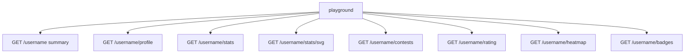

# Dashboard

`GET /` is a LeetCode profile analyzer, not a JSON payload. Enter a username and the page loads the canonical routes on this origin.

Live:

- [leetcode-stats.tashif.codes](https://leetcode-stats.tashif.codes)
- [Playground](https://leetcode-stats.tashif.codes/playground)
- [OpenAPI](https://leetcode-stats.tashif.codes/docs)
- [ReDoc](https://leetcode-stats.tashif.codes/redoc)

`/playground` is the route tester: substitute the handle, run one path or all of them, inspect latency and JSON. The SVG row has `theme` and `exclude` controls. Placeholder sample is `demo`. Use a real LeetCode username.

Input and output shapes: [Envelope and schemas](3.1-envelope-and-schemas).

Recent handles sit in `localStorage` under a `pg_recent_leetcode` key. Clearing it only affects that browser.

Nothing is proxied to a third party from the playground. The browser calls this FastAPI app. The app still hits LeetCode GraphQL server-side.
